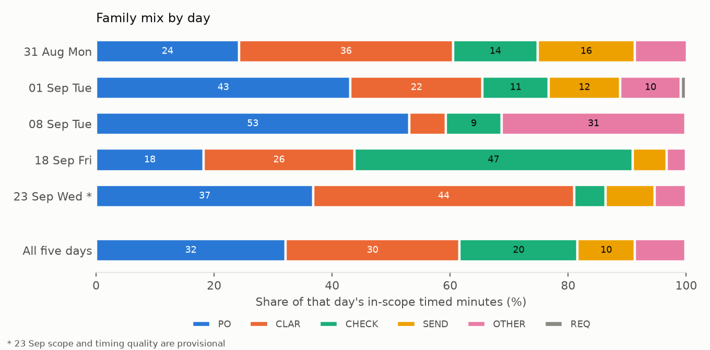

# Day-5 exploratory analysis: Arno's five baseline days

**Prepared:** 25 September 2026, revised the same day after review
**Status:** Measure review and initial workload profile. This is input for the Day-5 coverage, stability and saturation review agreed on [3 September](../docs/meetings/Academic_Supervisor_Meeting_Notes_2026-09-03.md). It does not close Measure, complete Analyze, rank candidates or select a focal case. All figures are derived; no observation file is changed.

**Reproduce:** `N_BOOT=500 python3 analysis/day5_exploratory_analysis.py` (numpy, pandas, scipy, matplotlib). Outputs land in [`analysis/output/`](output/). The seed, replicate count, package versions and git commit of the run are stored under `provenance` in `output/results.json`.

## 1. Data used

| Day | Date | Weekday | Dayparts | Enriched? | Exposure (min) | Rows | Timed rows | In-scope timed min |
|---|---|---|---|---|---:|---:|---:|---:|
| 1 | 31 Aug | Mon | AM + PM | Yes | 165 (verified net) | 63 | 39 | 91 |
| 2 | 1 Sep | Tue | AM + PM | Yes | 186 (verified net) | 50 | 43 | 116 |
| 3 | 8 Sep | Tue | AM | Yes | ≤113 (window) | 42 | 38 | 32 |
| 4 | 18 Sep | Fri | AM + PM | Yes | ≤240 (window) | 74 | 57 | 121 |
| 5 | 23 Sep | Wed | AM + PM | **No, provisional** | ≤196 (window) | 58 | 48 | 95 |
| | **Total** | | | | **≤900** | **287** | **225** | **455** |

- Days 1 to 4 come from [the 21 September enriched dataset](../docs/measurement/Activity_Framework_Enriched_Observations_2026-09-21.csv). Their in-scope minutes (91, 116, 32, 121) match the measurement README.
- Day 5 comes from the raw table in [the 23 September notes](../docs/measurement/Measure_Observation_2026-09-23.md) and has not been enriched. The script applies two **provisional** rule sets, kept separate:
  - **Scope** (`SCOPE_0923`): EXC excluded; OBS-18 SEND to the transport company excluded as logistics; OBS-06 OTHER, OBS-09 Exact fault and OBS-16 CLAR set to `REVIEW_SCOPE`.
  - **Timing quality** (`QUALITY_0923`): the deliberately concurrent OBS-07 EXC (11:41–11:43) and OBS-03 PO (11:42–11:45) are `UNCERTAIN_CONCURRENT`, and OBS-16 EXC 13:42–14:24 is `ELAPSED_ONLY`. As with the 18 September `UNCERTAIN` row, non-`VALID` rows leave the primary profile.
  - Replace both rule sets with the real enrichment once it exists.
- "In scope" means `INCLUDE` with `VALID` quality. `REVIEW_SCOPE` minutes (56 across the five days) appear only in a sensitivity check.
- Net observed time is verified for 31 August and 1 September (165 + 186 = the historical 351 minutes). For 8, 18 and 23 September only the notebook window is known, so any rate for those days is a lower bound.
- EXC accounts for 182 recorded minutes, 24 % of all recorded interval time. The included profile is therefore **not** a complete account of Arno's workload, as the scope addendum states.

## 2. Where the observed in-scope time is concentrated

| Family | 31 Aug | 1 Sep | 8 Sep | 18 Sep | 23 Sep* | Total min | Share of included timed min |
|---|---:|---:|---:|---:|---:|---:|---:|
| PO | 22 | 50 | 17 | 22 | 35 | 146 | 32.1 % |
| CLAR | 33 | 26 | 2 | 31 | 42 | 134 | 29.5 % |
| CHECK | 13 | 13 | 3 | 57 | 5 | 91 | 20.0 % |
| SEND | 15 | 14 | 0 | 7 | 8 | 44 | 9.7 % |
| OTHER | 8 | 12 | 10 | 4 | 5 | 39 | 8.6 % |
| REQ | 0 | 1 | 0 | 0 | 0 | 1 | 0.2 % |

\*provisional. REQ is almost always a tally (39 in-scope occurrences, 1 timed), so it appears as occurrences, not minutes.

**PO and CLAR together account for 61.5 % of the provisionally included timed minutes.** These are sums of eligible recorded minutes. They describe where observed in-scope time went. They do not measure Arno's entire workload or the time AI could remove.

Median and IQR describe a typical episode, not total time. PO has 55 complete timed episodes with a median of 2 min, but 146 minutes in total; 55 × 2 would give only 110. For time burden, use the summed minutes.

## 3. PO and CLAR remain the leading contributors in pooled and leave-one-day-out summaries

Individual days differ considerably:

| Day | PO + CLAR share | Largest two families that day |
|---|---:|---|
| 31 Aug | 60.5 % | CLAR, PO |
| 1 Sep | 65.5 % | PO, CLAR |
| 8 Sep | 59.3 % | PO, OTHER (only 32 in-scope min) |
| 18 Sep | 43.8 % | CHECK, CLAR |
| 23 Sep* | 81.0 % | CLAR, PO |

CHECK is 47.1 % of included minutes on 18 September (57/121) but 5.3 % on 23 September (5/95). Its total comes mainly from a few long cases, including one 20-minute check and a 32-line check that was already running when observation began.

The main evidence for a consistent leading ranking is the pooled and leave-one-day-out summaries:

| Summary | Result |
|---|---|
| Pooled ranking by minutes | PO > CLAR > CHECK > SEND > OTHER |
| Leave one day out | PO and CLAR are the two largest contributors whichever day is dropped. Their order flips when 1 Sep or 8 Sep is dropped; CHECK falls to fifth (10.2 %) when 18 Sep is dropped. |
| Cumulative shares after each added day | Day 5 moved no family share by more than 3.9 pp. This is weak evidence on its own, because each added day has less influence on a growing pool. |

The script also runs Kruskal–Wallis, Monte Carlo χ² and Mann–Whitney tests across days and dayparts; none shows a difference (results in `output/results.json`). These are **secondary**. A large p-value is not evidence that days are equivalent, and the tests treat episodes as independent even though several episodes belong to the same case (for example OBS-02 on 23 September has PO, CHECK and SEND episodes). They are not used to decide whether Measure is sufficient.

## 4. Fragmentation: new cases, returns and interruptions

These are kept as three separate measures.

| Day | In-scope new-case starts | In-scope case returns | INT recorded (numeric rows / all rows) |
|---|---:|---:|---|
| 31 Aug | 15 | 6 | 4 (63 / 63) |
| 1 Sep | 19 | 5 | 5 (50 / 50) |
| 8 Sep | 11 | 1 | 3 (3 / 42) |
| 18 Sep | 15 | 7 | 3 (3 / 74) |
| 23 Sep* | 12 | 9 | 1 (1 / 58) |

- A **case return** is an in-scope episode of a case already seen that day, after work on a different case.
- **Gaps between successive new-case starts** are measured only within one observation block and never across an observer-unavailable interval. 61 gaps qualify: median 6 min, IQR 3–12 min. This replaces the earlier 8.2-minute mean, which let gaps cross breaks (for example 12:21 → 13:02 on 23 September).
- **INT is not comparable across days.** From 8 September most rows record `/` rather than a number, so the recorded counts for days 3–5 are not interruption totals. Whether `/` meant zero or "not recorded" needs to be settled from the notebooks before interruptions are analysed.

## 5. Inconsistent line-count definitions prevent a reliable assessment of PO volume versus processing time

For 37 in-scope PO episodes with a line volume, Spearman ρ = 0.13 (p = 0.46). This is not a finding about the relationship itself, because the Volume field mixes different quantities. On 23 September, for example, 16L means an existing 15-line PO plus one added line, while other entries record only the lines added.

For the deeper PO analysis, extract these separately and only where the notes support them. Unknown values stay unknown.

| Variable | Meaning |
|---|---|
| Existing PO lines | Size before the observed work |
| Lines added or changed | Work performed during the episode |
| Lines checked | Volume actually verified |

## 6. Saturation

| Day | New analytical activities | Cumulative | New live families |
|---|---:|---:|---|
| 31 Aug | 10 | 10 | all seven live families plus EXC |
| 1 Sep | 1 | 11 | none |
| 8 Sep | 0 | 11 | none |
| 18 Sep | 2 | 13 | none |
| 23 Sep | not enriched yet | — | none |

Most Day-5 events repeat earlier patterns: MAX additions to open POs and unsuccessful MAX attempts, searching for drawings and specifications, price or website checks, and Exact errors. Two items need a dated note before the review:

1. **Deliberate concurrent activity** (OBS-07 EXC 11:41–11:43 alongside OBS-03 PO 11:42–11:45). Protocol v1.3 §7.1 does not allow two active episodes in the same minute, and earlier overlaps were transcription errors. Both rows are provisionally `UNCERTAIN_CONCURRENT`.
2. **A 12-minute Exact fault** (OBS-09 OTHER), the longest system-constraint episode so far. It is currently `REVIEW_SCOPE`.

## 7. Status for the Day-5 review

| Criterion (v1.3 §11 and 3 Sep) | Status | Evidence / gap |
|---|---|---|
| Morning and afternoon coverage | Covered | 5 mornings, 4 afternoons |
| Weekdays | Partly covered | Mon, Tue ×2, Wed, Fri; no Thursday. On 17 Sep Zhongxin advised this matters mainly if patterns are inconsistent. |
| Abnormal days | Noted | 8 Sep is thin (32 in-scope min). Leave-one-out keeps PO and CLAR as the top two without it. |
| Main families and channels | Observed | All seven families from Day 1; channels include mail, phone, desk, letter and Exact. |
| Quantitative stability | Preliminary support | PO and CLAR lead the pooled and leave-one-day-out summaries. Day-level variation is large, and Day 5 is provisional. |
| Qualitative saturation | Pending | Days 2–4 added 0–2 analytical activities each; enrich Day 5 to confirm. |
| Exposure denominators | Open | Net observed time verified only for 31 Aug and 1 Sep. |
| Interruptions | Open | INT is numeric on only 7 of 174 rows after 1 Sep. |

## 8. Conclusion

Across five partial observation days, PO processing and clarification accounted for 61.5 % of the provisionally included timed minutes and remained the two largest contributors in leave-one-day-out summaries. These results support prioritizing PO and CLAR for deeper process analysis, while retaining CHECK because of its contribution from longer cases. They do not establish that the daily work mix is identical or that the baseline represents Arno's entire workload. Formal Measure closure remains subject to Day-5 enrichment, timing and exposure checks, and the documented coverage and saturation review.

**Next substantive step:** explain the PO and CLAR minutes. Separate supported episodes involving PO amendments, maximalisatie, missing specifications, drawing retrieval and requester clarification, then investigate which information problems or process conditions create that work.

## 9. Limitations

- Five partial days of one buyer with one observer.
- Day-5 scope and timing quality are provisional.
- Per-day rates for three days use upper-bound exposure.
- Durations are exclusive active episodes, not case lead times or complete tasks; interrupted cases span several episodes.
- Episodes within a case are not independent.
- The analysis describes observed time only. It says nothing about quality, difficulty or expertise dependence, which the workload definition keeps separate.

## Appendix A. Exploratory distribution fitting

This appendix is supporting material. As the 3 September notes state, fitting a distribution supports the coverage, stability and saturation review but does not replace it.

**Recording model assumed.** Start and end are read from a clock in whole minutes. The fit models a recorded duration as `floor(U + T)` with a uniform start-second phase `U`, and conditions on a recorded duration of at least one minute. The protocol's tally rule depends on whether an action can be timed reliably, which is not necessarily the same selection. The results therefore hold only under this assumed recording model. Goodness of fit uses a parametric-bootstrap discrete Kolmogorov–Smirnov test that refits the model on every replicate (500 replicates).

**Result.** Recorded episode durations are right-skewed. Under the assumed recording model, a lognormal distribution provides the best fit among the distributions compared (lognormal, gamma, Weibull, exponential). The pooled sample mixes work families and interrupted segments, so it describes recorded segments, not the duration of a complete purchasing task or PO.

| Sample | n | Best model (Akaike weight) | Runner-up (ΔAIC) | Bootstrap p of best | Best-model parameters |
|---|---:|---|---|---:|---|
| All in-scope episodes | 142 | Lognormal (0.78) | Exponential (3.7) | 0.89 | median 2.09 min, σ(log) 0.83 |
| PO | 55 | Lognormal (0.61) | Exponential (2.4) | 0.38 | median 1.71 min, σ(log) 0.81 |
| CLAR | 33 | Lognormal (0.32) | Exponential (0.1) | 0.99 | median 3.04 min, σ(log) 0.74 |
| SEND | 22 | Exponential (0.40) | Lognormal (1.4) | 0.84 | mean 1.44 min |
| CHECK | 20 | Exponential (0.41) | Lognormal (0.7) | 0.66 | mean 3.63 min |
| All incl. REVIEW_SCOPE | 162 | Lognormal (0.86) | Exponential (4.9) | 0.75 | median 2.07 min, σ(log) 0.82 |
| Days 1–4 only | 108 | Lognormal (0.76) | Exponential (4.1) | 0.66 | median 2.04 min, σ(log) 0.88 |

- Within single families (n = 20–55), the models cannot be told apart (ΔAIC below 2 for CLAR, SEND and CHECK).
- A normal curve with the pooled sample mean (3.1 min) and SD (3.0 min) would put 15 % of its mass below zero minutes. Describe typical episodes with the median and IQR.
- The analysis method for any later manual-versus-AI comparison should be chosen after the evaluation unit, matched cases and repeated observations are defined. This baseline distribution does not settle that design.

Full table including gamma and Weibull: `output/results.json`, key `distribution_fits`.

## Appendix B. Durations by day

