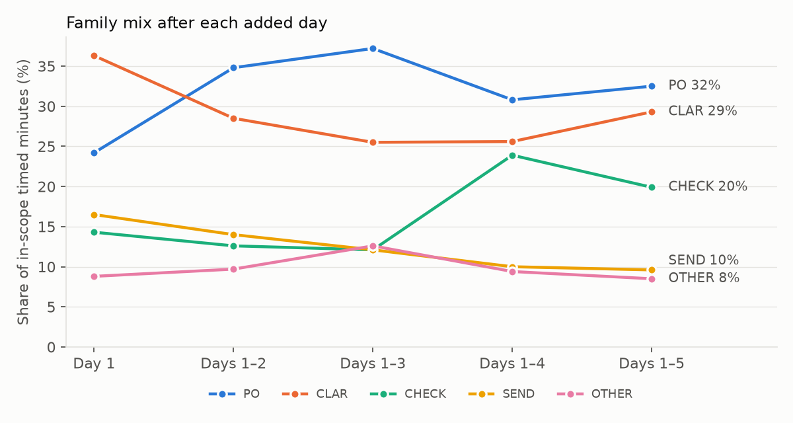
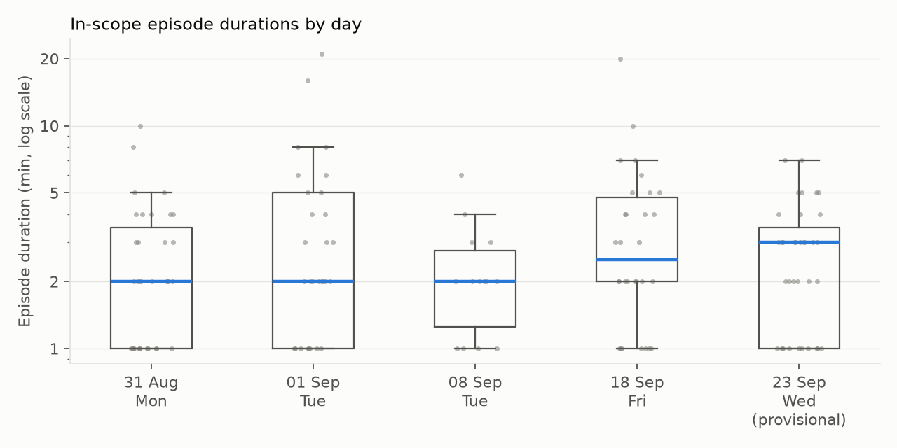
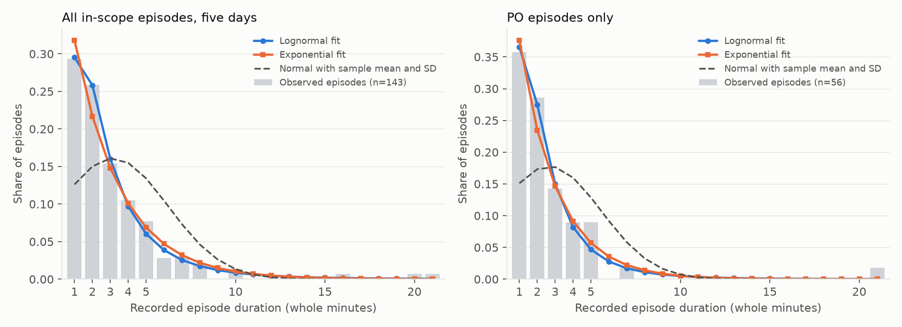

# Day-5 exploratory analysis: Arno's five baseline days

**Prepared:** 25 September 2026
**Status:** Exploratory input for the Day-5 coverage, stability and saturation review agreed on [3 September](../docs/meetings/Academic_Supervisor_Meeting_Notes_2026-09-03.md). It does not close Measure, rank candidates or select a focal case. All figures are derived; no observation file is changed.

**Reproduce:** `python3 analysis/day5_exploratory_analysis.py` (numpy, pandas, scipy, matplotlib). Outputs land in [`analysis/output/`](output/).

## 1. Data used

| Day | Date | Weekday | Dayparts | Enriched? | Exposure (min) | Rows | Timed rows | In-scope timed min | In-scope min per exposure hour |
|---|---|---|---|---|---:|---:|---:|---:|---:|
| 1 | 31 Aug | Mon | AM + PM | Yes | 165 (verified net) | 63 | 39 | 91 | 33 |
| 2 | 1 Sep | Tue | AM + PM | Yes | 186 (verified net) | 50 | 43 | 116 | 37 |
| 3 | 8 Sep | Tue | AM | Yes | ≤113 (window) | 42 | 38 | 32 | ≥17 |
| 4 | 18 Sep | Fri | AM + PM | Yes | ≤240 (window) | 74 | 57 | 121 | ≥30 |
| 5 | 23 Sep | Wed | AM + PM | **No, provisional** | ≤196 (window) | 58 | 48 | 98 | ≥30 |
| | **Total** | | | | **≤900** | **287** | **225** | **458** | |

- Days 1 to 4 come from [the 21 September enriched dataset](../docs/measurement/Activity_Framework_Enriched_Observations_2026-09-21.csv). Their in-scope minutes (91, 116, 32, 121) match the measurement README.
- Day 5 comes from the raw table in [the 23 September notes](../docs/measurement/Measure_Observation_2026-09-23.md). It has not been enriched yet. The script applies a **provisional** scope rule: EXC excluded, OBS-18 SEND to the transport company excluded as logistics, and three rows set to `REVIEW_SCOPE` (OBS-06 OTHER, OBS-09 Exact fault, OBS-16 CLAR). The provisional reasons are in `SCOPE_0923` in the script. Replace them with the real enrichment once it exists.
- "In scope" means `INCLUDE` with `VALID` quality. `REVIEW_SCOPE` minutes (56 across the five days) appear only in a sensitivity check.
- Net observed time is verified for 31 August and 1 September (165 + 186 = the historical 351 minutes). For 8, 18 and 23 September only the notebook window is known, so any rate for those days is a **lower bound**. The 18 September CHECK segment that began before observation is excluded from the duration analysis (it is not a full episode) but counted in the minutes.
- Across the five days, EXC accounts for 182 recorded minutes, 24 % of all recorded interval time. Excluding it narrows what can be said about Arno's total work, as the scope addendum already notes.

## 2. Pattern 1: the work mix is stable

In-scope timed minutes by family and day:

| Family | 31 Aug | 1 Sep | 8 Sep | 18 Sep | 23 Sep* | Total | Share |
|---|---:|---:|---:|---:|---:|---:|---:|
| PO | 22 | 50 | 17 | 22 | 38 | 149 | 32.5 % |
| CLAR | 33 | 26 | 2 | 31 | 42 | 134 | 29.3 % |
| CHECK | 13 | 13 | 3 | 57 | 5 | 91 | 19.9 % |
| SEND | 15 | 14 | 0 | 7 | 8 | 44 | 9.6 % |
| OTHER | 8 | 12 | 10 | 4 | 5 | 39 | 8.5 % |
| REQ | 0 | 1 | 0 | 0 | 0 | 1 | 0.2 % |

\*provisional scope. REQ is almost always a tally (39 in-scope occurrences, 1 timed), so its workload shows up as occurrences, not minutes.

| Check | Result |
|---|---|
| Ranking after each added day | Days 1–2: PO > CLAR > SEND > CHECK > OTHER. Days 1–4 and 1–5: **PO > CLAR > CHECK > SEND > OTHER**. Day 5 did not change the ranking. |
| Largest change in any family share when a day is added | Day 2 10.6 pp, Day 3 3.0 pp, Day 4 11.8 pp, **Day 5 4.0 pp** |
| Leave one day out | PO and CLAR stay the top two whichever day is dropped. CLAR moves ahead only when 1 September (with its PO-heavy afternoon) is dropped; dropping 8 September leaves them tied. |
| Median episode duration after each added day | All families together: 2 min on every step. PO 2 min throughout; CLAR moved 2 → 3 min. |
| Episode durations differ by day? (Kruskal–Wallis) | All in-scope p = 0.48; PO p = 0.55; CLAR p = 0.82; SEND p = 0.42. No detectable day effect. |
| Family mix differs by day? (Monte Carlo χ², episode counts) | p = 0.30. No detectable day effect. |
| Morning vs afternoon durations (Mann–Whitney) | p = 0.55; median 2 min in both. Afternoons lean more towards PO (42 % vs 27 % of minutes). |

Two caveats. First, CHECK's jump on Day 4 comes almost entirely from 18 September, which had 57 CHECK minutes, including one 20-minute check and a 32-line check that was already running when observation began. CHECK's share therefore depends on a few long cases, not on routine frequency. Second, 8 September is an outlier day: only 32 in-scope minutes, because most of its time was EXC, aftercare, review or contaminated. With five days the tests have little power, so "no detectable difference" is weaker than "the days are the same".

## 3. Pattern 2: episode durations are right-skewed and lognormal

Of the 143 complete in-scope episodes, 29 % last one recorded minute, 55 % two minutes or less and 89 % five minutes or less. Five episodes of 10 minutes or more (two CLAR on 31 Aug and 1 Sep, a 21-minute PO on 1 Sep, a CLAR and a 20-minute CHECK on 18 Sep) hold 17 % of all in-scope minutes.

**How the fit handles the recording method.** Start and end are read from a clock in whole minutes, and actions shorter than a minute are tallied rather than timed. The fit therefore models a recorded duration as `floor(U + T)` with a uniform start-second phase `U`, and conditions on at least one minute. Ignoring this would bias every fit towards the 1- and 2-minute spikes. Goodness of fit uses a parametric-bootstrap discrete Kolmogorov–Smirnov test with a refit on every replicate (500 replicates).

| Sample | n | Best model (Akaike weight) | Runner-up (ΔAIC) | Bootstrap p of best | Best-model parameters |
|---|---:|---|---|---:|---|
| All in-scope episodes | 143 | **Lognormal (0.79)** | Exponential (3.9) | 0.88 | median 2.1 min, σ(log) 0.82, mean 2.9 min |
| PO | 56 | **Lognormal (0.63)** | Exponential (2.4) | 0.34 | median 1.75 min, σ(log) 0.79 |
| CLAR | 33 | Lognormal (0.30) | Exponential (0.1) | 0.98 | median 3.0 min, σ(log) 0.74 |
| SEND | 22 | Exponential (0.40) | Lognormal (1.4) | 0.80 | mean 1.4 min |
| CHECK | 20 | Exponential (0.40) | Lognormal (0.7) | 0.61 | mean 3.6 min |
| All incl. REVIEW_SCOPE | 163 | Lognormal (0.87) | Exponential (5.0) | 0.70 | median 2.1 min, σ(log) 0.82 |
| Days 1–4 only | 108 | Lognormal (0.76) | Exponential (4.1) | 0.65 | median 2.0 min, σ(log) 0.88 |

Full table with Gamma and Weibull: `analysis/output/results.json`, key `distribution_fits`.

Interpretation:

- **Pooled, the lognormal fits best** (Akaike weight 0.79; the exponential is 3.9 AIC units behind) and the bootstrap does not reject it. The day 1–4 fit (median 2.0, σ 0.88) and the five-day fit (median 2.1, σ 0.82) are nearly identical, so Day 5 did not shift the distribution.
- **A normal distribution is the wrong model.** A normal curve with the sample mean (3.2 min) and SD (3.0 min) puts 15 % of its mass below zero minutes. The data have skewness 3.4 and a median (2 min) well below the mean. Report **median and IQR**, not mean ± SD. Later manual-versus-AI comparisons should use log-scale methods, such as a ratio of geometric means or a rank-based test.
- **Within a single family**, n = 20–56 cannot distinguish lognormal from exponential (ΔAIC < 2 for CLAR, SEND and CHECK). The safe claim is "right-skewed with a long tail", not a specific family law.
- **For workload burden, use the mean or the total minutes, not the median.** Because of the long tail, `frequency × median` understates time. For PO, the observed median is 2 min but the observed mean is 2.7 min. The simplest honest burden figure is observed minutes per verified net hour.

## 4. Pattern 3: work is fragmented

- A new case starts every **8.2 minutes on average** (median about 5; 110 gaps within blocks). Gaps are more variable than a Poisson arrival process would produce (CV 1.11), and the bootstrap rejects the exponential (p = 0.018) but not the lognormal (p = 0.58, median gap 4.8 min). Arno partly chooses what to work on next, so this describes switching between cases, not external request arrival.
- 118 distinct case IDs over five days; on 1 September, 31 cases in 186 net minutes.
- Case continuation is common: for example, OBS-02 on 23 September appears in five separate episodes across 35 minutes.

## 5. Pattern 4: PO time does not scale with recorded line count

For 38 in-scope PO episodes with a line volume, Spearman ρ = 0.14 (p = 0.41), with a median of 0.5 min per recorded line. Part of the reason is the volume field itself: it sometimes records the PO total (for example 16L, 17L) and sometimes the lines added. Line count is therefore not yet a usable driver of PO time. For a PO/MAX candidate, record added lines separately from final PO lines.

## 6. Saturation

| Day | New analytical activities | Cumulative | New live families |
|---|---:|---:|---|
| 31 Aug | 10 | 10 | all seven live families plus EXC |
| 1 Sep | 1 | 11 | none |
| 8 Sep | 0 | 11 | none |
| 18 Sep | 2 | 13 | none |
| 23 Sep | not enriched yet | — | none |

Qualitatively, most Day 5 events repeat earlier patterns: MAX additions to open POs and unsuccessful MAX attempts (18 Sep), searching for drawings and specifications, price or website checks (8 and 18 Sep), Exact errors (31 Aug). Two things are new and should be written up before the review:

1. **Deliberate concurrent activity** (OBS-07 EXC 11:41–11:43 alongside OBS-03 PO 11:42–11:45). Protocol v1.3 §7.1 does not allow two active episodes in the same minute, and earlier overlaps were transcription errors. Here the overlap does not affect in-scope minutes because the EXC row is excluded, but the treatment needs a dated note.
2. **A 12-minute Exact fault** (OBS-09 OTHER). Earlier days had short Exact errors. This is the longest system-constraint episode so far and is currently `REVIEW_SCOPE`.

## 7. What this means for the Day-5 review

| v1.3 §11 / 3 Sep criterion | Status | Evidence / gap |
|---|---|---|
| Morning and afternoon coverage | **Met** | 5 mornings, 4 afternoons |
| Weekdays | **Partly met** | Mon, Tue ×2, Wed, Fri. No Thursday. On 17 Sep Zhongxin advised this matters only if patterns are inconsistent, and they look consistent. |
| No abnormal day that distorts the baseline | **Met, with one note** | 8 Sep is thin (32 in-scope min). Leave-one-out shows it does not change the ranking. |
| Main families and channels observed | **Met** | All seven families from Day 1; channels include mail, phone, desk, letter and Exact. |
| Quantitative stability | **Met at family level** | Day 5 shifted shares by at most 4 pp, left the ranking and medians unchanged, and left the duration distribution unchanged. |
| Qualitative saturation | **Pending** | Days 2–4 added 0–2 analytical activities each. Enrich Day 5 to confirm. |
| Verified exposure denominators | **Open** | Net observed time is verified only for 31 Aug and 1 Sep. Occurrence rates for the other days are lower bounds. |

**Recommendation:** Arno's family-level pattern is stable enough to start Analyze on the two largest contributors, **PO (including MAX)** and **CLAR**, and to treat CHECK as the third, case-driven contributor. Before formally closing Measure: enrich 23 Sep, confirm net observed minutes for 8, 18 and 23 Sep (or explicitly report the windows as upper bounds), document the concurrency and Exact-fault cases, and record the review outcome with the supervisor. Timing Dennis can continue in parallel as the check dataset agreed on 17 September.

## 8. Limitations

- Five days of one buyer with one observer; the tests have little power.
- Day 5 scope and classification are provisional.
- Per-day rates for three days use upper-bound exposure.
- Minute-level recording; the rounding model assumes a uniform start phase and that timed episodes are at least one minute.
- Durations are exclusive active episodes, not case lead times; interrupted cases span several episodes.
- The distribution fits describe observed time. They say nothing about quality, difficulty or expertise dependence, which the workload definition keeps separate.
