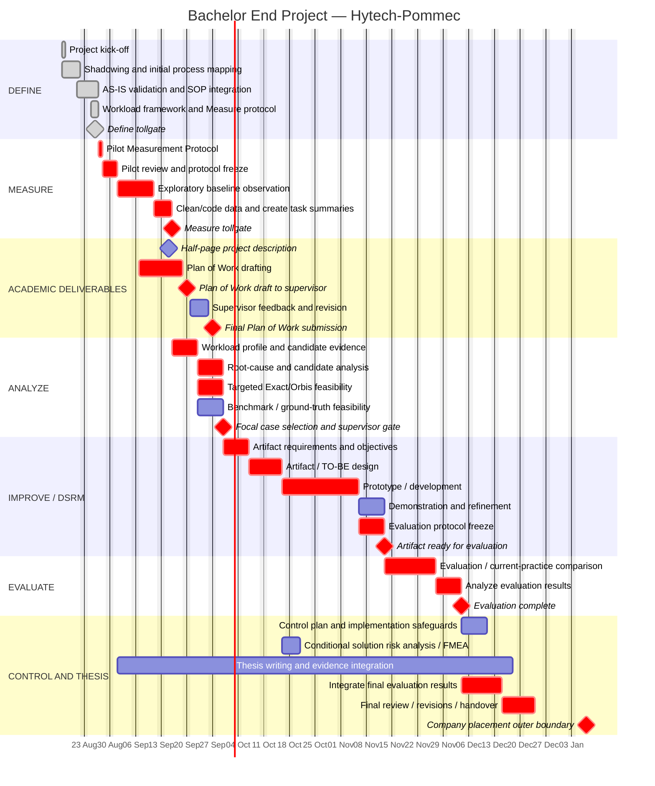

# Project Timeline / Gantt — Bachelor End Project

**Status:** Current planning draft, synchronized 26 August 2026.

**Purpose:** This file is the project-planning companion to `Project_Charter.md`. It turns the current DMAIC/DSRM sequence, supervisor milestones and known dependencies into a shareable Gantt chart. The Mermaid source can be copied into draw.io / diagrams.net for visual editing.

## Planning assumptions

- Project start: **17 August 2026**.
- Hytech-Pommec contract end / latest company-placement boundary: **7 January 2027**. The BEP/company work may finish earlier if the required project activities are completed and this is agreed with the relevant parties.
- Current project state: **Define largely complete; exploratory Measure begins with the next-working-day pilot**.
- Pilot: planned for **27 August 2026**; if the actual next working day changes, move this task and all dependent Measure tasks accordingly.
- The baseline observation window below is **provisional**. The exact observation coverage/sample window must be frozen after the pilot according to `methodology/Measurement_Protocol_v1.0.md`.
- Detailed Exact/Orbis production-data/interface feasibility is intentionally scheduled in **Analyze, after the exploratory Measure baseline**.
- Supervisor milestones from the 25 August meeting are fixed: **15 September half-page project description; 20 September Plan of Work draft; 27 September final Plan of Work submission**.
- Weekly academic supervision: **Thursday 15:00–16:00**, with agenda prepared/sent on Wednesday.
- Durations after Measure are **planning estimates**, because the final artifact and evaluation design depend on the selected focal case.
- FMEA is **not a mandatory timeline item**. A solution-risk analysis/FMEA is added during Improve/Control only if the selected intervention creates failure modes for which systematic risk prioritization is useful.

---

## Gantt chart

---

## Critical-path logic

The main dependency chain is:

`Pilot → Measurement protocol freeze → workload baseline → workload/candidate analysis → targeted Exact/Orbis feasibility → focal-case selection → artifact design/development → evaluation → final thesis integration / handover`

The Plan of Work is developed **in parallel** with Measure/Analyze and should be updated with the strongest evidence available at the time of each submission milestone.

The 7 January 2027 milestone is an **outer contractual boundary, not a required finish date**. If the artifact, evaluation, thesis/handover obligations and academic/company agreements allow it, the project may conclude earlier.

## DMAIC tollgate interpretation

| Tollgate | Planned evidence / decision |
|---|---|
| **Define → Measure** | AS-IS stable enough, scope/workload construct defined, protocol ready for pilot. |
| **Pilot → baseline** | Observation sheet usable; timing/task-switch rules workable; sampling/confidentiality rules frozen. |
| **Measure → Analyze** | Representative task-level workload profile with observation coverage, sample sizes and limitations. |
| **Analyze → Improve** | Focal activity selected based on workload, business relevance, standardizability, quality risk, expertise, technical/data feasibility and evaluation feasibility; supervisor aligned. |
| **Improve → Control** | Artifact evaluated with predeclared workload + quality measures; implementation controls defined. |

## How to edit visually in draw.io / diagrams.net

1. Open **app.diagrams.net**.
2. Create a new diagram and store it in Google Drive or OneDrive if you want a shareable collaborative file.
3. Choose **Arrange → Insert → Advanced → Mermaid** (menu wording can vary slightly by draw.io version).
4. Copy only the Mermaid code inside the fenced block above.
5. Insert it as an editable **Diagram**, not as a static image.
6. Adjust task labels, positions, sizing, styling and notes visually.
7. Share the Drive/OneDrive diagram link with the supervisor.

### Important synchronization rule

The Mermaid version in GitHub is the **planning source** until a visually edited draw.io copy becomes the supervisor-facing master. Once extensive manual visual edits are made in draw.io, do not assume that regenerating from Mermaid will preserve every manual position. If dates/dependencies change materially, update both the GitHub planning source and the supervisor-facing diagram.

## Items that are deliberately provisional

The following should be revised as evidence becomes available rather than treated as fixed promises:

- exact number of baseline observation days;
- exact Analyze duration;
- artifact-development duration (depends strongly on selected case);
- evaluation duration and participant/case requirements;
- whether the project finishes before the 7 January 2027 contractual boundary;
- official final BEP submission/presentation date if different from the company contract;
- whether FMEA is useful for the selected intervention.

The fixed dates currently known are the **15 / 20 / 27 September 2026 academic milestones** documented in the 25 August supervisor meeting notes and the **7 January 2027 Hytech-Pommec contract end**.
