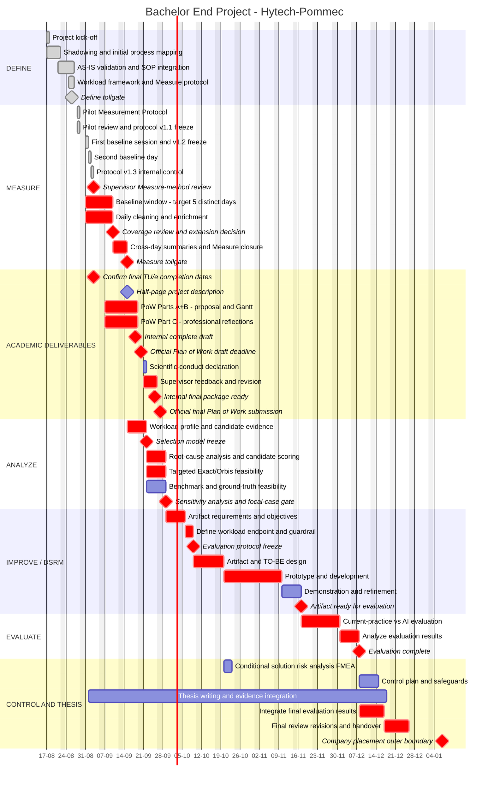

# Project Timeline / Gantt — Bachelor End Project

**Status:** Current planning draft, synchronized 2 September 2026.

**Purpose:** This file is the project-planning companion to `Project_Charter.md`. It turns the current DMAIC/DSRM sequence, supervisor milestones and known dependencies into a shareable Gantt chart. The Mermaid source can be copied into draw.io / diagrams.net for visual editing.

**Supervisor-facing visual master:** [Ganttchart.drawio.png](https://drive.google.com/file/d/1Qe29SYs5xBGpjUXFTREVlIS7x2jsy18P/view?usp=sharing). Keep this Drive copy synchronized with the Mermaid planning source below.

## Planning assumptions

- Project start: **17 August 2026**.
- Hytech-Pommec contract end / latest company-placement boundary: **7 January 2027**. The BEP/company work may finish earlier if the required project activities are completed and this is agreed with the relevant parties.
- Current project state: **Define largely complete; the pilot and two official baseline days are complete, and exploratory baseline collection continues under v1.3 from 2 September**. Current evidence totals 351 net observed minutes and 265 timed coded-active minutes.
- Pilot: completed on **28 August 2026**; v1.1 established the two-level architecture. The 31 August session led to v1.2. The 1 September session then exposed the post-MAX interpretation, stopping-rule and governance clarifications internally controlled in v1.3 from 2 September. Academic methodological review is scheduled for 3 September. Any supervisor-required change will be dated and versioned; earlier data remain usable unless the review identifies a material measurement-system validity problem.
- Official baseline observations began **31 August 2026**. The eight-day Gantt bar is the collection window, not a promise of eight observation days. The current planning minimum is meaningful coverage on **five distinct working days**, followed by the v1.3 Day-5 coverage review. The two completed partial days contribute evidence, but whether they count as two of the five days must be confirmed with the academic supervisor. Five days is not automatically 40 net observed hours; both days/windows and net minutes are reported.
- Detailed Exact/Orbis production-data/interface feasibility is intentionally scheduled in **Analyze, after the exploratory Measure baseline**.
- Supervisor milestones from the 25 August meeting are fixed: **15 September half-page project description; 20 September Plan of Work draft; 27 September final Plan of Work submission**. Internal complete-package targets are **18 September** for the draft and **25 September** for the final package. The attached template also requires five start-BEP professional-skill reflections (approximately 1,500–2,000 words total) and the scientific-conduct declaration; these are part of the submission workload.
- Weekly academic supervision: **Thursday 15:00–16:00**, with agenda prepared/sent on Wednesday.
- Durations after Measure are **planning estimates**, because the final artifact and evaluation design depend on the selected focal case.
- FMEA is **not a mandatory timeline item**. A solution-risk analysis/FMEA is added during Improve/Control only if the selected intervention creates failure modes for which systematic risk prioritization is useful.

---

## Gantt chart

The axis deliberately uses the numeric format `DD-MM` rather than abbreviated month names. Some embedded Mermaid renderers can display `%b` literally instead of converting it to a month abbreviation. Weekly ticks start on Monday to keep the chart readable when imported into draw.io.

---

## Critical-path logic

The main dependency chain is:

`Pilot → v1.2/v1.3 controlled baseline → five-day coverage review → workload/candidate analysis → targeted Exact/Orbis feasibility → veto gates + weighted/sensitivity-tested focal-case selection → evaluation-protocol freeze → artifact design/development → held-out evaluation → final thesis integration / handover`

The Plan of Work is developed **in parallel** with Measure/Analyze and should use the strongest evidence available at each submission milestone. The TU/e template requires a defensible prospective research method and detailed Gantt; it does not state that the focal use case must already be selected. Therefore the 27 September submission and a later focal-case gate are compatible only if the Plan of Work predefines the candidate population, veto/score method, evidence, decision owner, fallback and evaluation-freeze milestone. A provisional shortlist before submission is preferable.

The 7 January 2027 milestone is an **outer contractual boundary, not a required finish date**. If the artifact, evaluation, thesis/handover obligations and academic/company agreements allow it, the project may conclude earlier.

## DMAIC tollgate interpretation

| Tollgate | Planned evidence / decision |
|---|---|
| **Define → Measure** | AS-IS stable enough, scope/workload construct defined, protocol ready for pilot. |
| **Pilot → baseline** | Observation sheet usable; timing/task-switch rules workable; v1.3 sampling/coverage and private-repository governance controlled without changing live fields. |
| **Measure → Analyze** | Five distinct observation days plus a passed Day-5 coverage review; representative activity-family workload profile, with detailed Task-ID enrichment where justified, plus windows, net/coded-active time, case mix and limitations. |
| **Analyze → Improve** | Focal activity passes the non-compensable gates and wins/stays credible under pre-agreed weighted scoring and sensitivity analysis; supervisor aligned. |
| **Improve → Control** | Workload endpoint, meaningful threshold, quality rubric/guardrail and held-out evaluation design frozen before development/formal testing; artifact evaluated and implementation controls defined. |

## Recommended visual-editing workflow: draw.io / diagrams.net

For this **Gantt chart**, draw.io is the preferred visual editor.

1. Open **app.diagrams.net**.
2. Create a new diagram and store it in Google Drive or OneDrive if you want a shareable collaborative file.
3. Choose **Arrange → Insert → Mermaid** (or `+ → Mermaid`, depending on the editor version).
4. Copy only the Mermaid code inside the fenced block above.
5. Keep the default **Diagram** option so the result is inserted as native draw.io shapes rather than a static SVG image.
6. If the inserted diagram behaves as one locked Mermaid group, click the **unlock** icon or right-click and **Ungroup** when you want completely independent shape editing. Ungrouping removes the stored Mermaid source from that group, so keep the GitHub source as the canonical code version.
7. Adjust labels, positions, sizing and styling visually.
8. Share the Drive/OneDrive diagram link with the supervisor.

### Lucidchart limitation for this Gantt

Lucid can render Mermaid Gantt syntax, but Mermaid diagrams created through Lucid's **diagram-as-code / Mermaid editor** are rendered as an image and are edited by changing the code. Lucid also has a newer direct-paste feature that converts supported Mermaid elements into native Lucid shapes; however, unsupported elements/features are retained as static SVGs. In practice, a Gantt may therefore not become fully shape-editable even when the same Mermaid code renders correctly.

For that reason, use **draw.io as the supervisor-facing visual master** for this Gantt rather than relying on Lucid for direct bar-by-bar editing.

### Important synchronization rule

The Mermaid version in GitHub is the **planning source** until a visually edited draw.io copy becomes the supervisor-facing master. Once extensive manual visual edits are made in draw.io, do not assume that regenerating from Mermaid will preserve every manual position. If dates/dependencies change materially, update both the GitHub planning source and the supervisor-facing diagram.

## Items that are deliberately provisional

The following should be revised as evidence becomes available rather than treated as fixed promises:

- whether the two completed partial days count as two of the five distinct observation days and whether the Day-5 coverage review requires targeted extension;
- exact Analyze duration;
- artifact-development duration (depends strongly on selected case);
- evaluation duration and participant/case requirements after the predevelopment protocol freeze;
- whether the project finishes before the 7 January 2027 contractual boundary;
- Part D signing/logistics and the official final BEP submission/presentation date if different from the company contract;
- whether FMEA is useful for the selected intervention.

The fixed dates currently known are the **15 / 20 / 27 September 2026 academic milestones** documented in the 25 August supervisor meeting notes and the **7 January 2027 Hytech-Pommec contract end**.
