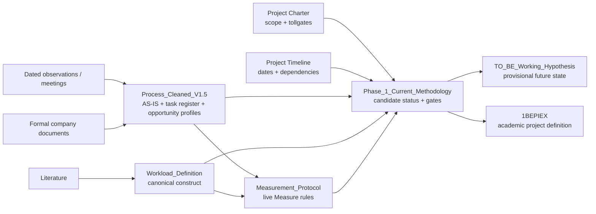

# Project Documentation Navigation — Bachelor End Project

**Last synchronized:** 28 August 2026

Use this page as the main navigation map for the BEP repository. It shows **where to look for each type of information**, which file owns the current status, and where useful context is intentionally retained.

---

# 1. Quick navigation by question

| If you want to know... | Go to... | Role |
|---|---|---|
| What are the current project-control decisions, scope and DMAIC tollgates? | [`Project_Charter.md`](Project_Charter.md) | Lightweight project charter / control summary |
| What is the current project schedule and Gantt? | [`Project_Timeline.md`](Project_Timeline.md) | DMAIC/DSRM timeline, dependencies, milestones and contract boundary |
| What is the current academic project scope, objective and research question? | [`proposal/BEP_Assignment_1BEPIEX.md`](proposal/BEP_Assignment_1BEPIEX.md) | Current readable academic project definition |
| Where is the Word submission/use copy? | [`proposal/BEP_Assignment_1BEPIEX_Final.docx`](proposal/BEP_Assignment_1BEPIEX_Final.docx) | Binary Word copy retained for external use/submission |
| What does the purchasing process currently look like in practice? | [`process/Process_Cleaned_V1.5.md`](process/Process_Cleaned_V1.5.md) | Current AS-IS operational master |
| Which improvement areas are interesting and why? | [`process/Process_Cleaned_V1.5.md`](process/Process_Cleaned_V1.5.md) | Operational opportunity profiles and evidence context |
| Which candidates are currently prioritized and what gates determine selection? | [`methodology/Phase_1_Current_Methodology.md`](methodology/Phase_1_Current_Methodology.md) | Authoritative candidate-selection and research-method status |
| What does workload mean in this BEP? | [`methodology/Workload_Definition.md`](methodology/Workload_Definition.md) | Canonical workload construct |
| How will the exploratory Measure observations actually be collected? | [`measurement/Measurement_Protocol_v1.1.md`](measurement/Measurement_Protocol_v1.1.md) | Live observation, timing, sampling and data-governance protocol |
| What should I keep beside me during live shadowing? | [`measurement/Measure_Live_Cheat_Sheet_v1.1.md`](measurement/Measure_Live_Cheat_Sheet_v1.1.md) | One-page activity codes, shorthand and live-use rules |
| Where are all Measure-phase collection materials kept? | [`measurement/`](measurement/) | Dedicated Measure folder with current/historical protocols, pilot evidence and observer materials |
| What formal purchasing SOPs / work instructions support the analysis? | [`company-documentation/Official_Document_Register_2026-08-21.md`](company-documentation/Official_Document_Register_2026-08-21.md) | Formal-company-evidence register |
| What could the future process look like? | [`process/TO_BE_Working_Hypothesis_v0.1.md`](process/TO_BE_Working_Hypothesis_v0.1.md) | Provisional TO-BE hypothesis, not a selected final design |
| Which literature is currently confirmed, likely or conditional? | [`../literature/README.md`](../literature/README.md) | Literature selection and source-role register |
| What happened on a specific observation / meeting date? | [`meetings/`](meetings/) | Historical evidence snapshots |
| Where are earlier exploratory notes and ideas? | [`research-notes/`](research-notes/) | Historical / supporting research material |

---

# 2. Current core documents

## A. Project control and planning

### [`Project_Charter.md`](Project_Charter.md)
One-page Define-phase control record. It freezes the business problem, AI/business direction, scope, outcome structure, stakeholders and DMAIC tollgates without duplicating the detailed methodology.

The current sequencing is explicit:

`pilot → freeze measurement protocol → exploratory workload baseline → Analyze/technical feasibility → focal-case selection → DSRM artifact`

Detailed Exact/Orbis production-data/interface feasibility is intentionally **deferred until after the exploratory Measure phase**.

### [`Project_Timeline.md`](Project_Timeline.md)
Current Gantt/planning source. It contains:

- completed Define work;
- the Measure pilot and baseline sequence;
- the known 15 / 20 / 27 September academic milestones;
- Analyze, targeted Exact/Orbis feasibility and focal-case selection;
- Improve/DSRM, evaluation and Control/thesis work;
- the **7 January 2027 Hytech-Pommec contract end as the outer company-placement boundary**.

The project may conclude before that boundary if the required work is completed and this is agreed. Post-Measure task durations are planning estimates and should be refined after the focal case is selected.

The Mermaid Gantt can be copied into draw.io / diagrams.net for visual editing and supervisor sharing.

---

## B. Academic project definition

### [`proposal/BEP_Assignment_1BEPIEX.md`](proposal/BEP_Assignment_1BEPIEX.md)
Use for the current readable project title, context, problem description, objective, provisional research question, sub-questions, research design and communication expectations.

The Word file remains beside it as the external/submission copy. The Markdown version is the easier repository source to keep synchronized when framing changes.

---

## C. Current AS-IS process and operational evidence

### [`process/Process_Cleaned_V1.5.md`](process/Process_Cleaned_V1.5.md)
Main current-state purchasing document. It contains:

- process scope;
- evidence basis and labels;
- current AS-IS workflow;
- detailed stage explanations;
- 31-row Step / Task Register;
- observed timing/evidence context;
- improvement-opportunity profiles;
- validation status;
- unresolved AS-IS facts;
- current operational interpretation.

**Important:** this file may retain useful opportunity/context explanations even when the authoritative candidate ranking itself lives in the methodology file. Operational reasoning should not be deleted merely to eliminate all overlap.

### [`process/TO_BE_Working_Hypothesis_v0.1.md`](process/TO_BE_Working_Hypothesis_v0.1.md)
Contains the provisional future-state AUTO / REVIEW / MANUAL routing concept and technology-allocation logic.

This is a **hypothesis**, not a conclusion from DMAIC Improve.

---

## D. Research methodology, workload and Measure protocol

### [`methodology/Phase_1_Current_Methodology.md`](methodology/Phase_1_Current_Methodology.md)
Authoritative file for:

- DMAIC and DSRM relationship;
- candidate status;
- Measure- and Analyze-stage decision gates;
- case-selection logic;
- evaluation logic by problem type;
- immediate research actions.

Candidate names are used rather than reusable letter IDs to avoid cross-file ambiguity.

### [`methodology/Workload_Definition.md`](methodology/Workload_Definition.md)
Canonical workload definition. The project currently uses:

- **Bowling & Kirkendall (2012)** for the broad occupational-workload umbrella (amount and difficulty of work);
- **Spector & Jex (1998)** as a conceptual anchor for quantitative workload and organizational constraints;
- **Young et al. (2015)** specifically for mental workload;
- expertise dependence as a separate analytical dimension.

The project does not create an unvalidated composite `total workload` equation.

### [`measurement/Measurement_Protocol_v1.1.md`](measurement/Measurement_Protocol_v1.1.md)
Operationalizes the exploratory Measure baseline after the 28 August pilot.

It defines:

- broad live activity families (`REQ`, `CLAR`, `DEC`, `PO`, `CHECK`, `SEND`, `EXC`, `OTHER`);
- `TIME`, `TALLY` and `TIME IF` rules at the live-coding level;
- post-session mapping to the detailed 31-task register with confidence codes;
- active processing time versus elapsed time;
- interruption attribution, system-wait and non-purchasing-work rules;
- separate `J` and `EXP` evidence;
- observation-session headers, case-ID continuity and `MISS` handling;
- small-sample safeguards and matched-denominator rules for rework;
- anonymized case-ID and confidentiality rules;
- activity-family baseline outputs with detailed Task-ID analysis where justified.

Version 1.1 is the frozen baseline-ready protocol for official observations from 31 August. Use [`Measure_Live_Cheat_Sheet_v1.1.md`](measurement/Measure_Live_Cheat_Sheet_v1.1.md) beside the live sheet. Exact/Orbis technical feasibility is not required to start this Measure baseline.

Pilot evidence is retained with the Measure materials in [`measurement/Pilot_Measure_Observation_2026-08-28.md`](measurement/Pilot_Measure_Observation_2026-08-28.md).

---

## E. Formal company evidence

### [`company-documentation/Official_Document_Register_2026-08-21.md`](company-documentation/Official_Document_Register_2026-08-21.md)
Register and analytical summary of the received purchasing SOPs, supplier-control documents, article-management instruction and related company documentation.

The proprietary source files themselves are not stored in the repository. This file records what the formal documentation supports and where operational practice goes beyond the level of detail of the SOP.

---

## F. Literature

### [`../literature/README.md`](../literature/README.md)
Tracks the confirmed, high-chance and conditional literature and states where each source supports the BEP.

### [`../literature/open-access/`](../literature/open-access/)
Contains permitted open-access / author-posted papers already collected for the project.

---

# 3. Historical and supporting evidence

## [`meetings/`](meetings/)
Dated evidence should remain historically accurate and should **not be rewritten to match later understanding**.

Current files include:

- [`Academic_Supervisor_Meeting_Notes_2026-08-25.md`](meetings/Academic_Supervisor_Meeting_Notes_2026-08-25.md)
- [`Internship_notes_2026-08-17.md`](meetings/Internship_notes_2026-08-17.md)
- [`Internship_notes_2026-08-19.md`](meetings/Internship_notes_2026-08-19.md)
- [`Internship_notes_2026-08-20.md`](meetings/Internship_notes_2026-08-20.md)
- [`Internship_notes_2026-08-21.md`](meetings/Internship_notes_2026-08-21.md)
- [`Internship_notes_2026-08-28.md`](meetings/Internship_notes_2026-08-28.md)
- [`Meeting notes supervisor 2026-06-10.docx`](meetings/Meeting%20notes%20supervisor%202026-06-10.docx)

Use these files when traceability matters: what was observed, stated or believed at a specific point in time.

## [`research-notes/`](research-notes/)
Contains earlier exploratory research material. These notes can contain useful ideas and historical reasoning even when they are no longer authoritative for current project status.

---

# 4. Ownership without information loss

The repository uses a **primary-owner** model, not a strict "delete all duplication" model.

A topic should have one file that determines its **current authoritative status**, while other files may retain useful context when they serve a different purpose.

Examples:

- `Process_Cleaned_V1.5.md` can explain **why price checking is operationally interesting**; `Phase_1_Current_Methodology.md` determines whether price checking is currently a primary thesis candidate.
- `Process_Cleaned_V1.5.md` documents the maximalisatie process; the methodology file owns the research gates for selecting/studying it.
- `Measurement_Protocol_v1.1.md` owns live data-collection rules; the methodology file owns why those measurements are needed for case selection.
- `Project_Timeline.md` owns the current planning sequence and dates; dated meeting notes remain the evidence source for agreed milestones.
- Meeting notes preserve what was known on the meeting date even when later evidence changes the current AS-IS master.
- The company-document register explains what the SOP formally supports; the AS-IS file explains what people actually do operationally.

Useful evidence, interpretations and candidate profiles should therefore **not be removed simply because related material exists elsewhere**.

---

# 5. Update rules

When new evidence arrives:

1. preserve the dated observation/meeting note as historical evidence;
2. update `Project_Charter.md` only when project-control decisions, scope or tollgates genuinely change;
3. update `Project_Timeline.md` when agreed milestones, planning assumptions, dependencies or the contract/project boundary changes;
4. update `Process_Cleaned_V1.5.md` when the current workflow, operational evidence, task inventory, operational interpretation or opportunity profile changes;
5. update `Phase_1_Current_Methodology.md` when candidate priority, research design, selection gates or evaluation logic changes;
6. update `Workload_Definition.md` only when the theoretical workload construct changes;
7. treat `Measurement_Protocol_v1.1.md` as the frozen official baseline protocol; after baseline freeze, document/version any necessary deviations rather than silently rewriting rules;
8. update the company-document register when new formal SOP/WI evidence is received or reinterpreted;
9. update the TO-BE file when the provisional future-state architecture changes;
10. update the readable BEP assignment when a major research-scope/framing change requires academic alignment;
11. preserve useful context unless it is factually obsolete, contradicted by stronger evidence, confidentially inappropriate, or genuinely redundant without analytical value.

---

# 6. Current document flow

Current practical progression:

`Define / AS-IS → pilot → frozen Measure protocol → workload baseline → Analyze + targeted Exact/Orbis feasibility → focal case selection → DSRM artifact / TO-BE → evaluation → Control recommendations → final thesis / handover`
