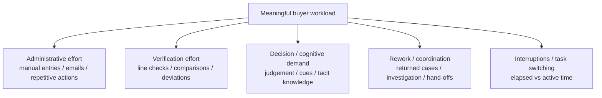
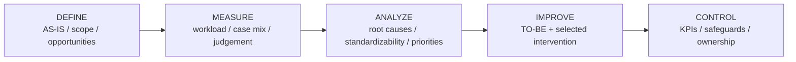
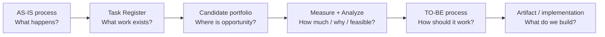
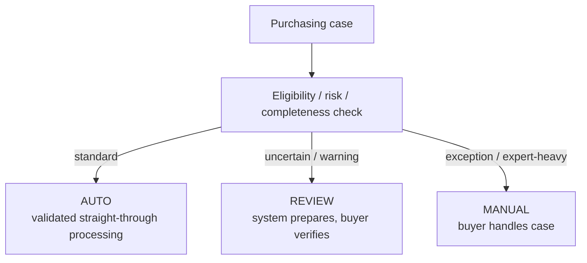
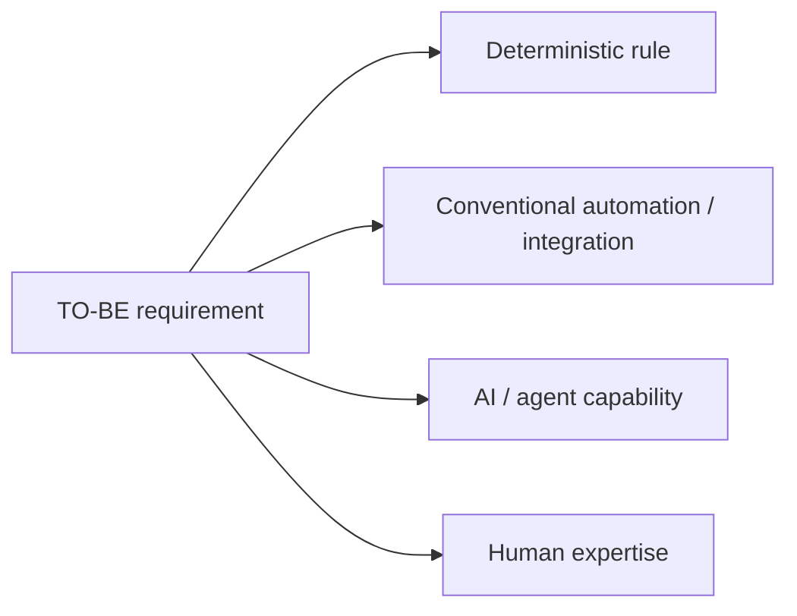
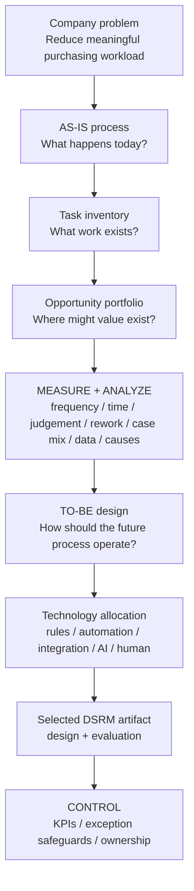

# Academic Supervisor Meeting Brief — 25 August 2026

**Purpose:** Present the BEP clearly to someone who is new to the project, show the current status, and obtain methodological guidance before structured Measure-phase observations begin.

**Current project stage:** Transition from **Define → Measure**.

---

## Quick navigation

Use these links during the meeting instead of searching through the repository.

| Topic | One-click source |
|---|---|
| Original / approved BEP assignment | [Open proposal](../proposal/BEP_Assignment_1BEPIEX_Final.docx) |
| Current AS-IS process | [Open AS-IS workflow](../process/Process_Cleaned_V1.0.md#4-current-as-is-workflow) |
| Step / Task Register | [Open task inventory](../process/Process_Cleaned_V1.0.md#6-step--task-register) |
| Current improvement opportunities | [Open Section 7 candidate portfolio](../process/Process_Cleaned_V1.0.md#7-current-candidate-portfolio) |
| Current methodology / candidate status | [Open methodology](../methodology/Phase_1_Current_Methodology.md) |
| Process-layer explanation | [Open process README](../process/README.md) |
| Current TO-BE hypothesis | [Open TO-BE hypothesis](../process/TO_BE_Working_Hypothesis_v0.1.md) |
| Formal SOP / work-instruction evidence | [Open official document register](../company-documentation/Official_Document_Register_2026-08-21.md) |
| Week-1 observation evidence | [17 Aug](./Internship_notes_2026-08-17.md) · [19 Aug](./Internship_notes_2026-08-19.md) · [20 Aug](./Internship_notes_2026-08-20.md) · [21 Aug](./Internship_notes_2026-08-21.md) |

---

# 1. What is this project?

### 30-second explanation

> The project studies operational purchasing at Hytech-Pommec with the goal of reducing meaningful buyer workload. I first map and measure the existing purchasing process, then identify where process improvement, automation or AI support can create value, and ultimately develop and evaluate one suitable intervention.

The company-level objective is broader than building one AI tool. The aim is to reduce unnecessary administrative effort, repetitive verification, avoidable rework and information-handling burden while preserving or supporting work that depends on purchasing expertise.

The thesis-level objective is narrower: after sufficient evidence is collected, select one high-value process component or activity and design/evaluate a suitable digital or AI-supported artifact.

**If more detail is needed:** [Open proposal](../proposal/BEP_Assignment_1BEPIEX_Final.docx) · [Open current methodology](../methodology/Phase_1_Current_Methodology.md)

---

# 2. What actually happens today?

The current AS-IS backbone is approximately:

```text
Purchasing need
      ↓
Validate / investigate information
      ↓
Assess stock, demand, open POs, lead time, urgency
      ↓
Order now vs hold / maximalisatie
      ↓
Exact Advies → Toewijzen
      ↓
Relevant pre-PO price check / correction
      ↓
Prepare PO / consolidate supplier demand
      ↓
Authorization / Fiatteren / Verrichten
      ↓
PO generated and sent to supplier
      ↓
Supplier confirmation
      ↓
Compare confirmation with PO / Exact
      ↓
Correct deviations if needed
      ↓
Archive + Bevestigd
      ↓
Possible Finance-returned rework
```

Do **not** explain every Exact status during the meeting unless asked. The purpose is to show enough of the workflow for the supervisor to understand where workload occurs.

### Useful examples from the task inventory

| Work type | Example |
|---|---|
| Administrative | Entering external purchasing information / forwarding a generated PO |
| Verification | Comparing supplier confirmation prices with PO / Exact |
| Judgement | Order now vs hold / maximalisatie |
| Investigation | Searching historical POs to resolve suspicious information |
| Rework | Investigating a discrepancy returned by Finance |

**One-click evidence:** [Open AS-IS workflow](../process/Process_Cleaned_V1.0.md#4-current-as-is-workflow) · [Open Step / Task Register](../process/Process_Cleaned_V1.0.md#6-step--task-register)

---

# 3. What problem am I actually trying to reduce?

A key learning from Week 1 is that **workload should not be represented only by stopwatch time**.

Some repetitive administrative or verification tasks can consume many minutes. Other important purchasing decisions can happen in seconds but still depend on experience, interpretation and tacit knowledge.

Current working workload model:



Therefore **time is one measure of workload, not the complete definition of workload**.

For cognitive micro-decisions that occur too quickly to time meaningfully, the plan is to measure the surrounding decision episode and capture occurrence, outcome, cues/reasons and judgement requirement rather than inventing false timing precision.

---

# 4. How am I investigating it?

## DMAIC — broader process-improvement structure



DMAIC structures the **company process-improvement engagement**.

## DSRM — artifact development and evaluation

If Improve results in a digital or AI artifact, DSRM structures its development and evaluation:

```text
Problem identification
      ↓
Objectives
      ↓
Design / development
      ↓
Demonstration
      ↓
Evaluation
      ↓
Communication
```

Working methodological interpretation:

> **DMAIC determines what should be improved in the purchasing process. DSRM structures the design and evaluation of the selected artifact inside the Improve stage.**

**One-click source:** [Open current methodology](../methodology/Phase_1_Current_Methodology.md)

---

# 5. Where am I right now?

The project is moving from **Define into Measure**.

| DEFINE — largely established | MEASURE — next evidence needed |
|---|---|
| Company problem / scope | Task and case frequency |
| AS-IS workflow | Active processing time |
| Step / Task Register | Elapsed time / interruption effect |
| Formal SOP comparison | Volume / PO lines |
| Initial opportunity portfolio | Verification deviations |
| Key open process questions | Rework frequency / causes |
| Initial TO-BE hypothesis | Decision/judgement characteristics |
|  | Standard vs exception characteristics |
|  | Exact/Orbis/data availability |

The final thesis artifact should **not yet be frozen** purely from Week-1 observations.

The purpose of Measure is to establish what actually contributes meaningful workload and which work is repetitive, standardizable, judgement-heavy, risky or data-constrained.

---

# 6. What currently looks promising?

The current candidate portfolio contains **improvement opportunities**, not final solutions.

### Strong active candidates

- **Order timing & consolidation** — buy now vs hold, maximalisatie, stock/demand/open-PO/lead-time trade-offs.
- **Purchase-price control** — repeated manual comparisons with measurable discrepancy outcomes.

### Real problems needing more evidence

- **Request intake & validation** — manual entry, incomplete/suspicious information, historical investigation.
- **Finance rework** — returned discrepancies and unclear downstream rework burden.

### Supporting / quick-win opportunities

- `Advies / Toewijzen` process support.
- Manual PO supplier communication / forwarding.

The methodology file is the current authoritative source for candidate status.

**One-click source:** [Open current candidate portfolio](../methodology/Phase_1_Current_Methodology.md#5-current-candidate-portfolio)

### Important relationship



This prevents confusing **Section 7 opportunities** with the **TO-BE result**.

---

# 7. Where could this eventually go?

A current TO-BE hypothesis is an exception-based flow:



This is **not the selected final solution**.

Measure and Analyze need to determine whether enough work is genuinely standard and repeatable for this architecture to make sense.

If supported by evidence, the redesigned process could then assign each step to the mechanism that fits best:



Examples:

- authorization thresholds → deterministic rule;
- Exact data retrieval → system integration;
- standard PO execution → conventional automation;
- unstructured request interpretation → possible AI use;
- ambiguous/high-risk technical cases → human buyer;
- multi-tool coordination → possible AI-agent orchestration.

**One-click source:** [Open TO-BE working hypothesis](../process/TO_BE_Working_Hypothesis_v0.1.md)

---

# 8. Proposed Measure approach after the meeting

## Execution / verification work

Examples: PO entry, price checking, confirmation checking, corrections, Finance rework.

Measure where practical:

- frequency;
- active time;
- elapsed time;
- number of PO lines / volume;
- deviations;
- rework;
- interruptions / task switches.

## Judgement-heavy work

Examples: buy/hold, maximalisatie, suspicious information validation.

Measure where practical:

- occurrence;
- decision / outcome;
- information checked;
- short cue/reason when obtainable;
- judgement requirement;
- exception / unusual characteristic;
- consequence / importance where a defensible scale is defined.

For decisions that are too fast to isolate:

> **Duration: embedded in overall case / not separately measurable.**

## Exploratory standard-vs-exception characteristics

Do not prematurely label a case as “automatable.” Instead observe characteristics such as:

- known vs new article;
- known supplier;
- missing information;
- special drawing / PDF / technical specification;
- configured component;
- price deviation;
- unusual quantity or delivery condition;
- historical investigation required;
- technical judgement required.

These characteristics can later support a defensible standard / review / manual classification.

---

# 9. Questions to ask the academic supervisor

### Q1 — Methodology

> Is **DMAIC for the broader process-improvement project + DSRM for the selected artifact** a defensible methodological combination for this BEP?

### Q2 — Scope / timing of case selection

> Should I narrow immediately to one isolated use case, or is it acceptable to first Measure/Analyze the broader purchasing process and select the artifact from the evidence?

### Q3 — TO-BE-first logic

> Is it academically valid to redesign the future purchasing workflow first and then determine where deterministic rules, conventional automation, AI/agents and human judgement should be used?

### Q4 — Workload measurement

> Is the proposed multidimensional measurement approach defensible: frequency/time/volume for execution work, while judgement tasks are measured through occurrence, outcome, cues and expertise requirements rather than only timing?

### Q5 — Artifact freeze gate

> What evidence would you want to see before I freeze the final thesis case and artifact?

### Q6 — Company interpretation

> The company request could mean either putting AI inside the existing workflow or using process/AI analysis to design a more effective future workflow. Should I explicitly clarify this distinction with the company before narrowing the research question?

---

# 10. What not to spend meeting time on unless asked

Keep these as supporting evidence rather than the main story:

- every Exact status;
- all 27 Step IDs;
- every SOP detail;
- exact authorization thresholds;
- every Week-1 timing observation;
- all previously considered candidates;
- detailed supplier-selection evidence;
- detailed technical AI architecture.

If the supervisor asks for evidence, navigate using the links at the top of this file.

---

# 11. One-picture meeting story



---

# 12. Desired outcome of the meeting

The meeting does **not** need to determine the final AI system.

A successful outcome is clarity on:

1. whether the overall DMAIC + DSRM logic is defensible;
2. whether broad Measure/Analyze before final case selection is acceptable;
3. whether process-redesign-first is an acceptable thesis direction;
4. which workload constructs and case characteristics should be measured;
5. what evidence threshold should trigger final artifact selection.

After that clarification, the structured Measure phase can start with a more stable protocol.
