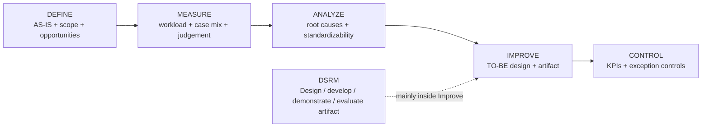

# Phase 1 — Current Methodology and Case-Selection Status

**Status:** Current research-method and case-selection source of truth, synchronized 24 August 2026.

**Ownership:** This file owns the research framework, measurement design, candidate portfolio, selection gates, evaluation logic and current research actions.

Related sources:

- AS-IS process and open process facts: `docs/process/Process_Cleaned_V1.5.md`
- Canonical workload definition: `docs/methodology/Workload_Definition.md`
- Formal company evidence: `docs/company-documentation/Official_Document_Register_2026-08-21.md`
- Working TO-BE hypothesis: `docs/process/TO_BE_Working_Hypothesis_v0.1.md`

---

# 1. Project objective

The company-level objective is to reduce meaningful workload in operational purchasing by reducing unnecessary administrative effort, repetitive verification, avoidable rework and information-handling burden while preserving or supporting work that depends on purchasing expertise.

The thesis-level objective is to select one high-value purchasing activity or coherent TO-BE process component and design and evaluate a digital or AI-supported artifact for that focus.

Selecting one thesis case does not remove other improvement opportunities from the wider company improvement portfolio.

---

# 2. Research structure

## DMAIC — process-improvement framework

DMAIC structures improvement of the existing purchasing process:

- **Define:** scope, stakeholders, AS-IS process and initial opportunity areas.
- **Measure:** establish workload, frequency, case mix, complexity, rework, interruptions and relevant performance data.
- **Analyze:** identify root causes, standardizability, constraints and which work should be eliminated, simplified, standardized, automated or supported.
- **Improve:** design evidence-based TO-BE alternatives and develop the selected artifact.
- **Control:** define KPIs, ownership, exception controls and implementation safeguards.

DMAIC fits because the project improves an **existing** process rather than designing a completely new process from scratch.

## DSRM — artifact design and evaluation

If a digital/AI artifact is developed, its design and evaluation follow DSRM:

`problem identification → objectives → design/development → demonstration → evaluation → communication`

DSRM mainly supports DMAIC's Improve stage.

## Visualizations of DMAIC&DSRM

Within this structure:

- `Process_Cleaned_V1.5.md` mainly supports **Define** and the transition into Measure;
- Section 7 provides the opportunity portfolio to be tested in **Measure/Analyze**;
- `TO_BE_Working_Hypothesis_v0.1.md` is an early **Improve hypothesis**, not yet an Improve conclusion;
- the final digital/AI artifact should be selected after the evidence supports a specific TO-BE intervention.

---

## CTA-informed elicitation

Cognitive Task Analysis-informed questioning is used for tacit buyer expertise, especially the small-order/maximalisatie/hold sequence, suspicious-information recognition, exceptions and override reasoning. For small/non-urgent requirements, elicitation should capture how the buyer searches for additional same-supplier demand, what makes consolidation useful enough to proceed, when a requirement is held, and what later causes it to be reconsidered.

## Human-AI reliance

Judge-Advisor System / reliance concepts remain conditional. They become relevant only if the final artifact gives advice that a buyer can accept, modify or reject.

---

# 3. Measure design

Workload is interpreted according to **Young et al. (2015)** through `Workload_Definition.md`; the theoretical definition is not repeated here.

For relevant cases, record where practical:

`Task ID | Trigger | Order type | # lines | Active time | Elapsed time | Manual actions | Rework | Interruption/task switch | Judgement required | Uncertainty/exception | Experience/tacit knowledge needed | Output`

Use the following measurement principles:

1. **Active processing time and elapsed time remain separate.** Week-1 timings are single-case elapsed observations, not representative averages.
2. **Frequency × representative active time** can estimate operational effort volume for comparable tasks, but is not a total mental-workload score.
3. For judgement-heavy tasks, capture **decision + cues + reason** rather than trying to time invisible cognition to the second.
4. Transaction complexity should be retained where relevant, for example PO-line count, information sources, deviation count or exception type.
5. Exploratory TO-BE case labels may be recorded as `Standard candidate`, `Review candidate`, `Manual / exception` or `Unknown`; these labels do not yet prove automation feasibility.

---

# 4. Current candidate portfolio

This is the **only current candidate-status table**. The AS-IS process file retains all tasks even when they are not thesis candidates.

## 4.1 Active primary-case candidates

| Candidate | Current reason | Main evidence gates | Possible artifact direction |
|---|---|---|---|
| **A. Order timing & supplier-order consolidation** | Repeated judgement-intensive activity involving stock, future demand, open POs, lead time, urgency and maximalisatie. Small/non-urgent requirements can first trigger a search for additional same-supplier demand; holding is one possible outcome when useful consolidation is not currently available. | workload contribution, frequency, Exact/Orbis data availability, CTA decision rules, defensible benchmark | decision / information / optimization support |
| **B. Purchase-price control** | Repeated manual verification with measurable discrepancy outcomes, both pre-PO and post-confirmation | frequency, line complexity, active time, deviation rate, attention demand, supplier/Exact data feasibility | automated retrieval/comparison, stale-price/deviation support |
| **E. Standard/exception process redesign** | Promising process-level hypothesis if a meaningful share of cases is repeatable and safely classifiable | standard-case share, exception boundary, addressable workload, system/data feasibility, evaluation feasibility | exception-based workflow with rules/automation/AI where justified |

The detailed AUTO / REVIEW / MANUAL future-state hypothesis is maintained only in `TO_BE_Working_Hypothesis_v0.1.md`.

## 4.2 Active but evidence-insufficient candidates

| Candidate | Current position | Main evidence needed |
|---|---|---|
| **C. Request intake & validation** | Real information-quality/tacit-knowledge burden observed | frequency, investigation time, error types, business impact |
| **D. Finance-returned rework** | Potentially avoidable rework / weak hand-off | return frequency, causes, investigation time, Finance detection method |

## 4.3 Supporting improvement opportunities, not current primary thesis candidates

| Topic | Current position |
|---|---|
| **Exact Advies / Toewijzen** | Important system/process-control topic; `Toewijzen` is primarily an assignment/control action rather than a stand-alone optimization problem |
| **PO supplier communication** | Clear repetitive quick win / semi-automation opportunity; likely too narrow as the primary thesis case unless volume shows substantial total burden |

## 4.4 Ruled out / deprioritized

### Supplier selection

Supplier selection is removed from the active Arnold-focused portfolio. The operational buyer stated that suppliers are usually predetermined or selected elsewhere, and the formal ownership/control structure is documented in `Official_Document_Register_2026-08-21.md`.

It remains background procurement context, not a default operational-buyer workload case.

---

# 5. Decision-critical gates before final case selection

1. **Workload baseline:** which candidate contributes the most meaningful workload under the Young et al. framework as well as operational effort?
2. **Case-mix baseline:** what share of relevant cases is standard, reviewable or genuinely manual/exceptional?
3. **Exact/Orbis data availability:** which fields and histories are reliably accessible?
4. **Exact `Advies` logic:** what determines advised quantities and how operationally relevant is it?
5. **Small-order/maximalisatie/hold logic:** what rules, cues and trade-offs determine whether additional same-supplier demand is searched, which demand is useful to consolidate, whether the resulting order proceeds, and when a held requirement is reconsidered?
6. **Price-control baseline:** frequency, active time, line complexity, deviation rate and verification demand.
7. **Finance rework:** frequency, root causes and investigation burden.
8. **Technical feasibility:** usable supplier-price sources and Exact/Orbis interfaces.
9. **Standard-case boundary:** which case characteristics can be expressed reliably as rules, and which require AI or human judgement?
10. **Exception safety:** can unusual/high-risk cases be detected before automatic execution?
11. **Evaluation feasibility:** sufficient repeated cases, defensible reference/ground truth and participant access.
12. **University-supervisor alignment:** confirm the final case and evaluation design before freezing artifact scope.

Unresolved facts about the **current process itself** are maintained in Section 5 of `Process_Cleaned_V1.5.md`, not duplicated here.

---

# 6. Evaluation logic by problem type

## Optimization / decision-support case

Possible measures:

- decision quality against a defensible benchmark;
- constraint violations;
- consistency;
- active processing time;
- workload change using measures consistent with Young et al.;
- human override/reasoning where relevant.

## Verification / detection case

Possible measures:

- accuracy;
- precision/recall where appropriate;
- false positives/negatives;
- deviations detected;
- processing time;
- workload change;
- consistency.

## Exception-based automation / process-redesign case

Possible measures:

- standard-case classification accuracy;
- exception-detection recall;
- exception escape rate;
- PO/output accuracy against trusted reference cases;
- percentage eligible for straight-through processing;
- correction/review rate;
- active buyer effort avoided;
- effect on remaining attention/judgement demand;
- false-positive review burden.

The selected problem type determines the final evaluation design. Processing-time reduction alone should not automatically be reported as mental-workload reduction.

---

# 7. Immediate research actions

1. Collect structured baseline observations without timing every click.
2. Obtain normal PO/line volumes and relevant historical fields from Exact where possible.
3. Clarify Exact/Orbis access and `Advies` logic with IT.
4. Continue CTA-informed elicitation around real small-order/maximalisatie/hold cases, including how same-supplier demand is searched and what triggers later reconsideration of a held requirement.
5. Measure pre-PO and post-confirmation price control separately.
6. Collect and categorize Finance-returned cases.
7. Explore Standard / Review / Manual case classification without treating it as proven automation feasibility.
8. Estimate addressable operational effort where appropriate while keeping it distinct from mental workload.
9. Reassess the candidate portfolio against workload, standardizability, business value, data availability, evaluation quality, implementation risk and required human expertise.
10. Select one primary thesis artifact with the university supervisor.
