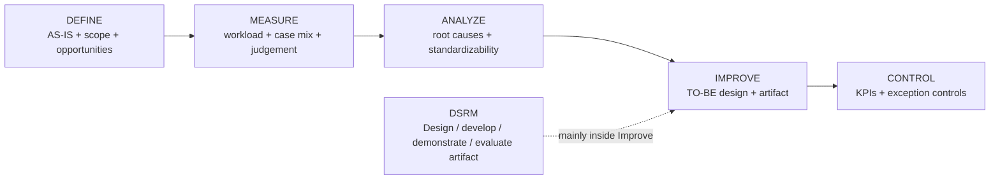

# Phase 1 — Current Methodology and Case-Selection Status

**Status:** Current working source of truth, synchronized 24 August 2026.

This file replaces the earlier `v0.1`–`v0.5` working drafts. Those revisions remain recoverable through Git history but should no longer be treated as active project status.

The canonical workload definition for the project is maintained in `docs/methodology/Workload_Definition.md` and follows **Young et al. (2015)**.

---

# 1. Project objective

The company-level objective is to reduce workload in operational purchasing by identifying and reducing unnecessary administrative effort, repetitive verification, avoidable rework and information-handling burden, while preserving or supporting activities that depend on purchasing expertise.

The thesis-level objective is to select one high-value purchasing activity or coherent TO-BE process component and design and evaluate a digital or AI-supported artifact for that focus.

Selecting one primary thesis case does not mean other improvement opportunities disappear. They remain part of the company improvement portfolio.

A new working distinction is now explicit:

- **process redesign** determines what the future purchasing process should look like;
- **technology selection** then determines whether each redesigned step should use deterministic rules, conventional automation, AI/agent capabilities, or human expertise.

An AI agent is therefore a possible implementation mechanism, not an assumed starting point.

---

# 2. Research structure

## DMAIC — broader process-improvement framework

DMAIC structures the improvement of the existing operational purchasing process:

- **Define:** scope, stakeholders, workload problem and candidate areas.
- **Measure:** task characteristics, operator/context factors, frequency, active processing time, elapsed time, rework, interruptions, judgement and transaction complexity.
- **Analyze:** identify root causes, case types and the distinction between administrative, verification, judgement, rework and information-flow problems.
- **Improve:** design and compare TO-BE alternatives, determine which work should be eliminated/simplified/standardized/automated/supported, then select one artifact for deeper development.
- **Control:** define KPIs, ownership, review cadence, exception controls and implementation safeguards.

DMAIC is appropriate because the project is improving an **existing** purchasing process rather than designing an entirely new process from scratch.

## DSRM — artifact design and evaluation

The selected AI/digital artifact will follow Design Science Research Methodology:

`problem identification → objectives → design/development → demonstration → evaluation → communication`

DSRM sits mainly inside DMAIC's Improve stage and provides the formal artifact-development/evaluation structure.

## VISUALIZATIONS OF DMAIC&DSRM

Within this structure:

- `Process_Cleaned_V1.0.md` mainly supports **Define** and the transition into Measure;
- the candidate portfolio is tested in **Measure/Analyze**;
- `TO_BE_Working_Hypothesis_v0.1.md` is an early **Improve hypothesis**, not yet an Improve conclusion;
- the final digital/AI artifact should be selected after the evidence supports a specific TO-BE intervention.

---

## CTA-informed elicitation

Cognitive Task Analysis-informed questioning is used where buyer expertise is tacit, especially for:

- buy-now versus hold decisions;
- maximalisatie;
- interpreting stock/future demand/urgency;
- recognizing suspicious request information;
- exception rules and override reasoning.

## JAS / human-AI reliance

Judge-Advisor System concepts remain conditional. They become relevant only if the final artifact gives advice that a buyer can accept, modify or reject. They are not automatically required for pure administrative automation or discrepancy detection.

---

# 3. Evidence base now available

The methodology and case-selection process now uses:

1. direct observations from 17–21 August;
2. buyer/manager explanations and the 21 August workflow walkthrough;
3. formal purchasing documentation received 21 August;
4. future system/data evidence from Exact/Orbis and structured baseline measurement.

The formal-document package includes SOP740-01, SOP741-01 and supporting forms/work instructions. Its analytical register is stored in `docs/company-documentation/Official_Document_Register_2026-08-21.md`.

**The project is no longer waiting for the formal purchasing SOP.**

---

# 4. Workload definition and baseline

## 4.1 Governing definition

The BEP follows **Young et al. (2015), *State of science: Mental workload in ergonomics*** as the governing theoretical source for workload.

Young et al. treat mental workload as a **multidimensional construct** determined by:

- **task characteristics**, such as task demands and required performance;
- **operator characteristics**, such as skill and attention;
- the **environmental context** in which the task is performed.

Their global framing centres on the **attentional resources required to meet objective and subjective performance criteria**, with task demands, external support and past experience influencing the amount of resources required.

Accordingly, this project does **not** define workload as time spent on a task. Time is one observable process measure, but mental workload must be interpreted in relation to task demands, buyer expertise/attention and contextual support or disruption.

The detailed canonical interpretation is stored in `docs/methodology/Workload_Definition.md`.

## 4.2 Measurement variables

For relevant cases record where practical:

`Task | Trigger | Order type | # lines | Active time | Elapsed time | Manual actions | Rework | Interruption/task switch | Judgement required | Uncertainty/exception | Experience/tacit knowledge needed | Output`

The baseline therefore combines process-effort indicators with the Young et al. workload dimensions:

| Perspective | Example measures / observations |
|---|---|
| **Task characteristics** | complexity, # lines, information sources, concurrent demands, uncertainty, verification requirement, exception status |
| **Operator characteristics** | experience dependence, tacit knowledge, familiarity, judgement, automatic vs controlled processing |
| **Environmental context/support** | interruptions, colleague support, Exact/Orbis support, task switching, information availability |
| **Operational effort** | frequency, active time, elapsed time, manual actions, rework, hand-offs |
| **Performance/output** | correct quantity/price/allocation, correct PO, timely action, no duplicate demand, correct confirmation handling |

Clock measurements from Week 1 are single-case **elapsed-time** observations, not representative averages.

`Frequency × representative active processing time` can be used to estimate **operational effort volume** for comparable task categories. It is useful for prioritization, but it is **not the definition of total workload or mental workload**.

For judgement-heavy tasks, record the **decision, cues and reason** instead of attempting to micro-time invisible cognitive processing.

For the new TO-BE hypothesis, observations should also begin to distinguish whether a case appears to be a potential:

- `Standard candidate`
- `Review candidate`
- `Manual / exception`

This classification is exploratory and does not yet prove automation feasibility.

---

# 5. Current candidate portfolio

## 5.1 Active primary-case candidates

### A. Order timing and supplier-order consolidation

Observed repeatedly:

- order now versus wait;
- urgency versus MOQ/minimum value;
- same-supplier consolidation;
- stock, future demand, open POs, expected receipts and lead time.

**Current status:** Strong active candidate.

**Main gates:**

- workload contribution interpreted under the Young et al. framework;
- frequency and operational effort;
- Exact/Orbis data availability;
- defensible decision representation/benchmark;
- tacit buyer constraints captured through CTA.

Potential artifact: decision support / optimization / information support.

### B. Purchase-price control

Two distinct activities:

1. pre-PO current supplier price versus stored Exact price;
2. post-PO supplier confirmation versus PO/Exact.

**Current status:** Strong active candidate because manual line-by-line verification has been observed and produces measurable discrepancy outcomes.

**Main gates:**

- normal frequency;
- line count/complexity;
- representative active time;
- price-deviation rate;
- attentional/verification demand;
- availability of supplier/Exact data or APIs.

Potential artifact: automated retrieval/comparison, stale-price detection, deviation highlighting, human-reviewed correction.

### E. Process redesign around standard and exception flows

A new working architecture hypothesis is to redesign operational purchasing so routine cases can follow a standardized or straight-through route, while uncertain, unusual or technically complex cases are routed to buyer review.

**Current status:** Promising process-level direction, but not yet selected as the final artifact.

The working three-way routing concept is:

- **AUTO:** standard, complete and low-risk case handled through validated rules/automation;
- **REVIEW:** system prepares the case but buyer verification is required;
- **MANUAL:** exception/high-judgement case remains with the buyer.

The important methodological point is that this direction does **not** assume an AI agent first. The TO-BE process should be designed first. Each step can then be assigned to:

- deterministic business rules;
- conventional automation/integration;
- AI/agent capability;
- human expertise.

**Main gates:**

- percentage of cases that are genuinely standard/repeatable;
- workload share represented by those standard cases, interpreted using both operational effort and mental-workload demand;
- ability to define exceptions and safety boundaries;
- Exact/Orbis and supplier-data access;
- which rules can be deterministic;
- which inputs genuinely require AI because they are unstructured/ambiguous;
- whether exception cases can be detected reliably before automatic execution;
- evaluation feasibility and supervisor/manager alignment.

Potential artifact if supported by evidence: exception-based purchasing workflow with an AI/automation component for the standard route.

Detailed working hypothesis: `docs/process/TO_BE_Working_Hypothesis_v0.1.md`.

## 5.2 Active but evidence-insufficient candidates

### C. Request intake and validation

Observed issues include screenshots, manual entry, incomplete information, suspicious serial/machine information and historical-PO searching.

**Current status:** Real problem observed, but frequency and business impact are not yet known.

Potential artifact: structured intake, information extraction, retrieval/validation support.

### D. Finance-returned rework

Finance can return cases to the buyer for investigation.

**Current status:** Potential process/rework problem, but frequency and root causes remain unknown.

Potential artifact: structured hand-off, discrepancy classification, automated evidence comparison.

## 5.3 Supporting improvement opportunities, not current primary thesis candidates

### Exact Advies / Toewijzen

`Toewijzen` is now understood primarily as an assignment/control action linking purchased quantity to underlying project/production demand. It is important for process reliability but currently weak as a stand-alone optimization thesis case.

`Advies` logic still needs to be understood and may support another artifact.

### PO supplier communication

Manual forwarding of generated POs is repetitive and likely suitable for a quick win or semi-automation. It is currently too narrow to be the default thesis case unless transaction volume shows substantial total workload.

## 5.4 Ruled out / deprioritized

### Supplier selection

**Removed from the active Arnold-focused candidate portfolio.**

The operational buyer stated that suppliers are usually predetermined or selected elsewhere. Formal SOP741-01 further assigns supplier selection/approval and monitoring to Manager Procurement with QA involvement where required.

Supplier selection may remain relevant as wider procurement context but should no longer appear as a major unresolved Arnold-workload candidate.

---

# 6. Current convergence hypothesis: process redesign and AI agent

The earlier "AI-agent" and "AI-assisted process-redesign" directions are not necessarily competing final solutions.

## AI-agent-first direction

Starts with the technology question:

> Which purchasing tasks can an AI agent perform for the buyer?

## Process-redesign-first direction

Starts with the process question:

> What should the future purchasing process look like, which work should disappear or change, and which mechanism is appropriate for each step?

## Possible convergence

If Measure and Analyze show that a material share of buyer workload consists of repeatable standard cases, process redesign may lead to an exception-based future workflow. An AI agent could then become the orchestration layer for part of the standard flow, while deterministic controls and conventional integrations perform the predictable operations.

The current working sequence is therefore:

`AS-IS analysis → workload/case-mix measurement → identify standard vs exception cases → design TO-BE → assign rule/automation/AI/human mechanism → prototype selected artifact → evaluate → Control plan`

This convergence is a **working hypothesis**, not yet a final project decision.

---

# 7. Formal procedure versus operational practice — resolved at high level

Earlier methodology drafts treated formal purchasing documentation as a major missing input. That is no longer correct.

The received SOP package confirms the high-level purchasing process and control responsibilities. It does **not** define the detailed operational routines observed during shadowing, such as maximalisatie, Exact `Advies`, `Toewijzen`, proactive price checking and Finance rework.

Therefore current classification is:

- **Formal requirement** where explicitly stated in SOP/work instruction;
- **Partly documented** where the SOP specifies only a high-level requirement;
- **Observed operational practice** where detailed execution is not specified;
- **Divergence** only if direct contradictory evidence exists.

Absence from the SOP is not evidence of non-compliance.

---

# 8. Resolved items removed from the active gate list

The following should no longer be carried forward as unresolved research questions:

- whether the formal purchasing SOP exists/has been received;
- formal ownership of supplier-selection control;
- whether supplier selection is a default Arnold-focused candidate;
- the basic purpose of `Toewijzen`;
- the conceptual difference between VRD and project/production purchasing;
- whether Week-1 timing values were estimates.

These findings can be reopened only if new direct evidence contradicts the current understanding.

---

# 9. Active decision-critical gates

## P0 — required before final primary-case selection

1. **Workload baseline:** which active candidate contributes the most meaningful workload under the Young et al. framework, considering task demand, operator/expertise factors and environmental/contextual factors as well as operational effort?
2. **Case-mix baseline:** what share of cases appears standard, reviewable or genuinely manual/exceptional, and how much operational effort and cognitive demand sits in each group?
3. **Exact/Orbis data availability:** which fields and histories can be accessed reliably?
4. **Exact `Advies` logic:** what determines advised quantities and how often is it operationally relevant?
5. **Buy/hold/maximalisatie logic:** what rules, cues, trade-offs and tacit constraints does the buyer use?
6. **Price-control baseline:** frequency, active time, line complexity, deviation rate and verification/attention demand.
7. **Finance rework:** frequency, root causes and investigation burden.
8. **Technical feasibility:** supplier price source/API and usable Exact/Orbis interfaces.
9. **Standard-case boundary:** which case features can be expressed as deterministic eligibility rules, and which require AI or human judgement?
10. **Exception safety:** can unusual/high-risk cases be detected reliably before automatic execution?
11. **Evaluation feasibility:** sufficient repeated cases, benchmark/ground truth and participant access.
12. **University-supervisor decision:** confirm final case and evaluation design before freezing the artifact scope.

## Secondary process questions

- How is an unavailable requirement tracked after removal from a PO?
- How exactly is an above-authority order routed/recorded and continued after `Fiatteren`?
- Are services normally included in proactive pre-PO price checking?
- Who owns later stages after `Bevestigd` where they create purchasing rework?

---

# 10. Evaluation logic by problem type

## Optimization / decision-support case

Potential example: order timing/consolidation.

Possible evaluation:

- decision quality against a defensible benchmark;
- constraint violations;
- active processing time;
- workload reduction using measures consistent with Young et al.;
- consistency;
- human override/reasoning where relevant.

## Verification / detection case

Potential example: price control.

Possible evaluation:

- accuracy;
- precision/recall where appropriate;
- false positives/negatives;
- deviations detected;
- processing time;
- workload reduction using measures consistent with Young et al.;
- consistency.

## Exception-based automation / process-redesign case

Potential example: standard-case purchasing route with exception-based human review.

Possible evaluation:

- standard-case classification accuracy;
- exception-detection recall;
- exception escape rate;
- PO-field/output accuracy against trusted reference cases;
- percentage of cases eligible for straight-through processing;
- correction/review rate;
- active buyer effort avoided;
- effect on attentional/judgement demand for the remaining buyer work;
- false-positive review burden;
- consistency across repeated cases.

The evaluation design should follow the selected problem type rather than forcing every candidate into the same metric. A reduction in processing time alone should not automatically be described as a reduction in mental workload.

---

# 11. Immediate methodology actions

1. Collect structured baseline observations without timing every click.
2. Interpret workload according to `Workload_Definition.md` and Young et al. (2015), not as time alone.
3. Add an exploratory `Standard / Review / Manual` case classification where the distinction can be made without disrupting the work.
4. For judgement-heavy cases, record the decision/cue/reason rather than forcing artificial micro-timing.
5. Obtain PO/line volumes and relevant historical fields from Exact where possible.
6. Clarify Exact/Orbis access and `Advies` logic with IT.
7. Continue CTA-informed elicitation around real buy/hold/maximalisatie cases.
8. Measure pre-PO and post-confirmation price control separately.
9. Collect/categorize Finance-returned cases.
10. Estimate **addressable operational effort** using frequency × representative active time where appropriate, while keeping this distinct from mental workload.
11. Reassess active candidates using workload, standardizability, business value, data availability, evaluation quality, implementation risk and human-expertise requirements.
12. Select one primary thesis artifact with the university supervisor.

---

# 12. Decision rule for repository synchronization

Going forward:

- dated meeting notes are **historical evidence snapshots**;
- `docs/process/Process_Cleaned_V1.0.md` is the current operational-process truth;
- `docs/process/TO_BE_Working_Hypothesis_v0.1.md` is a provisional future-process hypothesis only;
- this file is the current methodology/candidate-selection truth;
- `docs/methodology/Workload_Definition.md` is the **canonical workload-definition source based on Young et al. (2015)**;
- `docs/company-documentation/Official_Document_Register_2026-08-21.md` is the formal-document evidence register;
- the final proposal in `docs/proposal/` is the approved/current proposal document;
- older hypotheses should not remain in active candidate tables or active question lists once resolved.