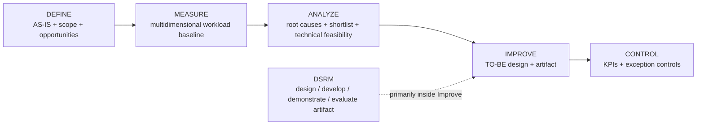

# Phase 1 — Current Methodology and Case-Selection Status

**Status:** Current research-method and case-selection source of truth, synchronized 2 September 2026.

**Ownership:** This file owns the research framework, candidate portfolio, selection gates, evaluation logic and current research actions. Detailed workload theory and live Measure-phase collection rules are maintained in their dedicated files rather than duplicated here.

Related sources:

- Project control / DMAIC tollgates: `docs/Project_Charter.md`
- AS-IS process and open process facts: `docs/process/Process_Cleaned_V1.5.md`
- Canonical workload definition: `docs/methodology/Workload_Definition.md`
- Exploratory Measure protocol: `docs/measurement/Measurement_Protocol_v1.3.md`
- Formal company evidence: `docs/company-documentation/Official_Document_Register_2026-08-21.md`
- Working TO-BE hypothesis: `docs/process/TO_BE_Working_Hypothesis_v0.1.md`

---

# 1. Project objective

The company-level objective is to reduce meaningful workload in operational purchasing by reducing unnecessary administrative effort, repetitive verification, avoidable rework and information-handling burden while preserving or supporting work that depends on purchasing expertise.

The thesis-level objective is to select one high-value purchasing activity or coherent TO-BE process component and design and evaluate a focal artifact containing a **meaningful AI-supported contribution**.

The company expects AI to be part of the focal thesis solution. Conventional process redesign, deterministic rules and digital automation may be supporting components or separate quick-win recommendations. A non-AI focal artifact is an exception: it requires documented Analyze evidence that no candidate passes the responsible-AI, data, quality and evaluation-feasibility gates, followed by explicit company and academic-supervisor approval. The project must not relabel a deterministic rule as AI merely to satisfy the expectation.

Selecting one thesis case does not remove other improvement opportunities from the wider company improvement portfolio.

---

# 2. Research structure

## DMAIC — process-improvement framework

DMAIC structures improvement of the existing purchasing process:

- **Define:** scope, stakeholders, AS-IS process, workload problem and initial opportunity areas.
- **Measure:** establish a defensible multidimensional workload baseline across the operational process.
- **Analyze:** identify root causes, standardizability, constraints and which work should be eliminated, simplified, standardized, automated or supported; then test technical/data feasibility for the shortlisted candidates.
- **Improve:** design evidence-based TO-BE alternatives and develop the selected artifact.
- **Control:** define KPIs, ownership, exception controls and implementation safeguards.

DMAIC fits because the project improves an **existing** process rather than designing a completely new process from scratch.

## DSRM — artifact design and evaluation

If a digital/AI artifact is developed, its design and evaluation follow DSRM:

`problem identification → objectives → design/development → demonstration → evaluation → communication`

DSRM mainly supports DMAIC's Improve stage, while some problem/objective work naturally begins earlier as the focal case is defined.

## Visual relationship

Within this structure:

- `Process_Cleaned_V1.5.md` mainly supports **Define** and the transition into Measure;
- Section 4 below is the authoritative candidate-status portfolio to be tested by Measure/Analyze;
- `../measurement/Measurement_Protocol_v1.3.md` operationalizes the exploratory **Measure** phase;
- `TO_BE_Working_Hypothesis_v0.1.md` is an early **Improve hypothesis**, not yet an Improve conclusion;
- the final digital/AI artifact is selected only after the relevant Measure and Analyze gates are satisfied.

---

## CTA-informed elicitation

Cognitive Task Analysis-informed questioning is used where buyer expertise is tacit, especially the standard maximalisatie check and downstream order/hold logic, suspicious-information recognition, exceptions and override reasoning.

For the maximalisatie/order-hold sequence, elicitation should capture:

- how the buyer searches for additional same-supplier demand;
- what makes consolidation useful enough to proceed;
- after MAX, whether or not demand was added, what makes the resulting order proceed versus be held (including size, urgency, MOQ/minimum-value considerations and current purchasing context);
- what later causes a held requirement to be reconsidered;
- which cues are explicit in data versus experience-based or undocumented.

This is **CTA-informed elicitation**, not automatically a full standalone CTA study.

## Human-AI reliance

Judge-Advisor System / reliance concepts remain conditional. They become relevant only if the final artifact gives advice that a buyer can accept, modify or reject. They are not automatically required for pure administrative automation or discrepancy detection.

---

# 3. Measure design

The broad workload construct is defined in `Workload_Definition.md` and uses a layered structure:

- **overall/occupational workload:** amount and difficulty of work, grounded primarily in Bowling & Kirkendall (2012);
- **quantitative workload / organizational constraints:** conceptually supported by Spector & Jex (1998);
- **mental workload:** treated specifically through Young et al. (2015);
- **expertise dependence:** kept analytically separate from mental workload.

The project therefore does **not** use processing time as a proxy for total or mental workload, and it does not create an unvalidated composite equation combining heterogeneous indicators.

Detailed live observation rules are owned by `../measurement/Measurement_Protocol_v1.3.md`. The exploratory Measure phase records a multidimensional activity-family profile, with post-session detailed Task-ID enrichment where evidence supports it, using where relevant:

- frequency;
- active processing time;
- case/line volume;
- rework occurrence and time;
- interruptions and task switching;
- qualitative difficulty / uncertainty / exception evidence;
- expertise dependence.

For comparable recurring execution tasks:

`operational time burden = frequency × representative active processing time`

is a buyer-capacity indicator, not a total workload or mental-workload score.

For fast judgement-heavy activities, occurrence, outcome, cues and reasoning are more informative than artificial second-level timing.

### Current Measure sequencing

1. The 28 August pilot identified that direct live coding against the 31-task register was too granular for reliable one-observer use.
2. Two official baseline days are complete: 31 August (165 net observed minutes; 103 timed coded-active minutes after the OBS-05 transcription correction) and 1 September (186 net observed minutes; 162 timed coded-active minutes). Current totals are therefore **351 net observed minutes** and **265 timed coded-active minutes**; these are different quantities.
3. `../measurement/Measurement_Protocol_v1.3.md` is controlled for observations from 2 September onward. Its live fields/timing rules remain comparable with v1.2, while its MAX interpretation, five-day coverage rule and repository governance are updated.
4. Continue until at least five distinct working days have been covered, then apply the v1.3 Day-5 coverage review. Five working days is not automatically interpreted as 40 net observed hours.
5. Supplement live observation with approved aggregated/system PO-volume information where Johan/company can provide it; dashboard access is not required to start.
6. Move into Analyze only after the Measure coverage rule and evidence gate are satisfied.

**Exact/Orbis production-data/interface feasibility is intentionally not an immediate Measure-phase task.** It is deferred until after the exploratory workload baseline, when the shortlisted candidate(s) justify targeted technical investigation. This avoids delaying Measure with system-integration work before the workload evidence shows where that effort is most valuable.

---

# 4. Current candidate portfolio

Candidate names are used instead of reusable letter IDs so that a candidate cannot mean different things in different documents. The AS-IS process file may retain local profile labels for navigation, but this methodology file is authoritative for current thesis-candidate status.

## 4.1 Active primary-case candidates

| Candidate | Current reason | Main evidence gates | Possible artifact direction |
|---|---|---|---|
| **Order timing / maximalisatie / supplier-order consolidation** | Repeated judgement-intensive activity involving stock, future demand, open POs, lead time, urgency and maximalisatie. Useful same-supplier demand can be combined; after MAX, the resulting order is assessed and may be held or ordered whether or not demand was added. | Measure-phase workload contribution and frequency; CTA decision rules; after Measure: Exact/Orbis data feasibility and defensible benchmark | decision / information / optimization support |
| **Purchase-price control** | Repeated manual verification with measurable discrepancy outcomes, both pre-PO and post-confirmation | Measure-phase frequency, line complexity, active time, deviation rate and verification demand; after Measure: supplier/Exact data feasibility | automated retrieval/comparison, stale-price/deviation support |
| **Standard / review / manual process redesign** | Promising process-level hypothesis if a meaningful share of cases is repeatable and safely classifiable | standard-case share, addressable workload, exception boundary, quality/safety risk; after Measure: system/data feasibility and evaluation feasibility | exception-based workflow with rules/automation/AI where justified |

The detailed AUTO / REVIEW / MANUAL future-state hypothesis is maintained in `TO_BE_Working_Hypothesis_v0.1.md` and remains provisional.

## 4.2 Active but evidence-insufficient candidates

| Candidate | Current position | Main evidence needed |
|---|---|---|
| **Request intake & validation** | Real information-quality/tacit-knowledge burden observed | frequency, investigation time, error types, business impact |
| **Finance-returned rework** | Potentially avoidable rework / weak hand-off | return frequency, causes, investigation time, Finance detection method |

## 4.3 Supporting improvement opportunities, not current primary thesis candidates

| Topic | Current position |
|---|---|
| **Exact Advies / Toewijzen** | Important system/process-control topic; `Toewijzen` is primarily an assignment/control action rather than a stand-alone optimization problem |
| **PO supplier communication** | Clear repetitive quick win / semi-automation opportunity; likely too narrow as the primary thesis case unless volume shows substantial total burden |

## 4.4 Ruled out / deprioritized

### Supplier selection

Supplier selection is removed from the active operational-buyer portfolio. The operational buyer stated that suppliers are usually predetermined or selected elsewhere, and the formal ownership/control structure is documented in `Official_Document_Register_2026-08-21.md`.

It remains background procurement context, not a default operational-buyer workload case.

---

# 5. Decision gates before final case selection

## 5.1 Measure-phase evidence gates

1. **Workload baseline:** which activities contribute meaningful quantitative and/or qualitative workload rather than merely appearing interesting in isolated observations?
2. **Frequency / case mix:** how often do relevant tasks and case types occur across the observed working periods?
3. **Active processing time / volume:** for timed activities, what are the representative active-time distributions and how do they relate to line/case volume?
4. **Rework and organizational constraints:** where do repeated work, interruptions, missing information or hand-off problems materially affect the buyer?
5. **Expertise dependence:** which activities rely on tacit cues or experience that cannot yet be reproduced from explicit process rules/data?
6. **Standard-case boundary:** what share of the observed work appears routine/standard versus review/manual/exceptional, without yet assuming automation feasibility?

## 5.2 Analyze-phase feasibility gates — after Measure

7. **Exact/Orbis data availability:** for the shortlisted candidate(s), which production fields, histories and interfaces are reliably accessible?
8. **Exact `Advies` logic:** investigate only to the degree required by the shortlisted case.
9. **Technical feasibility:** usable supplier-price sources, Exact/Orbis interfaces and integration constraints for the shortlisted candidate(s).
10. **Benchmark / ground truth:** can a defensible reference be constructed before AI/artifact evaluation?
11. **Exception safety / quality risk:** can high-risk or unusual cases be detected and controlled appropriately?
12. **Evaluation feasibility:** sufficient repeated cases, measurable workload and quality outcomes, and participant/domain-expert access.
13. **University-supervisor alignment:** confirm the final case and evaluation design before freezing artifact scope.

## 5.3 Formal two-stage selection rule

The focal case is selected in two stages. A weighted score may not compensate for a failed veto gate.

### Stage A — veto gates (Pass / Redesign / Reject)

1. Required data and tooling are permitted for the intended research use.
2. Accessible data are sufficiently representative for a prototype and test.
3. A reproducible ground truth/reference standard and manual baseline can be created.
4. Critical errors are detectable/reversible and residual risk can be controlled through human review, an audit trail and fallback.
5. Prototype development and evaluation fit the BEP's time, access and participant constraints.
6. The task has a non-trivial AI fit: unstructured, probabilistic or pattern-based support creates value beyond a simpler deterministic rule.

If no candidate passes all gates, do not force an unsuitable AI case. Document the evidence and escalate the focal-artifact decision to the company and academic supervisor.

### Stage B — evidence-scored comparison

Criteria and scoring anchors are grounded in the project objective, the workload construct, Task–Technology Fit and MCDA practice. Weights express local value trade-offs and are therefore set in a short stakeholder swing-weighting session, not copied as universal percentages from literature. The buyer/process owner and company supervisor set business/risk preferences; the student prepares evidence scores; the academic supervisor checks methodological defensibility.

| Criterion | Provisional workshop start | What it means |
|---|---:|---|
| Observed workload contribution | 25% | Human minutes/frequency and qualitative burden; do not also count business effects here. |
| Business value beyond counted workload | 15% | Lead time, service, compliance, scalability or strategic priority not already counted above. |
| AI–task fit | 15% | Degree to which AI capability fits the actual information/decision task. |
| Data readiness above the gate minimum | 15% | Representativeness, traceability, labelling/annotation and cleaning burden. |
| Repetition / process standardization | 10% | Recurrence and stability of inputs, outputs and exception boundaries. |
| Prototype / technical feasibility | 10% | Access, integration dependencies and ability to build a credible prototype. |
| Evaluation feasibility | 10% | Availability of comparable cases, a clear rubric, benchmark and participant access. |

These weights are a **provisional discussion starting point**, not a literature-derived truth. Freeze the agreed weights before scoring candidates.

Use anchored 1–5 scores: `1 = weak/poorly supported`, `3 = moderate with direct evidence`, `5 = strong with direct evidence`; define candidate-specific 1/3/5 anchors before seeing the total. Record evidence and uncertainty for each score. The total is `Σ(weight × score/5)`.

Run a proportionate sensitivity check using (a) the agreed weights, (b) equal weights, (c) each weight changed by ±20% with renormalization and (d) disputed scores changed by ±1. If the winner changes, report the ranking as unstable and collect more evidence or retain a shortlist rather than hiding the dependence on assumptions.

Unresolved facts about the **current process itself** remain in `Process_Cleaned_V1.5.md` rather than being duplicated here.

---

# 6. Evaluation logic by problem type

The selected focal activity determines the final activity-specific metric, but the **success logic is predeclared now**.

## 6.1 Workload endpoint and quality guardrail

The artifact is successful only when **both** conditions hold:

1. the primary workload endpoint improves by at least the predeclared meaningful threshold; and
2. the quality guardrail passes.

The default primary endpoint is **active human handling time per eligible case** (or per line/item when case size varies materially), comparing matched manual and AI-assisted work. Include reading, searching, entering data, reviewing AI output, correcting it and completing the required hand-off/documentation. Exclude passive supplier/system waiting and unrelated interruptions; report those separately. Report the median and distribution, with mean and percentage change as supporting statistics, and match/stratify by case complexity.

Secondary endpoints may include manual actions, system switches, rework/correction time, throughput and a validated post-task workload measure such as NASA-TLX when justified. These do not replace the primary endpoint.

Quality is measured on the **final human-approved outcome**, not only the AI output. After focal-case selection, define a case-specific rubric, a trusted reference/adjudicator and critical versus minor errors. The default guardrail is zero observed critical errors plus final-decision correctness no more than a pre-agreed margin `δ` below the matched manual baseline. `δ = 0` for critical errors; any non-zero margin for minor errors requires explicit process-owner acceptance. With a small BEP sample, report that the guardrail passed in the observed cases rather than claiming statistical non-inferiority.

After the manual baseline and focal case are known, the company/process owner defines the smallest worthwhile workload improvement `Δ` and acceptable minor-error margin `δ`; the academic supervisor validates the research rule. Freeze eligible cases, comparator, rubric, `Δ`, `δ` and analysis before prototype development/formal testing. Keep development examples separate from held-out evaluation cases where feasible.

BEP-ready rule: `For eligible [case type], the AI-assisted workflow is successful only if median active buyer handling time per [case/line] decreases by at least [Δ minutes or r%] versus a matched manual baseline, while final human-approved decisions contain zero critical errors and their correctness rate is no more than [δ percentage points] below baseline.`

## Optimization / decision-support case

Possible measures:

- decision quality against a defensible benchmark;
- constraint violations;
- consistency;
- active processing time;
- relevant workload measures from the selected activity;
- human override/reasoning where relevant.

## Verification / detection case

Possible measures:

- accuracy;
- precision/recall where appropriate;
- false positives/negatives;
- deviations detected;
- processing time;
- relevant workload change;
- consistency.

## Exception-based automation / process-redesign case

Possible measures:

- standard-case classification accuracy;
- exception-detection recall;
- exception escape rate;
- PO/output accuracy against trusted reference cases;
- percentage eligible for straight-through processing;
- correction/review rate;
- active buyer effort avoided;
- effect on remaining attention/judgement demand;
- false-positive review burden.

Processing-time reduction alone should not automatically be reported as mental-workload reduction. Likewise, the project should distinguish **potential/estimated workload reduction** from **realized operational reduction** if the artifact is evaluated only on standardized/historical cases rather than deployed live.

---

# 7. Immediate research actions

1. Use the v1.3 live sheet and cheat sheet from 2 September onward, with the restricted case index recording Origin and Channel once per case.
2. Continue official exploratory baseline observations after the completed 31 August and 1 September sessions; reach five distinct working days and then apply the predeclared coverage review rather than substituting an unconfirmed 40-net-hour target.
3. Complete post-session enrichment immediately after each block, mapping to detailed Task IDs only where evidence supports it.
4. Record MISS, interruptions, J/EXP and recurring unmapped activities consistently; do not silently reconstruct missing information.
5. Ask Johan for approved aggregated or exportable PO-volume information (for example PO count and PO-line count by week/month) as a supplement, not a prerequisite for observation.
6. Preserve pre-PO and post-confirmation price control as separate analytical categories during enrichment.
7. Continue CTA-informed notes around maximalisatie/hold, request validation, clarification and exception cases where tacit cues become visible.
8. Collect and categorize Finance-returned rework/aftercare when it occurs, but do not calculate a live rework percentage without a matched denominator.
9. Produce an activity-family multidimensional workload profile first, then detailed Task-ID analysis where mapping confidence and sample size justify it.
10. **Only after Measure**, begin targeted Exact/Orbis and other technical/data feasibility work for the shortlisted candidate(s).
11. Run the veto gates, stakeholder weighting, anchored evidence scoring and sensitivity analysis before selecting the focal case.
12. Define and freeze the focal case's active-handling-time endpoint, quality rubric, `Δ` and `δ` before artifact development/formal evaluation.
13. Confirm the selected focal case and evaluation design with the university supervisor before DSRM artifact development.

# References added for selection and evaluation design

Belton, V., & Stewart, T. J. (2002). *Multiple Criteria Decision Analysis: An Integrated Approach*. Springer. https://doi.org/10.1007/978-1-4615-1495-4

Goodhue, D. L., & Thompson, R. L. (1995). Task-technology fit and individual performance. *MIS Quarterly, 19*(2), 213–236. https://doi.org/10.2307/249689

Hart, S. G., & Staveland, L. E. (1988). Development of NASA-TLX (Task Load Index): Results of empirical and theoretical research. In P. A. Hancock & N. Meshkati (Eds.), *Human Mental Workload* (pp. 139–183). Elsevier. https://doi.org/10.1016/S0166-4115(08)62386-9

Triantaphyllou, E., & Sánchez, A. (1997). A sensitivity analysis approach for some deterministic multi-criteria decision-making methods. *Decision Sciences, 28*(1), 151–194. https://doi.org/10.1111/j.1540-5915.1997.tb01306.x