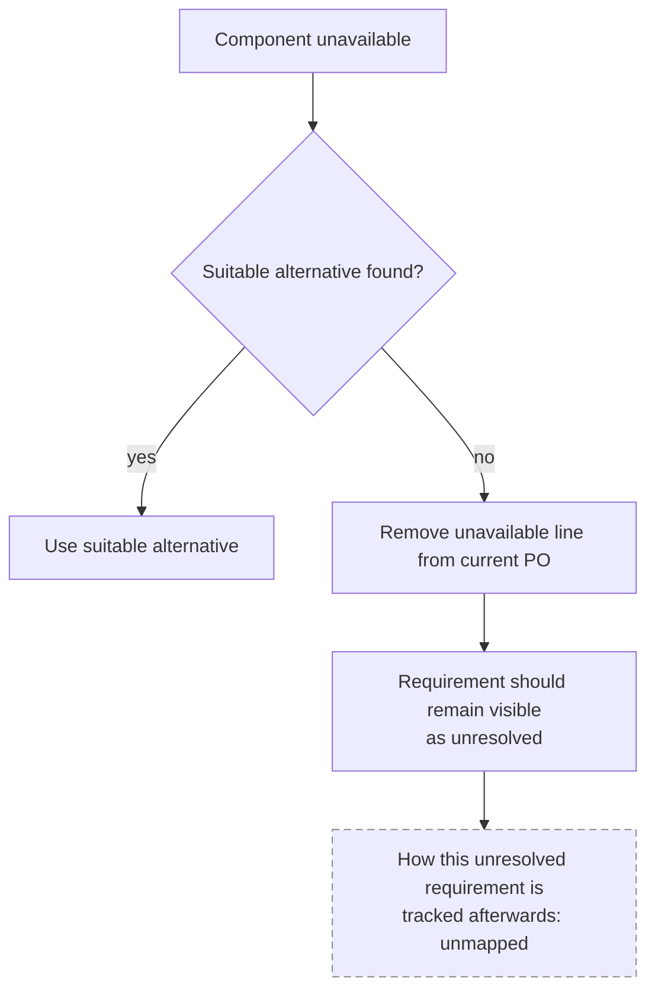

# Process Cleaned V1.0 — Operational Purchasing Current State

**Status:** Working draft, 20 August 2026.

**Evidence base:** Internship observations and discussions from 17, 19 and 20 August 2026. Observed durations should currently be treated as individual cases rather than representative averages.

**Purpose:**
1. describe the current operational purchasing process;
2. distinguish administrative work, expert judgement, verification work and process/information problems;
3. identify candidate improvement areas without selecting a final BEP use case yet;
4. specify what still needs to be measured and validated.

> **Confidentiality:** The process is described using roles such as *operational buyer*, *Requester* and *Finance*. Supplier cases should preferably be anonymised in documents that leave the company. Internal operational details should remain in the private project environment.

---

# 1. Scope

## In scope

The operational purchasing process from **purchasing need arising** through **Bevestigd**, including:

- purchasing requirements/demand already available in Exact;
- requests arriving outside Exact;
- request validation;
- stock/demand assessment;
- order timing;
- supplier-order consolidation;
- Exact purchasing advice;
- `toewijzen`;
- price checking;
- buyer authorization / additional approval boundary;
- PO generation;
- supplier communication;
- supplier confirmation;
- Finance rework;
- relevant exceptions and interruptions.

## Out of scope for now

The later Exact stages **Ontvangen → Gefactureerd → Betaald** are visible in Exact, but ownership and detailed activities after `Bevestigd` have not yet been fully mapped.

---

# 2. Evidence rules used in this document

To avoid turning early observations into conclusions, claims should be interpreted using four evidence levels.

| Evidence type | Meaning |
|---|---|
| **Observed** | Seen directly during the internship |
| **Stated** | Explained by the operational buyer, IT or another employee |
| **Single observation** | A duration or case observed once; not an average |
| **Unconfirmed / hypothesis** | Possible explanation or improvement direction requiring validation |

Where the current process is unclear, the workflow explicitly marks the step as **unmapped** or **to verify**.

---

# 3. Main AS-IS purchasing workflow

The purchasing workflow is not one completely linear process. A purchasing need can enter through different routes and may require different levels of administrative work, verification, judgement and exception handling.

```mermaid
flowchart LR

    classDef gap stroke-dasharray: 6 4,stroke:#888

    subgraph REQ["Requester / Engineer / Project"]
        need["Purchasing need arises"]
        routeA["Route A:<br>open purchasing requirement / demand<br>already visible in Exact"]
        routeB["Route B:<br>email / verbal request / screenshot"]
    end

    subgraph BUY["Operational buyer / Exact Globe+"]
        create["Create purchasing entry / PO lines manually<br>when request originates outside Exact"]

        validate{"Supplied / available information<br>plausible?"}

        investigate["Investigate suspicious / incomplete data:<br>historical POs, previous purchases,<br>machine / serial / supplier information"]

        orderQ{"Purchase now?<br>stock, future demand, open POs,<br>lead time, MOQ / min. value, urgency"}

        hold["Hold open temporarily<br>for maximalisatie"]

        prep["Prepare supplier PO:<br>combine demand from same supplier"]

        advice["Review Exact Advies<br>and underlying project / production demand"]

        assign["Toewijzen:<br>allocate purchased quantity<br>to underlying demand"]

        prePriceQ{"Advance supplier-price<br>check required?"}

        webPrice["Search current supplier price<br>and compare with Exact"]

        priceUpdate["Update outdated / deviating<br>price in Exact"]

        authQ{"Order value above<br>€10,000?"}

        approval["Additional approval required<br>approval path currently unmapped"]:::gap

        release["Fiatteren + Verrichten"]

        forward["forward generated PO to supplier"]

        best(["Besteld<br>order sent / ordered"])

        confirmPrice["Compare supplier confirmation<br>against Exact / PO"]

        fixConfirm["Correct relevant deviations<br>in Exact"]

        attach["Attach confirmation<br>and set Bevestigd"]

        bev(["Bevestigd"])

        rework["Investigate returned issue:<br>PO / confirmation / invoice / Outlook"]

        later["Ontvangen → Gefactureerd → Betaald<br>owner / detailed process unmapped"]:::gap
    end

    subgraph OUT["Outlook"]
        pdf["PO document generated<br>and emailed to buyer"]
    end

    subgraph SUP["Supplier"]
        supplierConf["Supplier confirmation<br>by email"]
    end

    subgraph FIN["Finance"]
        financeCheck{"Later control:<br>issue detected?"}
        financeReturn["Return issue to buyer"]
    end

    need --> routeA
    need --> routeB

    routeA --> validate
    routeB --> create
    create --> validate

    validate -- "looks plausible" --> orderQ
    validate -- "suspicious / incomplete" --> investigate
    investigate --> orderQ

    orderQ -- "small / non-urgent" --> hold
    hold -. "new demand / urgency changes" .-> orderQ

    orderQ -- "order now" --> prep
    prep --> advice
    advice --> assign

    assign --> prePriceQ

    prePriceQ -- "yes" --> webPrice
    webPrice --> priceUpdate
    priceUpdate --> authQ

    prePriceQ -- "no" --> authQ

    authQ -- "no" --> release
    authQ -- "yes" --> approval
    approval -. "after approval" .-> release

    release --> pdf
    pdf --> forward
    forward --> best
    best --> supplierConf

    supplierConf --> confirmPrice

    confirmPrice -- "difference" --> fixConfirm
    fixConfirm --> attach

    confirmPrice -- "match" --> attach

    attach --> bev
    bev --> financeCheck

    financeCheck -- "issue" --> financeReturn
    financeReturn --> rework

    financeCheck -- "no issue" --> later
```

The exact timing of Exact status transitions should be validated against the official buyer instruction and with the operational buyer.

The buyer has stated that orders above **€10,000** require additional approval. The approver, exact workflow and system status changes for that branch are currently unmapped, so the approval node is shown as a gap rather than a fully specified process.

---

# 4. Detailed workflow stages

## 4.1 Purchasing need enters the process

Two main routes have been observed.

### Route A — open purchasing requirement/demand already exists in Exact

The buyer starts from an **open purchasing requirement or demand that is already visible in Exact but still needs purchasing action**.

Who originally creates all Route-A requirements is not yet fully mapped.

### Route B — requirement originates outside Exact

Requests can arrive through email, direct colleague requests, screenshots, or other informal communication. The buyer then manually transfers the required information into Exact before continuing with the purchasing process.

One observed service-order case involving two lines took approximately **5 minutes** to enter. This is a single observation, not an average.

## 4.2 Validate the supplied information

The buyer does not necessarily accept the incoming information without checking it.

Potentially relevant information includes:

- article/component;
- description;
- machine;
- serial number;
- supplier;
- service information;
- previous purchasing history.

If something appears suspicious, the buyer may search historical POs before proceeding.

In one observed service case:

- manual data entry took about **5 minutes**;
- investigating suspicious machine/serial information took approximately **10–15 minutes**.

This suggests that workload can come less from entering information and more from verifying whether the incoming information is reliable.

**Work type:** judgement + investigation.

## 4.3 Decide whether to purchase now

The buyer does not automatically purchase every requirement immediately.

Observed considerations include:

- current stock;
- safety stock;
- expected future usage;
- existing/open purchase orders;
- expected deliveries;
- lead time;
- urgency;
- project or production requirement;
- MOQ/minimum supplier requirements;
- potential additional demand from the same supplier.

This appears to contain substantial experience-based judgement.

## 4.4 Maximalisatie — combine supplier demand

For a small non-urgent request, the buyer may deliberately leave the requirement open. He can wait until more demand exists for the same supplier and then combine the items into a larger supplier order.

Potential reasons include reducing unnecessary small orders, transport/ordering costs and possibly improving commercial efficiency.

During one observation, adding another item as part of this activity took approximately **4 minutes**.

**Work type:** purchasing judgement + administration.

## 4.5 Review Exact Advies

Exact contains a purchasing-advice function showing an `Advies` quantity.

The buyer can use this when identifying additional demand that may need to be included in the supplier PO. However, the quantity cannot yet be treated as self-explanatory.

The buyer still needs to understand:

- what demand produces the advised quantity;
- which project/production requirement it belongs to;
- whether it should be combined into the current PO.

Exactly how Exact calculates `Advies` remains to be verified.

## 4.6 Toewijzen

After adding demand to a supplier PO, the purchased quantity may need to be **toegewezen** to the underlying project or production demand.

If the purchased quantity is not correctly assigned, Exact may continue to regard the underlying demand as unresolved. This can cause the same requirement to appear again later and potentially create duplicate purchasing risk.

One observed case involving purchasing advice, maximalisatie, understanding the underlying demand, and allocation/toewijzen took approximately **30–35 minutes** in total.

**Work type:** system administration + purchasing interpretation.

## 4.7 Pre-PO price control

Price checking does **not** only happen after the supplier sends a confirmation.

For certain purchases, the buyer can proactively check the supplier's current price **before the PO is sent**.

This was explained particularly for:

- one-off items (`eenmalige artikelen`);
- special components.

Whether services (`diensten`) are normally included in this rule is currently unclear and should not yet be treated as confirmed.

The buyer explained that if the Exact price is outdated and is only corrected after a later supplier confirmation, that outdated price can remain available in Exact during the waiting period and potentially be reused for another PO.

The pre-PO check therefore serves a different purpose from the confirmation check later in the process.

## 4.8 Buyer authorization and additional approval

The operational buyer has stated that his normal purchasing authority applies up to the internal **€10,000** limit. Orders above **€10,000** require an additional approval step before the order can continue through the normal release process.

The following details are not yet mapped:

- who provides the additional approval;
- whether more than one approval level exists;
- what information the approver reviews;
- whether the approval is performed inside Exact or outside it;
- what Exact status/timestamp records the approval;
- how much additional elapsed and processing time the approval branch creates.

Because those details are unknown, this branch is treated as a **control boundary with an unmapped approval path**, not as a fully described workflow.

## 4.9 Fiatteren, Verrichten and Besteld

The operational sequence is currently mapped as:

`Prepare PO → relevant price check → authorization/approval if required → Fiatteren + Verrichten → PO generated and emailed to buyer → Send PO to supplier → Besteld → supplier confirmation → Bevestigd`

`Fiatteren` and `Verrichten` are represented together in the process map because the current focus is on the buyer's operational flow rather than showing each Exact status as a separate node.

The exact timing of the status transitions should still be validated against the official buyer instruction and with the operational buyer.

The later statuses `Ontvangen`, `Gefactureerd`, and `Betaald` remain outside the detailed current-state scope for now.

## 4.10 PO generation and supplier email

After `Verricht`, Exact generates the PO document and emails it to the buyer in Outlook.

The buyer then:

1. receives the generated PO in Outlook;
2. checks/uses the appropriate supplier recipient;
3. forwards the PO;
4. types a short standard message.

The buyer stated that PO forwarding is currently performed manually.

A more automated supplier-email approach existed in the past but was not considered sufficiently reliable. Supplier contact information changing was mentioned as one reason.

**Work type:** repetitive administration.

## 4.11 Supplier confirmation and post-PO price control

The supplier normally sends an order confirmation.

The buyer then compares the supplier confirmation with the information in Exact/the PO.

For relevant lines he may:

1. inspect supplier confirmation;
2. inspect Exact;
3. compare prices;
4. identify deviations;
5. manually update prices where required;
6. attach the confirmation;
7. set the order to `Bevestigd`.

A large supplier case on 19 August was estimated at approximately **30–40 minutes**, but this figure was not formally timed and should therefore remain an estimate until additional cases are measured.

### Important distinction: two price controls

These should remain separate in future analysis.

**Price control A — before PO:** current supplier price ↔ stored Exact price.

Purpose: prevent a potentially outdated stored price from being reused before supplier confirmation arrives.

**Price control B — after PO:** supplier confirmation ↔ PO / Exact.

Purpose: verify what the supplier actually confirms and update relevant differences.

## 4.12 Finance control and rework

After `Bevestigd`, Finance performs a later check.

A case may be returned to the buyer when Finance identifies a possible problem. The buyer has indicated that the returned note can sometimes indicate only that something is wrong without clearly showing where the mismatch is.

The buyer may then need to investigate Exact, the PO, supplier confirmation, invoice information, or other related information.

This can create rework.

However, it should **not** currently be assumed that every returned Finance case results from the buyer missing a price deviation. The actual causes of Finance returns still need to be measured.

**Work type:** process/information problem + exception investigation.

---

# 5. Exception flow — unavailable component

A supplier can report that a required component is unavailable.

The buyer deliberately removed the unavailable line because leaving it in the order could make Exact appear as though that requirement had successfully been ordered.

What keeps the unresolved need visible afterwards is still an important unanswered question.

---

# 6. Cross-cutting workload — interruptions and task switching

The process above should not be interpreted as an uninterrupted sequence.

While processing orders, the buyer can receive:

- new purchasing requests;
- colleague questions;
- supplier emails;
- payment-related supplier emails;
- project requests;
- exceptions.

Future timing should distinguish:

### Processing time

Actual hands-on time required to perform the task.

### Elapsed time

Total clock time from starting until completion, including interruptions and task switching.

The early-morning observation suggests that quieter working periods may be valuable for completing purchasing work, but this should be quantified rather than treated as a final conclusion.

---

# 7. Step register

`Type`

- **A:** administrative/repetitive
- **B:** judgement/investigation
- **C:** process/information issue
- **V:** verification/comparison

`Basis`

The distinction between formal Exact requirement and personal/company working practice is still provisional until the paper purchasing instruction is digitised and compared with the observed process.

| # | Step | Actor | Type | Current evidence | Basis | Main unknown |
|---|---|---|---|---|---|---|
| 1 | Receive/identify purchasing need through Route A/B | Requester / Buyer | C | Repeatedly observed/stated | — | Share by route |
| 2 | Create purchasing entry / PO lines from external request | Buyer | A | ~5 min / 2 lines, one case | Practice? | Frequency |
| 3 | Transfer information from screenshot/email | Buyer | A | Observed | Practice? | Frequency |
| 4 | Validate supplied information | Buyer | B | Observed | Practice? | Frequency/error types |
| 5 | Search historical POs to resolve suspicious data | Buyer | B | ~10–15 min, one case | Practice? | Frequency |
| 6 | Assess stock/future demand/lead time/urgency | Buyer | B | Repeatedly observed | Practice/System | Inputs/data availability |
| 7 | Decide order now vs hold | Buyer | B | Repeatedly observed | Practice | Decision logic |
| 8 | Maximalisatie | Buyer | B | Observed | Practice | Frequency/value |
| 9 | Review Exact Advies | Buyer | B | Observed | System + Practice | Calculation logic |
| 10 | Toewijzen | Buyer | A+B | Part of 30–35 min case | Mandatory? | Failure frequency |
| 11 | Pre-PO supplier price check | Buyer | V+A | Observed/stated for certain purchases | Practice? | Which categories/frequency |
| 12 | Update pre-PO price deviations | Buyer | A | Observed | Practice? | Frequency/time |
| 13 | Check whether order exceeds €10,000 buyer authorization limit | Buyer | C | Stated | Company control | Exact threshold handling / frequency |
| 14 | Additional approval for order above €10,000 | Approver / Buyer | C | Stated requirement; path unmapped | Company control | Approver, workflow, timing, Exact status |
| 15 | Fiatteren / Verrichten | Buyer / Exact | A | Confirmed actions | Mandatory? | Formal rules/status timing |
| 16 | PO generated and emailed to buyer in Outlook | Exact / Outlook | A | Observed/stated | System | Timing/automation details |
| 17 | Forward PO + standard supplier message | Buyer | A | Stated: every PO | Practice | Daily volume |
| 18 | PO reaches Besteld / ordered stage | Buyer / Exact | A | Current process map | System | Exact status transition timing |
| 19 | Supplier sends confirmation | Supplier | — | Observed/stated | External | — |
| 20 | Compare confirmation with Exact/PO | Buyer | V+A | Repeatedly observed | Practice? | Time/frequency |
| 21 | Correct confirmation deviations | Buyer | A | Observed | Practice? | Frequency |
| 22 | Attach confirmation + Bevestigd | Buyer | A | Observed | Mandatory? | Formal rule |
| 23 | Finance later control | Finance | C/V | Stated/observed workflow | Unknown | Frequency/issues |
| 24 | Investigate Finance-returned case | Buyer | C+B | Stated | Practice | Frequency/time |
| 25 | Handle unavailable component | Buyer | B+C | Observed | Practice | How unresolved need remains tracked |

---

# 8. Current improvement candidates

These are **candidates**, not selected solutions.

## A. Order timing and consolidation

Examples:

- purchase now vs wait;
- MOQ/minimum value vs urgency;
- future stock considerations;
- combining supplier demand.

**Current status:** Promising — repeatedly observed, but data structure and exact decision logic still need validation.

Potential intervention form: process support, decision support, optimization.

## B. Advies and toewijzen support

Examples:

- understanding advised quantity;
- linking demand to projects/production;
- avoiding reappearing demand.

**Current status:** Promising — one substantial 30–35 minute case observed; frequency and failure rate unknown.

Potential intervention form: information visualization, rule/system support, matching/allocation assistance.

## C. Purchase-price control

Includes two separate activities:

### C1 — proactive price check before PO

Supplier/current price compared with stored Exact price.

### C2 — confirmation price check after PO

Supplier confirmation compared with Exact/PO.

**Current status:** Promising — clear manual line-by-line work observed, but normal frequency and representative processing time still need measurement.

Potential intervention form: automated price retrieval, stale-price detection, document comparison, deviation highlighting, human-reviewed updates.

## D. Request intake and validation

Examples:

- requests outside Exact;
- screenshots;
- incomplete technical information;
- incorrect serial/machine information;
- historical PO searching.

**Current status:** Observed — potential benefit visible, but frequency and business impact are unknown.

Potential intervention form: structured request intake, information extraction, validation against historical data.

## E. PO supplier communication

Examples:

- receiving generated PO;
- selecting recipient;
- typing standard greeting;
- forwarding.

**Current status:** Clearly repetitive, but likely low time per individual case. Total value depends on daily PO volume.

Potential intervention form: semi-automation, pre-filled draft, recipient verification retained by buyer.

## F. Finance hand-off and rework

Examples:

- unclear mismatch notes;
- repeated investigation;
- possible duplicated checking.

**Current status:** Potential process problem — frequency and root causes not yet measured.

Potential intervention form: better issue classification, structured hand-off, automated discrepancy highlighting.

## G. Supplier selection

The project proposal considers supplier/quotation selection as a possible decision case.

**Current status:** Not yet observed during Week 1.

Before retaining this as a central BEP decision case, determine how frequently genuine supplier choice actually occurs.

---

# 9. Candidate status overview

| Candidate | Evidence today | Main uncertainty | Current status |
|---|---|---|---|
| Order timing & consolidation | Repeatedly observed | Exact data + decision rules | **Promising** |
| Advies / toewijzen | One substantial case | Frequency + Exact logic | **Promising** |
| Price control | Manual work clearly observed | Frequency + timed baseline | **Promising** |
| Request validation | Observed | Frequency/business impact | **Needs more evidence** |
| PO communication | Repeated | Total daily time | **Easy automation candidate** |
| Finance rework | Stated/observed | Frequency/root cause | **Needs measurement** |
| Supplier selection | Not observed | Whether decision occurs often | **Not yet supported** |

**No final ranking should be made from Week-1 evidence alone.**

---

# 10. Measurement plan

| # | Question | Method | Source |
|---|---|---|---|
| Q1 | What determines Exact `Advies`? | Ask buyer + verify in Exact/IT documentation | Buyer / IT / Exact |
| Q2 | How often is purchasing advice used? | Tally for several working days | Observation |
| Q3 | How often is `toewijzen` difficult or missed? | Ask + inspect relevant demand cases | Buyer / Exact |
| Q4 | What happens after an unavailable line is removed? | Trace one real case end-to-end | Buyer / Exact |
| Q5 | What share of requests originates outside Exact? | 5-day tally + Exact history if available | Observation / Exact |
| Q6 | How often is incoming information incomplete/wrong? | Tick sheet for several days | Observation |
| Q7 | Which information fields are commonly incorrect? | Categorise observed cases | Observation |
| Q8 | How often does Finance return cases? | Data/history if possible + collect examples | Finance / Exact |
| Q9 | What causes Finance-returned cases? | Categorise real examples | Finance / Buyer |
| Q10 | How many POs are processed per day? | Exact history | Exact |
| Q11 | How many lines per PO? | Exact history | Exact |
| Q12 | How long does post-confirmation price checking take? | Time 3–5 confirmations of different complexity | Observation |
| Q13 | Which purchases require proactive pre-PO price checking? | Ask + tally cases | Buyer |
| Q14 | How often does Exact price differ from current supplier price? | Record pre-PO checks | Observation |
| Q15 | How long does proactive website price checking take? | Time several different order sizes | Observation |
| Q16 | Is current supplier price available through any structured source/API? | Ask IT/supplier/system investigation | IT |
| Q17 | Which Exact fields contain stock, safety stock, usage, open PO and expected receipt information? | Inspect + ask IT | Exact / IT |
| Q18 | Does Exact already project future stock? | Inspect + ask | Exact / IT |
| Q19 | How often is genuine supplier selection performed? | Ask + inspect historical cases | Buyer / Exact |
| Q20 | How frequently is the buyer interrupted? | 2 × 2-hour tally, morning vs later day | Observation |
| Q21 | What types of interruptions occur? | Categorise interruption tally | Observation |
| Q22 | What differs between VRD and project/production purchasing? | Compare real cases | Buyer / Exact |
| Q23 | Who owns stages after `Bevestigd`? | Ask | Buyer / Finance |
| Q24 | Which steps are mandatory Exact/company procedure vs personal practice? | Digitise paper instruction and compare | Instruction document |
| Q25 | When exactly does Exact set/display `Besteld` relative to Fiatteren, Verrichten and sending the PO? | Validate with buyer + official instruction / Exact | Buyer / Exact |
| Q26 | For orders above €10,000, who approves, where is approval recorded, and how does the order return to the normal flow? | Ask buyer/manager + trace one case + verify in Exact | Buyer / Approver / Exact |

---

# 11. Recommended observation sheet

For future observations, use:

| Start | End | Task | Order type | # lines | What happened | Interruption | Exception | Judgement? |
|---|---|---|---|---:|---|---|---|---|

For price cases additionally record:

| Price-check type | # lines | # deviations | Processing time | Source used |
|---|---:|---:|---:|---|
| Pre-PO supplier check | | | | |
| Supplier confirmation check | | | | |

For orders above the buyer's normal authorization limit, additionally record:

| Order value | Approval required? | Approver/role | Processing time | Elapsed waiting time | Where recorded |
|---:|---|---|---:|---:|---|
| | | | | | |

This avoids incorrectly combining different price-control activities and makes the approval branch measurable rather than treating it as a purely descriptive exception.

---

# 12. Validation protocol

Before treating this as the formal current-state process:

## Step 1 — Buyer walkthrough

Take the operational buyer through the main process map.

Ask:

- Is this the correct sequence?
- Which steps are missing?
- Which steps only happen sometimes?
- Which decisions are represented incorrectly?
- Which steps are company rules versus your own working method?
- At what point should `Besteld` appear in the actual process?
- What exactly happens when an order exceeds the €10,000 buyer authorization limit?

Corrections should be recorded as research evidence.

## Step 2 — Document comparison

Digitise the paper purchasing instruction.

For every workflow step classify:

**Mandatory** / **Observed practice** / **Different from documented procedure** / **Not mentioned**

This can reveal workarounds and unnecessary steps.

## Step 3 — Validate with system/data

Determine which Exact/Orbis data can actually be retrieved.

Possible useful fields include:

- PO;
- PO line count;
- supplier;
- creation/status timestamps;
- buyer/action performer;
- stock;
- safety stock;
- planned demand;
- expected delivery;
- purchase price;
- project/production allocation;
- approval/status information for orders above the buyer authorization limit.

## Step 4 — Quantify the largest candidate workloads

Prioritise timing:

1. price checking;
2. purchasing advice/toewijzen cases;
3. external request/manual entry;
4. interruptions;
5. Finance rework.

The authorization branch should be traced when a real >€10,000 case occurs, but it does not need to become a primary workload candidate unless frequency or delay proves material.

## Step 5 — Reassess candidates

Only after the current process, frequencies and available data are clearer should the BEP use case be selected.

---

# 13. Evidence log — current state

| Claim | Value | Evidence type | Confidence |
|---|---:|---|---|
| Manual creation of two service lines | ~5 min | Observed | Single case |
| Investigation of suspicious service/machine information | ~10–15 min | Observed | Single case |
| Adding one item during maximalisatie | ~4 min | Observed | Single case |
| Advies + maximalisatie + toewijzen case | ~30–35 min | Observed | Single case |
| Large line-by-line price-control case | ~30–40 min | Student estimate | Needs formal timing |
| Generated POs forwarded manually | Every PO according to buyer | Stated | Needs volume measurement |
| Supplier-email automation was previously tried but had reliability problems | Yes | Stated | Historical description |
| Exact Globe+ accessible through Orbis | Yes | Stated by IT | Read/write/data scope unknown |
| Some Finance notes identify a problem without precise location | Yes | Stated | Frequency unknown |
| Certain one-off/special purchases receive pre-PO price checking | Yes | Observed/stated | Categories need clarification |
| Services included in the pre-PO price-check rule | Unclear | Unconfirmed | Do not use as rule |
| Missed `toewijzen` can leave underlying demand open | Yes | Explained/observed workflow | Frequency unknown |
| Orders above €10,000 require additional approval | Yes | Stated by operational buyer | Approval path/timing unmapped |

---

# 14. Current working interpretation

## 14.1 Operational purchasing is not one automation problem

The observed workload currently contains at least four fundamentally different types of work:

### Administrative execution

Examples: manual PO creation, copying information, standard supplier email, attachments, updating Exact fields.

### Verification/comparison

Examples: supplier website price vs Exact, supplier confirmation vs Exact, checking incoming request information.

### Expert judgement

Examples: buy now vs wait, future stock, urgency, maximalisatie, interpreting `Advies`, recognizing suspicious information, alternative components.

### Process/information problems

Examples: requests arriving through multiple channels, incomplete request information, unclear Finance hand-offs, unresolved unavailable items, interruption/task switching.

Different problem types may therefore require different solutions.

## 14.2 Price checking contains two distinct stages

Price checking appears in at least **two distinct stages**.

The underlying problem may concern:

- stale purchasing prices;
- availability of current supplier prices;
- timing of price updates;
- repeated manual comparison;
- information consistency between supplier, Exact and subsequent POs.

This remains a hypothesis requiring further measurement.

## 14.3 Order timing and consolidation is a promising candidate

The order-now-versus-wait decision has been observed repeatedly and contains a combination of stock, future demand, lead time, urgency, and supplier efficiency.

This makes it a promising decision-support candidate. However, its data availability and actual decision structure must still be validated before ranking it strongly.

If this candidate is modeled quantitatively, the €10,000 buyer authorization boundary may need to be represented as a hard control constraint or scenario condition rather than ignored.

## 14.4 Advies/toewijzen deserves separate attention

The 30–35 minute observed case and the potential duplicate-demand consequence show that this workflow can be important.

Whether it should become a major BEP problem depends on how often it occurs, how often mistakes occur, how much of the relationship Exact already exposes, and whether the difficulty is mainly system usability, process design or decision-making.

## 14.5 Supplier selection remains open

Supplier/quotation selection has not yet been observed during Week 1. Its actual frequency should be established before deciding whether it should remain a central BEP decision case.

---

# 15. Immediate next actions

In order:

1. **Validate the workflow with the operational buyer.**
2. **Correct this process model based on his feedback.**
3. **Digitise the paper purchasing instruction.**
4. **Compare documented process vs observed process.**
5. **Start a structured task/time tally.**
6. **Measure pre-PO and post-PO price checking separately.**
7. **Determine how often Advies/toewijzen occurs.**
8. **Ask how often genuine supplier selection occurs.**
9. **Ask IT what purchasing data Exact/Orbis can expose.**
10. **Validate exactly where `Besteld` sits relative to Fiatteren, Verrichten and supplier sending.**
11. **Map the >€10,000 additional-approval path: approver, system steps, timing and evidence in Exact.**
12. **Only then begin ranking the candidate BEP use cases more strongly.**

---

# Current-state conclusion

At the end of Week 1, the appropriate conclusion is **not yet which task should be automated**.

The current evidence supports a more limited conclusion:

> Operational purchasing contains several recurring sources of workload involving repetitive administration, manual information comparison, experience-based purchasing judgement, exception handling and process hand-offs. The next phase should quantify the frequency, time and business impact of these activities and validate the current-state model before selecting the primary AI or process-improvement use case.
