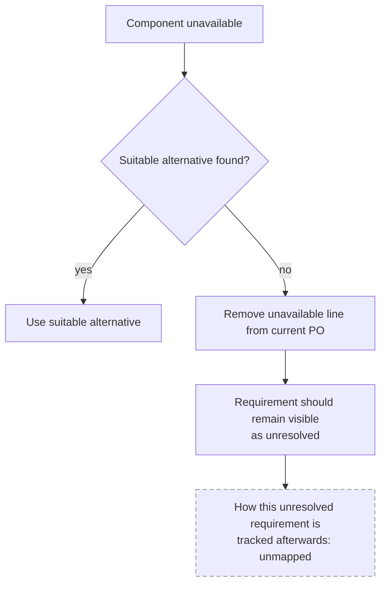

# Process Cleaned V1.0 — Operational Purchasing Current State

**Status:** Working draft, 21 August 2026.

**Evidence base:** Internship observations and discussions from 17, 19, 20 and 21 August 2026. The main workflow was walked through with the operational buyer on 21 August and corrected where the earlier sequence did not match actual working practice. Observed durations were measured by noting start/end clock times on the laptop during the work. They should therefore be interpreted as **observed elapsed-time measurements for individual cases**, not retrospective estimates or representative averages. Because the buyer regularly switches between work content, some measured durations include task switching and should not be interpreted as pure active processing time.

**Purpose:**
1. describe the current operational purchasing process;
2. distinguish administrative work, expert judgement, verification work and process/information problems;
3. identify candidate improvement areas without selecting a final BEP use case yet;
4. specify what still needs to be measured and validated.

> **Confidentiality:** The process is described using roles such as *operational buyer*, *Requester* and *Finance*. Supplier cases should preferably be anonymised in documents that leave the company. Internal operational details should remain in the private project environment.

---

# 1. Scope

## In scope

The operational purchasing process from **purchasing need arising** through **Bevestigd**, including:

- purchasing requirements/demand already available in Exact;
- requests arriving outside Exact;
- request validation;
- stock/demand assessment;
- order timing;
- supplier-order consolidation;
- Exact purchasing advice;
- `toewijzen`;
- price checking;
- buyer authorization / additional approval boundary;
- PO generation;
- supplier communication;
- supplier confirmation;
- Finance rework;
- relevant exceptions and interruptions.

## Out of scope for now

The later Exact stages **Ontvangen → Gefactureerd → Betaald** are visible in Exact, but ownership and detailed activities after `Bevestigd` have not yet been fully mapped.

---

# 2. Evidence rules used in this document

To avoid turning early observations into conclusions, claims should be interpreted using four evidence levels.

| Evidence type | Meaning |
|---|---|
| **Observed** | Seen directly during the internship |
| **Stated** | Explained by the operational buyer, IT or another employee |
| **Single observation** | A duration or case observed once; not an average |
| **Unconfirmed / hypothesis** | Possible explanation or improvement direction requiring validation |

Where the current process is unclear, the workflow explicitly marks the step as **unmapped** or **to verify**.

### Timing interpretation

The early timing observations were not guessed retrospectively. Start and end times were checked using the laptop clock while the buyer worked.

Unless a case was performed continuously, these values should be treated as **elapsed time**:

- they capture how long the case remained in progress from the observed start to finish;
- they can include switching to another order, Outlook, a colleague question or another task;
- they do not necessarily equal active hands-on processing time.

This distinction is especially important for longer observations. Future baseline measurement should therefore record **active processing time and elapsed time separately** where possible.

---

# 3. Main AS-IS purchasing workflow

The purchasing workflow is not one completely linear process. A purchasing need can enter through different routes and may require different levels of administrative work, verification, judgement and exception handling.

The sequence below incorporates the **21 August buyer walkthrough**. In particular, the current working sequence around purchasing advice is:

`Review Exact Advies → Toewijzen → relevant pre-PO price check / correction → prepare/complete supplier PO and combine relevant demand from the same supplier`.

```mermaid
flowchart LR

    classDef gap stroke-dasharray: 6 4,stroke:#888

    subgraph REQ["Requester / Engineer / Project"]
        need["Purchasing need arises"]
        routeA["Route A:<br>open purchasing requirement / demand<br>already visible in Exact"]
        routeB["Route B:<br>email / verbal request / screenshot"]
    end

    subgraph BUY["Operational buyer / Exact Globe+"]
        create["Create purchasing entry / PO lines manually<br>when request originates outside Exact"]
        validate{"Supplied / available information<br>plausible?"}
        investigate["Investigate suspicious / incomplete data:<br>historical POs, previous purchases,<br>machine / serial / supplier information"]
        orderQ{"Purchase now?<br>stock, future demand, open POs,<br>lead time, MOQ / min. value, urgency"}
        hold["Hold open temporarily<br>for maximalisatie"]
        advice["Review Exact Advies<br>and underlying project / production demand"]
        assign["Toewijzen:<br>allocate purchased quantity<br>to underlying demand"]
        prePriceQ{"Advance supplier-price<br>check required?"}
        webPrice["Search current supplier price<br>and compare with Exact"]
        priceUpdate["Update outdated / deviating<br>price in Exact"]
        prep["Prepare / complete supplier PO:<br>combine relevant demand from same supplier"]
        authQ{"Order value above<br>€10,000?"}
        approval["Above €10,000:<br>order routed via email to Dennis or Johan;<br>Dennis/Johan performs Fiatteren"]
        approvalContinue["Continuation after approval / Verrichten:<br>exact actor/system hand-off to verify"]:::gap
        release["Fiatteren + Verrichten<br>within operational buyer authority"]
        forward["Forward generated PO to supplier"]
        best(["Besteld<br>order sent / ordered"])
        confirmPrice["Compare supplier confirmation<br>against Exact / PO"]
        fixConfirm["Correct relevant deviations<br>in Exact"]
        attach["Attach confirmation<br>and set Bevestigd"]
        bev(["Bevestigd"])
        rework["Investigate returned issue:<br>PO / confirmation / invoice / Outlook"]
        later["Ontvangen → Gefactureerd → Betaald<br>owner / detailed process unmapped"]:::gap
    end

    subgraph OUT["Outlook"]
        pdf["PO document generated<br>and emailed to buyer"]
    end

    subgraph SUP["Supplier"]
        supplierConf["Supplier confirmation<br>by email"]
    end

    subgraph FIN["Finance"]
        financeCheck{"Later control:<br>issue detected?"}
        financeReturn["Return issue to buyer"]
    end

    need --> routeA
    need --> routeB
    routeA --> validate
    routeB --> create
    create --> validate
    validate -- "looks plausible" --> orderQ
    validate -- "suspicious / incomplete" --> investigate
    investigate --> orderQ
    orderQ -- "small / non-urgent" --> hold
    hold -. "new demand / urgency changes" .-> orderQ
    orderQ -- "order now" --> advice
    advice --> assign
    assign --> prePriceQ
    prePriceQ -- "yes" --> webPrice
    webPrice --> priceUpdate
    priceUpdate --> prep
    prePriceQ -- "no" --> prep
    prep --> authQ
    authQ -- "no" --> release
    authQ -- "yes" --> approval
    approval --> approvalContinue
    release --> pdf
    approvalContinue -. "after required continuation" .-> pdf
    pdf --> forward
    forward --> best
    best --> supplierConf
    supplierConf --> confirmPrice
    confirmPrice -- "difference" --> fixConfirm
    fixConfirm --> attach
    confirmPrice -- "match" --> attach
    attach --> bev
    bev --> financeCheck
    financeCheck -- "issue" --> financeReturn
    financeReturn --> rework
    financeCheck -- "no issue" --> later
```

The main sequence was reviewed with the operational buyer on **21 August 2026** and corrected based on his feedback. The process should still be compared with the formal SOP once the requested document is available.

For orders above the operational buyer's approximately **€10,000** authority, Johan stated that the order is routed into **Dennis's or Johan's email** and Dennis or Johan performs `Fiatteren`. The practical approval route is therefore partly mapped. The precise system hand-off after their `Fiatteren`, the routing rule between Dennis and Johan, and the Exact evidence/status still need verification.

---

# 4. Detailed workflow stages

## 4.1 Purchasing need enters the process — two main routes observed

### Route A — open purchasing requirement/demand already exists in Exact

The buyer starts from an **open purchasing requirement or demand that is already visible in Exact but still needs purchasing action**.

Who originally creates all Route-A requirements is not yet fully mapped.

### Route B — requirement originates outside Exact

Requests can arrive through email, direct colleague requests, screenshots, or other informal communication. The buyer then manually transfers the required information into Exact before continuing with the purchasing process.

One observed service-order case involving two lines took approximately **5 minutes of observed elapsed time**, measured using the clock. This is a single observation, not an average.

## 4.2 Validate the supplied information — Observed

The buyer does not necessarily accept the incoming information without checking it.

Potentially relevant information includes:

- article/component;
- description;
- machine;
- serial number;
- supplier;
- service information;
- previous purchasing history.

If something appears suspicious, the buyer may search historical POs before proceeding.

In one observed service case:

- manual data entry took about **5 minutes of observed elapsed time**;
- investigating suspicious machine/serial information took approximately **10–15 minutes of observed elapsed time**.

These are clock-based single-case measurements. Where task switching occurred, they should not be interpreted as continuous active handling time.

This suggests that workload can come less from entering information.

**Work type:** judgement + investigation.

## 4.3 Decide whether to purchase now — Observed

The buyer does not automatically purchase every requirement immediately.

Observed considerations include:

- current stock;
- safety stock;
- expected future usage;
- existing/open purchase orders;
- expected deliveries;
- lead time;
- urgency;
- project or production requirement;
- MOQ/minimum supplier requirements;
- potential additional demand from the same supplier.

This appears to contain substantial experience-based judgement.

## 4.4 Maximalisatie — combine supplier demand — Observed

For a small non-urgent request, the buyer may deliberately leave the requirement open. He can wait until more demand exists for the same supplier and later combine relevant requirements into a larger supplier order.

Potential reasons include reducing unnecessary small orders, transport/ordering costs and possibly improving commercial efficiency.

During one observation, adding another item as part of this activity took approximately **4 minutes of observed elapsed time**, measured using the clock.

**Work type:** purchasing judgement + administration.

## 4.5 Review Exact Advies — Observed; sequence validated 21 August

Exact contains a purchasing-advice function showing an `Advies` quantity.

The buyer can use this when identifying additional demand that may need to be included in the supplier PO. However, the quantity cannot yet be treated as self-explanatory.

The buyer still needs to understand:

- what demand produces the advised quantity;
- which project/production requirement it belongs to;
- whether it should be included in the purchase.

During the 21 August workflow walkthrough, `Review Exact Advies` was confirmed to occur **before `Toewijzen`, the relevant pre-PO price control, and final supplier-PO preparation/consolidation**.

Exactly how Exact calculates `Advies` remains to be verified.

## 4.6 Toewijzen — Observed; sequence validated 21 August

The purchased quantity may need to be **toegewezen** to the underlying project or production demand before the supplier PO is finally completed.

If the purchased quantity is not correctly assigned, Exact may continue to regard the underlying demand as unresolved. This can cause the same requirement to appear again later and potentially create duplicate purchasing risk.

One observed case involving purchasing advice, maximalisatie, understanding the underlying demand, and allocation/toewijzen took approximately **30–35 minutes of observed elapsed time** from the clock. During longer cases, the buyer switched between work content, so this should not be interpreted as 30–35 minutes of uninterrupted active processing.

**Work type:** system administration + purchasing interpretation.

## 4.7 Pre-PO price control — Stated and Observed; sequence validated 21 August

Price checking does **not** only happen after the supplier sends a confirmation.

For certain purchases, the buyer can proactively check the supplier's current price **before the PO is sent** and, according to the 21 August workflow validation, before the supplier PO is finally prepared/completed.

This was explained particularly for:

- one-off items (`eenmalige artikelen`);
- special components.

Whether services (`diensten`) are normally included in this rule is currently unclear and should not yet be treated as confirmed.

The buyer explained that if the Exact price is outdated and is only corrected after a later supplier confirmation, that outdated price can remain available in Exact during the waiting period and potentially be reused for another PO.

The pre-PO check therefore serves a different purpose from the confirmation check later in the process.

## 4.8 Prepare / complete supplier PO and combine relevant demand — Observed; sequence validated 21 August

After `Advies`, `Toewijzen` and any relevant pre-PO price check/correction, the buyer prepares or completes the supplier PO and combines relevant demand for the same supplier.

This placement was corrected during the 21 August walkthrough with the operational buyer. An earlier version of the process model placed supplier-PO preparation/consolidation before `Advies` and `Toewijzen`; that sequence should no longer be used.

**Work type:** purchasing administration + consolidation.

## 4.9 Buyer authorization and additional approval — Stated; partly mapped 21 August

The operational buyer's normal purchasing authority applies up to approximately **€10,000**. Orders above this limit require another person's `Fiatteren` before the order can continue.

Johan stated on 21 August that an order above the operational buyer's limit is put/sent into **Dennis's or Johan's email**, after which **Dennis or Johan performs `Fiatteren`**.

A current working understanding is that purchasing authority differs by role, with approximately **€10,000 for the operational buyer, €25,000 for the technical-buyer level and €100,000 for the purchasing manager level**.

The practical approval route is therefore no longer completely unmapped. The following details remain open:

- how the email/system routing is triggered;
- which cases go to Dennis versus Johan and according to what rule;
- what information they review before `Fiatteren`;
- what Exact status/timestamp records their approval;
- exactly who performs the next system action after their `Fiatteren`;
- how much additional elapsed and active processing time this route creates.

## 4.10 Fiatteren, Verrichten and Besteld — Observed and stated

For orders within the operational buyer's own authority, the operational sequence is currently mapped as:

`Review Exact Advies → Toewijzen → relevant pre-PO price check/correction → prepare/complete supplier PO → Fiatteren + Verrichten → PO generated and emailed to buyer → send PO to supplier → Besteld → supplier confirmation → Bevestigd`

For orders above the operational buyer's authority, Dennis or Johan performs the required `Fiatteren`. The precise continuation/actor for the following Exact action still needs to be verified rather than inferred.

`Fiatteren` and `Verrichten` can be close together in the normal buyer flow, but they should not be treated as one inseparable action when the additional-approval route is involved.

The later statuses `Ontvangen`, `Gefactureerd`, and `Betaald` remain outside the detailed current-state scope for now.

## 4.11 PO generation and supplier email — Observed

After `Verricht`, Exact generates the PO document and emails it to the buyer in Outlook.

The buyer then:

1. receives the generated PO in Outlook;
2. checks/uses the appropriate supplier recipient;
3. forwards the PO;
4. types a short standard message.

The buyer stated that PO forwarding is currently performed manually.

A more automated supplier-email approach existed in the past but was not considered sufficiently reliable. Supplier contact information changing was mentioned as one reason.

**Work type:** repetitive administration.

## 4.12 Supplier confirmation and post-PO price control — Observed

The supplier normally sends an order confirmation.

The buyer then compares the supplier confirmation with the information in Exact/the PO.

For relevant lines he may:

1. inspect supplier confirmation;
2. inspect Exact;
3. compare prices;
4. identify deviations;
5. manually update prices where required;
6. attach the confirmation;
7. set the order to `Bevestigd`.

A large supplier case on 19 August took approximately **30–40 minutes of observed elapsed time**, measured from the clock rather than estimated afterwards. This interval included switching between work content and therefore is **not** a measure of 30–40 minutes of continuous price-checking activity. The elapsed duration can also vary with the number of lines and component complexity.

### Important distinction: two price controls

These should remain separate in future analysis.

**Price control A — before PO:** current supplier price ↔ stored Exact price.

Purpose: prevent a potentially outdated stored price from being reused before supplier confirmation arrives.

**Price control B — after PO:** supplier confirmation ↔ PO / Exact.

Purpose: verify what the supplier actually confirms and update relevant differences.

## 4.13 Finance control and rework — Single observation

After `Bevestigd`, Finance performs a later check.

A case may be returned to the buyer when Finance identifies a possible problem. The buyer has indicated that the returned note can sometimes indicate only that something is wrong without clearly showing where the mismatch is.

The buyer may then need to investigate Exact, the PO, supplier confirmation, invoice information, or other related information.

This can create rework.

However, it should **not** currently be assumed that every returned Finance case results from the buyer missing a price deviation. The actual causes of Finance returns still need to be measured.

**Work type:** process/information problem + exception investigation.

---

# 5. Exception flow — unavailable component — Single observation

A supplier can report that a required component is unavailable.

The buyer deliberately removed the unavailable line because leaving it in the order could make Exact appear as though that requirement had successfully been ordered.

What keeps the unresolved need visible afterwards is still an important unanswered question.

---

# 6. Cross-cutting workload — interruptions and task switching — Observed

The process above should not be interpreted as an uninterrupted sequence.

While processing orders, the buyer can receive:

- new purchasing requests;
- colleague questions;
- supplier emails;
- payment-related supplier emails;
- project requests;
- exceptions.

It has also been observed that the buyer checks Outlook while waiting for Exact to generate/send a PO and that colleagues can approach the desk during purchasing work. The buyer also switches between different work content during longer purchasing cases. These establish the presence and types of interruptions/task switching, but not yet their representative frequency or workload impact.

This task switching is one reason some early clock-based measurements have relatively large elapsed durations. The measurements remain valid observations of how long a case stayed in progress, but they should not be interpreted as equivalent active processing time.

Future timing should distinguish:

### Processing time

Actual hands-on time required to perform the task.

### Elapsed time

Total clock time from starting until completion, including interruptions and task switching.

The early-morning observation suggests that quieter working periods may be valuable for completing purchasing work, but this should be quantified rather than treated as a final conclusion.

---

# 7. Step / task register

For Week-1 consolidation, this register serves two functions:

1. **Process step register:** it lists the activities in the order they occur in the current-state purchasing process.
2. **Task Inventory v1:** the same rows are the current in-scope units of work that can later be measured for frequency, processing time, judgement requirement and improvement potential.

A separate Task Inventory table would therefore largely duplicate this register. Cross-cutting interruptions and task switching remain in Section 6 because they affect many tasks rather than forming one sequential process step.

`Type`

- **A:** administrative/repetitive
- **B:** judgement/investigation
- **C:** process/information issue
- **V:** verification/comparison

`Basis`

The distinction between formal Exact requirement and personal/company working practice is still provisional. The formal SOP / purchasing procedure was requested from Johan on 21 August and should be compared with this observed workflow when received.

`Current evidence`

The evidence labels below follow Section 2. Clock-based timings from one observed case are explicitly marked as **Single observation — elapsed time**, rather than being treated as estimates, active processing times or representative averages.

| # | Step / task | Actor | Type | Current evidence | Basis | Main unknown |
|---|---|---|---|---|---|---|
| 1 | Receive/identify purchasing need through Route A/B | Requester / Buyer | C | **Observed** | — | Frequency/share by route |
| 2 | Create purchasing entry / PO lines from external request | Buyer | A | **Observed; Single observation — elapsed time** (~5 min / 2 lines) | Practice? | Frequency + representative active time |
| 3 | Transfer information from screenshot/email | Buyer | A | **Observed** | Practice? | Frequency |
| 4 | Validate supplied information | Buyer | B | **Observed** | Practice? | Frequency/error types |
| 5 | Search historical POs to resolve suspicious data | Buyer | B | **Observed; Single observation — elapsed time** (~10–15 min) | Practice? | Frequency + representative active time |
| 6 | Assess stock/future demand/lead time/urgency | Buyer | B | **Observed** | Practice/System | Inputs/data availability + decision logic |
| 7 | Decide order now vs hold | Buyer | B | **Observed** | Practice | Decision rules/cues |
| 8 | Hold/maximalisatie when appropriate | Buyer | B | **Observed; Single observation — elapsed time** (~4 min for one added item) | Practice | Frequency/value + decision rules |
| 9 | Review Exact Advies | Buyer | B | **Observed; sequence buyer-validated 21 Aug** | System + Practice | Calculation logic + frequency |
| 10 | Toewijzen | Buyer | A+B | **Observed; sequence buyer-validated 21 Aug; combined case = Single observation — elapsed time** | Mandatory? | Miss/failure frequency + formal rule + active-time split |
| 11 | Pre-PO supplier price check when relevant | Buyer | V+A | **Observed + Stated; sequence buyer-validated 21 Aug** | Practice? | Frequency + whether services are included |
| 12 | Update pre-PO price deviations | Buyer | A | **Observed** | Practice? | Frequency/time |
| 13 | Prepare / complete supplier PO and combine relevant same-supplier demand | Buyer | A+B | **Observed; sequence buyer-validated 21 Aug** | Practice/System | Frequency + workload contribution |
| 14 | Check whether order exceeds buyer authorization limit | Buyer | C | **Stated** | Company control | Frequency |
| 15 | Above-limit order routed via email to Dennis or Johan for Fiatteren | Dennis / Johan / Buyer | C+A | **Stated by Johan 21 Aug** | Company control | Routing rule + Exact recording + delay |
| 16 | Continue after above-limit Fiatteren / perform next Exact action | Buyer / Approver / Exact | A | **Partly unmapped** | Company control | Exact actor/action after Fiatteren |
| 17 | Fiatteren / Verrichten within buyer authority | Buyer / Exact | A | **Observed + Stated** | Mandatory? | Formal procedural basis |
| 18 | PO generated and emailed to buyer in Outlook | Exact / Outlook | A | **Observed + Stated** | System | Timing/automation details |
| 19 | Forward PO + standard supplier message | Buyer | A | **Observed + Stated** | Practice | Daily volume / total workload |
| 20 | PO reaches Besteld / ordered stage | Buyer / Exact | A | **Observed + Stated** | System | — |
| 21 | Supplier sends confirmation | Supplier | — | **Observed** | External | — |
| 22 | Compare confirmation with Exact/PO | Buyer | V+A | **Observed; longer case includes clock-measured elapsed time** | Practice? | Representative active + elapsed time/frequency |
| 23 | Correct confirmation deviations | Buyer | A | **Observed** | Practice? | Frequency |
| 24 | Attach confirmation + Bevestigd | Buyer | A | **Observed** | Mandatory? | Formal rule |
| 25 | Finance later control | Finance | C/V | **Single observation + Stated** | Unknown | Frequency/detection method/issues |
| 26 | Investigate Finance-returned case | Buyer | C+B | **Single observation + Stated** | Practice | Frequency/time/root cause |
| 27 | Handle unavailable component | Buyer | B+C | **Single observation** | Practice | How unresolved need remains tracked |

---

# 8. Current improvement candidates

These are **candidates**, not selected solutions.

## A. Order timing and consolidation

Examples:

- purchase now vs wait;
- MOQ/minimum value vs urgency;
- future stock considerations;
- combining supplier demand.

**Current status:** Promising — repeatedly observed, but data structure and exact decision logic still need validation.

Potential intervention form: process support, decision support, optimization.

## B. Advies and toewijzen support

Examples:

- understanding advised quantity;
- linking demand to projects/production;
- avoiding reappearing demand.

Current understanding suggests that `toewijzen` itself is mainly an assignment/control step rather than a decision with many valid alternatives: the purchased quantity is linked to the underlying project/production demand, and failure to assign it can leave the demand unresolved. The remaining question is therefore less about decision freedom and more about frequency, usability and failure risk.

**Current status:** Relevant system/process-support candidate — one substantial combined 30–35 minute **elapsed-time** case observed; frequency, active-time composition and Exact `Advies` logic remain unknown.

Potential intervention form: information visualization, rule/system support, matching/allocation assistance, missed-assignment control.

## C. Purchase-price control

Includes two separate activities:

### C1 — proactive price check before PO

Supplier/current price compared with stored Exact price.

### C2 — confirmation price check after PO

Supplier confirmation compared with Exact/PO.

**Current status:** Promising — clear manual line-by-line work observed, but normal frequency and representative active/elapsed processing time still need measurement.

Potential intervention form: automated price retrieval, stale-price detection, document comparison, deviation highlighting, human-reviewed updates.

## D. Request intake and validation

Examples:

- requests outside Exact;
- screenshots;
- incomplete technical information;
- incorrect serial/machine information;
- historical PO searching.

**Current status:** Observed — potential benefit visible, but frequency and business impact are unknown.

Potential intervention form: structured request intake, information extraction, validation against historical data.

## E. PO supplier communication

Examples:

- receiving generated PO;
- selecting recipient;
- typing standard greeting;
- forwarding.

**Current status:** Clearly repetitive, but likely low time per individual case. Total value depends on daily PO volume.

Potential intervention form: semi-automation, pre-filled draft, recipient verification retained by buyer.

## F. Finance hand-off and rework

Examples:

- unclear mismatch notes;
- repeated investigation;
- possible duplicated checking.

**Current status:** Potential process problem — frequency and root causes not yet measured.

Potential intervention form: better issue classification, structured hand-off, automated discrepancy highlighting.

## G. Supplier selection

The original project proposal considers supplier/quotation selection as a possible decision case.

According to the operational buyer, genuine supplier selection is generally **outside his operational decision**: the supplier is typically predetermined or selected elsewhere in the organization (Finance was mentioned as one route).

**Current status:** Weak as an Arnold-focused primary case. Formal ownership of supplier selection can be clarified later if needed, but this no longer needs to remain an active Week-1 case-selection question for Arnold's workload.

---

# 9. Candidate status overview

| Candidate | Evidence today | Main uncertainty | Current status |
|---|---|---|---|
| Order timing & consolidation | Repeatedly observed; workflow sequence buyer-validated | Exact data + decision rules + frequency | **Promising** |
| Advies / toewijzen | One substantial combined elapsed-time case; sequence buyer-validated | Frequency + active-time split + Exact Advies logic | **System/process-support candidate** |
| Price control | Manual work clearly observed | Frequency + representative active/elapsed baseline | **Promising** |
| Request validation | Observed | Frequency/business impact | **Needs more evidence** |
| PO communication | Repeated | Total daily time | **Easy automation candidate** |
| Finance rework | Single observation/stated | Frequency/root cause | **Needs measurement** |
| Supplier selection | Stated as generally outside Arnold's decision | Formal organizational ownership only if needed | **Weak Arnold-focused case** |

**No final ranking should be made from Week-1 evidence alone.**

---

# 10. Measurement status

The measurement section is split between **questions already answered sufficiently for the current stage** and the **active measurement plan**. Answered questions should not remain in the active list merely because they originally appeared in an earlier version of the plan.

## 10.1 Resolved / established findings

| Finding previously treated as an open question | Current answer | Evidence status | Remaining caveat |
|---|---|---|---|
| Has the main workflow sequence been validated with the operational buyer? | **Yes.** Arnold walked through the current process on 21 August and corrected the sequence. `Advies → Toewijzen → relevant pre-PO price check/correction → prepare/complete supplier PO` is the current working sequence. | **Buyer walkthrough / validated current-state model** | Still compare against formal SOP when received. |
| Does Arnold regularly choose the supplier? | Generally **no**. Supplier selection is usually predetermined or handled elsewhere in the organization; Finance was mentioned as one route. | **Stated** | Formal ownership can be clarified later if relevant. |
| What is the basic role of `toewijzen`? | Link/assign purchased quantity to underlying project/production demand. If not assigned, the underlying demand may remain unresolved and can reappear. | **Observed / current process understanding** | Frequency of missed/difficult assignments remains open. |
| What is the conceptual difference between VRD and project/production purchasing? | VRD is general stock that may later be used by projects/production; project/production purchasing is intended for a specific underlying requirement. | **Stated** | Detailed Exact allocation behaviour can be refined later. |
| Which types of interruptions occur? | Outlook/email checking while waiting for Exact, colleagues approaching the desk, supplier/project/payment-related messages and other ad-hoc requests have been observed. | **Observed** | Representative frequency and time impact remain open. |
| Which purchases have been identified for pre-PO price checking? | One-off items and special components have been identified. | **Observed + Stated** | Whether services are included remains unclear. |
| Is there an authorization hierarchy? | Current working understanding: operational buyer ~€10k, technical-buyer level ~€25k, purchasing manager ~€100k. | **Stated / working understanding** | Validate against formal authorization documentation if available. |
| What happens operationally when Arnold's order exceeds ~€10k? | The order is routed into **Dennis's or Johan's email**, and Dennis or Johan performs `Fiatteren`. | **Stated by Johan, 21 Aug** | Routing rule, Exact recording, next action/actor and delay remain open. |
| Where is `Besteld` placed in the current working process map? | The current map keeps `Besteld` after the PO is sent/ordered. `Verricht` generating the PO/email is treated as reliable for the current map. | **Current validated working model** | Reopen only if direct company evidence contradicts the current mapping. |
| Were the early task timings estimates? | **No.** The timings were observed by checking start/end clock times on the laptop. | **Observed measurement method** | They are elapsed-time measurements; task switching means they are not necessarily active processing time. |
| Are Johan's normal purchasing cases directly comparable with Arnold's normal case mix? | **Not automatically.** Johan stated that the POs he processes are usually urgent, so his normal context often leads directly to ordering. | **Stated by Johan, 21 Aug** | Standardized scenarios are still useful, but role/context must be recorded and interpreted. |

## 10.2 Active measurement plan — open questions only

| # | Open question | Method | Source |
|---|---|---|---|
| M1 | Which task categories consume the most **total workload** over a normal week? | Structured task/time tally; combine frequency × active processing time, while also retaining elapsed time | Observation / Exact where available |
| M2 | How frequently do the main task categories occur? | Several-day tally + system history where available | Observation / Exact |
| M3 | What determines Exact `Advies`, and how often is it used? | Test account + ask buyer/IT + Exact documentation if available | Buyer / IT / Exact |
| M4 | How often is `toewijzen` difficult, missed or associated with unresolved/reappearing demand? | Ask + tally/inspect real cases | Buyer / Exact |
| M5 | What happens to an unavailable requirement after the PO line is removed? | Trace one real case end-to-end | Buyer / Exact |
| M6 | What share of requests originates outside Exact, and how often is incoming information incomplete or wrong? | Several-day tally; categorize errors | Observation / Exact |
| M7 | How often does Finance return cases, how does Finance detect the issue, and what are the main root causes? | Talk to Finance + categorize real examples/history | Finance / Buyer / Exact |
| M8 | How many POs and PO lines are processed in a normal day/week? | Exact history | Exact |
| M9 | What are the representative **active processing time and elapsed time** for pre-PO and post-confirmation price checking as a function of line count/complexity? | Time several cases; record pauses/task switches separately | Observation |
| M10 | How often does the stored Exact price actually differ from the current supplier price? | Record deviations during pre-PO checks | Observation / Exact |
| M11 | Is current supplier price available through a structured source/API, and which Exact/Orbis purchasing fields can be retrieved reliably? | Ask IT + inspect/test available interfaces | IT / Exact / Orbis |
| M12 | Does Exact/Orbis expose the planning inputs required for buy/hold/maximalisatie: stock, safety stock, future demand, open POs, expected receipts and lead time? | Inspect + ask IT | Exact / IT / Orbis |
| M13 | What are Arnold's actual decision rules/cues for **order now vs hold/maximalisatie**, including information not represented in Exact? | CTA-informed questioning + scenario survey | Arnold |
| M14 | When Arnold, Johan and Dennis receive the **same standardized buy/hold scenarios**, where do their decisions/reasoning agree or differ, and are differences related to role/context? | Independent scenario survey; ask whether each case resembles normal work; debrief only after independent responses | Arnold / Johan / Dennis |
| M15 | How frequent are interruptions/task switches and how much do they contribute to the gap between active processing time and elapsed time? | Timed observation blocks; record start/end plus task switches | Observation |
| M16 | Which observed steps are formal company procedure versus individual working practice? | Review the SOP/formal purchasing procedure requested from Johan and compare it with the buyer-validated workflow | Johan / company documentation |
| M17 | Who owns the later stages after `Bevestigd`? | Ask/trace process | Buyer / Finance |
| M18 | For orders above Arnold's authority, how is the Dennis/Johan email routing triggered and recorded, what happens after their `Fiatteren`, and what delay does the route introduce? | Trace a real above-limit case + inspect Exact/email workflow | Buyer / Johan / Dennis / Exact |
| M19 | Are services included in the proactive pre-PO price-check rule, or does that rule apply only to certain material/component categories? | Ask + observe examples | Buyer |

---

# 11. Recommended observation sheet

For future observations, use:

| Start | End | Elapsed time | Task | Order type | # lines | Task switch / interruption? | What happened | Exception | Judgement? |
|---|---|---:|---|---|---:|---|---|---|---|

Where practical, also record **active processing time** separately, for example by pausing the task timer or noting when the buyer switches away from the case.

For price cases additionally record:

| Price-check type | # lines | # deviations | Active processing time | Elapsed time | Task switches | Source used |
|---|---:|---:|---:|---:|---:|---|
| Pre-PO supplier check | | | | | | |
| Supplier confirmation check | | | | | | |

For orders above the buyer's normal authorization limit, additionally record:

| Order value | Routed to | Fiatteren by | Active processing time | Elapsed waiting time | Where recorded | Next actor/action |
|---:|---|---|---:|---:|---|---|
| | | | | | | |

This avoids incorrectly combining active work with waiting/task-switching time and makes the partly mapped approval route measurable.

---

# 12. Validation protocol

Before treating this as the formal current-state process, use three complementary validation sources: buyer walkthrough, formal documentation and system/data evidence.

## Step 1 — Buyer walkthrough — initial walkthrough completed 21 August

The operational buyer was taken through the main process map on **21 August 2026**. The sequence was corrected based on his feedback, including the placement of `Advies`, `Toewijzen`, pre-PO price checking and supplier-PO preparation/consolidation.

Further corrections should still be recorded if new evidence contradicts the current model.

## Step 2 — Document comparison — requested, pending

The formal SOP / purchasing procedure was requested from Johan on 21 August.

When received, compare every relevant workflow step and classify it as:

**Mandatory** / **Observed practice** / **Different from documented procedure** / **Not mentioned**

This can reveal workarounds, locally developed routines and potentially unnecessary steps.

## Step 3 — Validate with system/data

Determine which Exact/Orbis data can actually be retrieved.

Possible useful fields include:

- PO;
- PO line count;
- supplier;
- creation/status timestamps;
- buyer/action performer;
- stock;
- safety stock;
- planned demand;
- expected delivery;
- purchase price;
- project/production allocation;
- approval/status information.

## Step 4 — Quantify the largest candidate workloads

Prioritise measurement of:

1. price checking;
2. order timing/maximalisatie decision work;
3. purchasing advice/toewijzen cases;
4. external request/manual entry and validation;
5. interruptions/task switching;
6. Finance rework.

For longer cases, distinguish **active processing time** from **elapsed case duration** so task switching is not mistaken for processing effort.

The authorization branch should be traced when a relevant case occurs, but it does not need to become a primary workload candidate unless frequency or delay proves material.

## Step 5 — Reassess candidates

Use the workload baseline, data feasibility and decision-logic evidence to prioritize the improvement portfolio and select one primary thesis case with the university supervisor.

---

# 13. Evidence log — current state

| Claim | Value | Evidence type | Interpretation / confidence |
|---|---:|---|---|
| Main current-state workflow reviewed with operational buyer | Yes, 21 Aug | **Buyer walkthrough** | Sequence corrected and stronger than observation-only model; formal SOP comparison still pending |
| Corrected sequence around purchasing advice | `Advies → Toewijzen → relevant pre-PO price check/correction → prepare/complete supplier PO` | **Buyer walkthrough, 21 Aug** | Current validated working sequence |
| Manual creation of two service lines | ~5 min | **Observed — clock measured** | Single-case **elapsed time**; not a representative average |
| Investigation of suspicious service/machine information | ~10–15 min | **Observed — clock measured** | Single-case **elapsed time**; may include task switching |
| Adding one item during maximalisatie | ~4 min | **Observed — clock measured** | Single-case **elapsed time** |
| Advies + maximalisatie + toewijzen case | ~30–35 min | **Observed — clock measured** | Single-case **elapsed time**; longer case included switching between work content |
| Large purchasing/price-control case | ~30–40 min | **Observed — clock measured** | Single-case **elapsed time**; included task switching and varies with line count/complexity |
| Generated POs forwarded manually | Every PO according to buyer | Stated | Needs volume measurement |
| Supplier-email automation was previously tried but had reliability problems | Yes | Stated | Historical description |
| Exact Globe+ accessible through Orbis | Yes | Stated by IT | Read/write/data scope unknown |
| Some Finance notes identify a problem without precise location | Yes | Stated | Frequency unknown |
| Certain one-off/special purchases receive pre-PO price checking | Yes | Observed/stated | Services/category boundary needs clarification |
| Missed `toewijzen` can leave underlying demand open | Yes | Observed/current process understanding | Frequency unknown |
| Operational buyer's supplier is usually predetermined/selected elsewhere | Yes | Stated | Weakens supplier-selection case for Arnold workload |
| VRD stock is general and can later serve projects/production, whereas project/production purchasing is requirement-specific | Yes | Stated | Exact allocation details can be refined |
| Orders above the operational buyer's ~€10,000 authority are routed to Dennis or Johan for Fiatteren | Yes | **Stated by Johan, 21 Aug** | Practical approval route partly mapped; system routing/next action/delay remain open |
| Current working authority levels | ~€10k operational buyer; ~€25k technical-buyer level; ~€100k purchasing manager | Stated / working understanding | Validate formal authorization matrix if available |
| Johan's own PO cases are usually urgent | Yes | **Stated by Johan, 21 Aug** | His normal decision distribution differs from Arnold's; relevant to scenario-study interpretation |
| Formal SOP / purchasing procedure requested from Johan | Yes, 21 Aug | Project action | Await document before formal-vs-practice comparison |
| Interruptions/task switching include Outlook/email, colleague walk-ups and switching to other work content | Yes | Observed | Frequency and contribution to elapsed-time inflation still need measurement |

---

# 14. Current working interpretation

## 14.1 Operational purchasing is not one automation problem

The observed workload currently contains at least four fundamentally different types of work:

### Administrative execution

Examples: manual PO creation, copying information, standard supplier email, attachments, updating Exact fields.

### Verification/comparison

Examples: supplier website price vs Exact, supplier confirmation vs Exact, checking incoming request information.

### Expert judgement

Examples: buy now vs wait, future stock, urgency, maximalisatie, interpreting `Advies`, recognizing suspicious information, alternative components.

### Process/information problems

Examples: requests arriving through multiple channels, incomplete request information, unclear Finance hand-offs, unresolved unavailable items, interruption/task switching.

Different problem types may therefore require different solutions.

## 14.2 Price checking contains two distinct stages

Price checking appears in at least **two distinct stages**.

The underlying problem may concern:

- stale purchasing prices;
- availability of current supplier prices;
- timing of price updates;
- repeated manual comparison;
- information consistency between supplier, Exact and subsequent POs.

This remains a hypothesis requiring further measurement.

## 14.3 Order timing and consolidation is a promising candidate

The order-now-versus-wait decision has been observed repeatedly and contains a combination of stock, future demand, lead time, urgency, and supplier efficiency.

This makes it a promising decision-support candidate. However, its data availability and actual decision structure must still be validated before ranking it strongly.

If this candidate is modeled quantitatively, authorization boundaries may need to be represented as hard control constraints or scenario conditions rather than ignored.

## 14.4 Advies and toewijzen should be separated conceptually

`Advies` may contain information/decision-support logic that is not yet understood and therefore remains an active investigation question.

`Toewijzen`, by contrast, currently appears primarily to be an assignment/control action linking purchased quantity to the underlying demand. Its importance may therefore come from usability, missed assignments and duplicate-demand risk rather than from optimization decision freedom.

The 21 August walkthrough also establishes their place in the operational sequence before final supplier-PO preparation/consolidation.

## 14.5 Supplier selection is weakened as an Arnold-focused case

According to the operational buyer, supplier selection is generally predetermined or handled elsewhere rather than being a recurring decision he personally makes.

This materially weakens supplier/quotation selection as the default primary case for an Arnold-workload project, even though formal supplier-selection ownership can still be clarified later if needed.

## 14.6 Buyer roles are not automatically interchangeable

Johan stated that the POs he personally processes are usually **urgent**, so his normal cases often lead directly to ordering rather than waiting for consolidation.

This does not make the planned scenario exercise uninformative. Instead, it changes the interpretation:

- use the **same standardized scenarios** across Arnold, Johan and Dennis;
- collect each response independently before group discussion;
- ask whether each scenario resembles the participant's normal work;
- compare both the decision and the reasoning/cues;
- do not interpret disagreement automatically as poorer decision quality;
- treat role/context differences as possible explanations.

The scenario exercise therefore functions as **scenario-based decision elicitation / CTA-informed comparison**, not as a test that three supposedly identical buyers must give the same answer.

---

# 15. Immediate next actions

The Week-1 consolidation and first buyer walkthrough are substantially complete. The next evidence phase should focus on closing the remaining high-value gaps rather than expanding the process map broadly.

1. **Receive and compare the formal SOP / purchasing procedure requested from Johan with the buyer-validated workflow.**
2. **Begin structured task/time measurement using separate active-processing and elapsed-time fields.**
3. **Use the independent buy-vs-hold scenario survey with Arnold, Johan and Dennis as standardized decision elicitation, while recording whether each scenario resembles the participant's normal work.**
4. **Ask IT what purchasing/planning data Exact/Orbis can expose.**
5. **Determine Exact `Advies` logic using the test account plus buyer/IT input.**
6. **Clarify the Finance detection/return process and collect examples.**
7. **Measure pre-PO and post-confirmation price checking separately across several cases.**
8. **Trace one real >€10,000 case to complete the Dennis/Johan Fiatteren route, Exact recording and continuation after approval.**
9. **Continue measuring Advies/toewijzen frequency, request-validation workload and interruptions/task switching.**
10. **Use the resulting evidence with the university supervisor to select the primary thesis case; do not treat the other opportunities as out of scope for the company improvement portfolio.**

---

# Current-state conclusion

At the end of Week 1, the appropriate conclusion is **not yet which task should be automated**.

The current evidence supports a more limited conclusion:

> Operational purchasing contains several recurring sources of workload involving repetitive administration, manual information comparison, experience-based purchasing judgement, exception handling and process hand-offs. The main workflow has now been reviewed with the operational buyer and corrected, while the practical >€10,000 Fiatteren route has been partly mapped. The next phase should quantify the frequency, **active processing time**, elapsed time and business impact of these activities, compare observed practice with the requested formal SOP, and validate data/decision feasibility before selecting the primary AI or process-improvement use case.
