```mermaid
flowchart LR
    classDef open stroke-dasharray: 6 4,stroke:#888

    need["Purchasing need arises"]
    routeA["Route A: demand already visible in Exact"]
    routeB["Route B: email / screenshot / colleague request"]
    create["Manually create purchasing entry / PO lines"]
    validate{"Information plausible / complete?"}
    investigate["Investigate historical POs / machine / serial / article information"]
    orderQ{"Order now or hold?"}
    hold["Hold for maximalisatie / later same-supplier demand"]
    advice["Review Exact Advies"]
    assign["Toewijzen to underlying project / production demand"]
    prePrice{"Pre-PO price check required?"}
    webPrice["Compare current supplier price with Exact"]
    updatePrice["Correct price in Exact where needed"]
    prep["Prepare / complete supplier PO and consolidate relevant demand"]
    auth{"Within buyer authorization?"}
    release["Fiatteren + Verrichten"]
    approval["Higher-authority Fiatteren"]
    approvalNext["Continuation after higher-authority Fiatteren"]:::open
    pdf["Exact generates PO and emails buyer"]
    forward["Buyer manually forwards PO to supplier"]
    best["Practical ordered / Besteld stage"]
    confirmation["Supplier confirmation"]
    compare["Compare confirmation with PO / Exact"]
    correct["Correct relevant deviations"]
    bevestigd["Attach confirmation + Bevestigd"]
    finance{"Finance later detects issue?"}
    rework["Buyer investigates returned case"]
    later["Later stages outside detailed scope"]:::open

    need --> routeA
    need --> routeB
    routeA --> validate
    routeB --> create --> validate
    validate -- "yes" --> orderQ
    validate -- "no / suspicious" --> investigate --> orderQ
    orderQ -- "hold" --> hold
    hold -. "new demand / urgency" .-> orderQ
    orderQ -- "order" --> advice --> assign --> prePrice
    prePrice -- "yes" --> webPrice --> updatePrice --> prep
    prePrice -- "no" --> prep
    prep --> auth
    auth -- "yes" --> release --> pdf
    auth -- "no" --> approval --> approvalNext -.-> pdf
    pdf --> forward --> best --> confirmation --> compare
    compare -- "difference" --> correct --> bevestigd
    compare -- "match" --> bevestigd
    bevestigd --> finance
    finance -- "issue" --> rework
    finance -- "no issue" --> later
```

# Operational Purchasing Current State — synchronized master

**Status:** Current working source of truth, synchronized 24 August 2026.

**Replaces the earlier Week-1 working interpretation in this file.** Historical observations remain in `docs/meetings/`. Current methodology and case-selection status are maintained in `docs/methodology/Phase_1_Current_Methodology.md`.

## Evidence base

This current-state model combines three evidence sources:

1. **Direct observation** of the operational buyer on 17, 19, 20 and 21 August 2026.
2. **Buyer/manager validation**, including the 21 August workflow walkthrough and approval-route clarification.
3. **Formal company documentation received on 21 August**, especially SOP740-01, SOP741-01 and WI741-01-001, summarized in `docs/company-documentation/Official_Document_Register_2026-08-21.md`.

Observed timings are clock-measured **single-case elapsed-time observations**, not representative averages. Longer cases can include task switching. Future measurement should distinguish active processing time from elapsed time.

---

# 1. Scope

## In scope

Operational purchasing from the appearance of a purchasing need through `Bevestigd`, including:

- demand already present in Exact;
- requests arriving through email, screenshots or colleagues;
- validation of incoming information;
- stock/demand assessment;
- buy-now versus hold decisions;
- maximalisatie / consolidation of demand from the same supplier;
- Exact `Advies` and `Toewijzen`;
- pre-PO and post-confirmation price checking;
- authorization and `Fiatteren`;
- PO generation and supplier communication;
- supplier confirmations;
- Finance-returned rework;
- relevant exceptions and interruptions.

## Out of detailed scope

`Ontvangen → Gefactureerd → Betaald` remain outside the detailed buyer-side map unless later evidence shows that they create material purchasing rework.

---

# 2. Evidence labels

| Label | Meaning |
|---|---|
| **Formal** | Explicitly supported by received company SOP/work instruction |
| **Observed** | Seen directly during shadowing |
| **Stated** | Explained by an employee |
| **Buyer-validated** | Confirmed/corrected during the 21 August process walkthrough |
| **Single case** | One observed case only; not a representative average |
| **Open** | Still requires evidence |

A step that is not described in the high-level SOP is **not automatically a deviation**. Many detailed operational routines are simply below the level of detail of the SOP.

---

# 3. Formal-document findings now integrated

The formal SOP package has been received. The repository should **no longer state that the project is waiting for the purchasing SOP**.

## SOP740-01 confirms at high level

- purchasing applies to materials, equipment and services;
- purchasing decisions can use requests/e-mails, ERP stock, customer orders and customer forecasts;
- a Purchase Order is produced in the ERP with a unique number;
- after completion and authorization, the PO is placed with the supplier and archived;
- received order confirmations are archived using the unique PO number.

## SOP741-01 resolves supplier-selection ownership

Supplier selection, approval and monitoring are formally controlled by the **Manager Procurement**, with QA involvement where required. Therefore supplier selection is **not an active Arnold-focused thesis candidate** unless later evidence identifies a recurring operational-buyer supplier-choice task.

## WI741-01-001 confirms article-management responsibility

The article-management work instruction supports that correct article entry/management in Exact is a Purchasing responsibility. It does not replace the operational process map.

## Important formal-versus-practice conclusion

The SOP gives the high-level control process but does not operationalize several recurring activities observed during shadowing, including:

- Exact `Advies` interpretation;
- `Toewijzen`;
- maximalisatie;
- detailed buy-now versus hold logic;
- proactive pre-PO price checking;
- manual forwarding of generated POs;
- detailed confirmation-price comparison;
- Finance-returned investigation.

These are currently classified as **observed operational practice not explicitly detailed by the SOP**, not as non-compliance.

---

# 4. Current AS-IS workflow

The 21 August buyer walkthrough established the working sequence around purchasing advice as:

`Advies → Toewijzen → relevant pre-PO price check/correction → prepare/complete supplier PO`.

The received SOP does not contradict this sequence, but it describes the process at a higher level.

---

# 5. Key current-state activities

## 5.1 Request intake and validation

Two routes are observed:

- a requirement already exists in Exact;
- a request originates outside Exact and must be manually entered.

Requests can arrive through email, screenshots or direct colleague requests. A two-line service case took about **5 minutes elapsed time** to enter.

The buyer may challenge supplied information when it appears implausible. In one case, investigating suspicious machine/serial information by searching historical POs took about **10–15 minutes elapsed time**.

**Interpretation:** validation/investigation can create more workload than pure typing.

## 5.2 Buy-now versus hold / maximalisatie

The buyer considers information such as:

- current stock;
- safety stock;
- expected/project demand;
- open POs and expected receipts;
- lead time;
- urgency;
- MOQ/minimum order constraints;
- additional same-supplier demand.

Small non-urgent demand can be held to combine it with later demand from the same supplier. This is an experience-based operational decision and remains one of the strongest current decision-support candidates.

## 5.3 Exact Advies

`Advies` is used to identify underlying demand that may need purchasing action. The buyer must still interpret what generates the advised quantity and whether it should be included.

**Open:** Exact calculation logic and usage frequency.

## 5.4 Toewijzen

`Toewijzen` links purchased quantity to the corresponding project/production demand. If assignment is missed, the underlying demand can remain unresolved and may reappear.

This is now treated primarily as a **system/assignment control issue**, not as a high-value optimization decision by itself.

A combined Advies/maximalisatie/toewijzen case took about **30–35 minutes elapsed time**, but the active-time split is unknown.

## 5.5 Pre-PO price control

For at least one-off items and special components, the buyer can check the current supplier price before sending the PO and update Exact where necessary. This reduces the chance that an outdated stored price is reused while confirmation is still pending.

**Open:** whether services normally fall under this rule, frequency, and representative time.

## 5.6 Authorization, Fiatteren and Verrichten

Current working authority levels are approximately:

- operational buyer: €10,000;
- technical-buyer level: €25,000;
- purchasing-manager level: €100,000.

For an order above the operational buyer's authority, the current working understanding is that it is routed to a higher-authority buyer/manager for `Fiatteren`.

**Open:** exact routing rule, Exact recording, actor for the next step after higher-authority `Fiatteren`, and added delay.

## 5.7 PO generation and supplier communication

After `Verrichten`, Exact generates the PO and emails it to the buyer. The buyer then manually forwards the PO to the supplier with a short standard message.

This is a **quick-win/semi-automation opportunity**, but currently not a strong primary thesis case unless volume shows substantial workload.

## 5.8 Supplier confirmation and post-PO price control

The buyer compares supplier confirmation information line by line with the PO/Exact and corrects relevant deviations before attaching the confirmation and setting `Bevestigd`.

One large case took about **30–40 minutes elapsed time**, including task switching. Time depends strongly on line count and complexity.

Pre-PO and post-confirmation price control must remain separate measurements.

## 5.9 Finance-returned rework

Finance can return a case when a possible discrepancy is detected. The buyer can then need to reopen and investigate Exact, PO, confirmation, invoice or email information.

**Open:** frequency, detection logic, cause categories and rework time.

## 5.10 Unavailable component exception

In one observed case, an unavailable component was removed from the current PO so the system would not falsely make it appear successfully ordered.

**Open:** how the unresolved requirement is subsequently tracked end-to-end.

## 5.11 Interruptions and task switching

Observed interruptions include email/Outlook, colleague walk-ups, supplier messages, project questions and switching to other purchasing work. Future measurement should retain both:

- **active processing time**;
- **elapsed case time**.

---

# 6. Current candidate portfolio

This section contains only candidates that are still relevant to the present research conversation.

## 6.1 Active primary-case candidates

| Candidate | Why still active | Main evidence needed |
|---|---|---|
| **Order timing & consolidation** | Repeated judgement-intensive work with clear operational relevance | workload frequency/time, Exact/Orbis data availability, CTA decision rules |
| **Purchase-price control** | Repeated manual comparison with measurable verification output | frequency, line complexity, active time, deviation rate, data/API feasibility |

## 6.2 Active but evidence-insufficient candidates

| Candidate | Current position | Main evidence needed |
|---|---|---|
| **Request intake & validation** | Real tacit-knowledge/information-quality burden observed | frequency, investigation time, error types, business impact |
| **Finance rework** | Potentially avoidable rework and poor hand-off | return frequency, causes, time, Finance detection method |

## 6.3 Supporting improvement opportunities, not current primary thesis candidates

| Topic | Current position |
|---|---|
| **Advies / Toewijzen** | Important system/process-support topic; `Toewijzen` itself is mainly an assignment/control step rather than an optimization decision |
| **PO supplier communication** | Clear repetitive quick win / semi-automation opportunity; likely too narrow for the main thesis unless volume proves large |

## 6.4 Ruled out / deprioritized from Arnold-focused primary case selection

### Supplier selection

**Removed from the active candidate portfolio.** Formal SOP741-01 assigns supplier-selection/approval control to Manager Procurement with QA involvement where required, and the operational buyer stated that suppliers are normally predetermined or selected elsewhere.

Supplier selection can remain background organizational context, but it should **not continue appearing as an unresolved Arnold-focused candidate**.

---

# 7. Resolved findings versus open questions

## 7.1 Resolved / established for the current stage

| Topic | Current answer |
|---|---|
| Main workflow validated? | Yes, buyer walkthrough completed 21 August |
| Formal purchasing SOP received? | **Yes, 21 August. No longer pending.** |
| Supplier-selection ownership? | Formally Manager Procurement / QA control; not a recurring Arnold decision by default |
| Basic role of `Toewijzen`? | Assignment of purchased quantity to underlying demand |
| VRD vs project/production concept? | VRD is general stock; project/production purchase serves a specific requirement |
| Main pre-PO price-check categories identified? | One-off items and special components |
| Above-limit Fiatteren route exists? | Yes; higher-authority approval route partly mapped |
| Early timings estimates? | No, clock-measured elapsed-time observations |

## 7.2 Active open questions only

| ID | Open question | Method |
|---|---|---|
| M1 | Which task categories consume the most workload in a normal week? | task/time tally + system history |
| M2 | How often do major task categories occur? | observation + Exact history |
| M3 | What determines Exact `Advies`, and how frequently is it used? | test account + buyer/IT/documentation |
| M4 | How often is `Toewijzen` missed/difficult or associated with reappearing demand? | case tally + Exact inspection |
| M5 | How is an unavailable requirement tracked after removal from a PO? | trace a real case |
| M6 | What share of requests starts outside Exact, and how often is information incomplete/wrong? | several-day tally |
| M7 | How often does Finance return cases, why, and how much rework results? | Finance discussion + case categorization |
| M8 | Normal PO and PO-line volume per day/week? | Exact history |
| M9 | Active and elapsed time for pre-PO and post-confirmation price checking by line count/complexity? | time multiple cases |
| M10 | How often does stored Exact price differ from supplier/current price? | deviation tally |
| M11 | Which supplier-price and Exact/Orbis fields are programmatically accessible? | IT/interface inspection |
| M12 | Are stock, safety stock, future demand, open PO, receipts and lead-time data accessible for buy/hold support? | IT/Exact/Orbis inspection |
| M13 | What are the operational buyer's buy-now/hold/maximalisatie rules and tacit cues? | CTA-informed real-case questioning/scenarios |
| M14 | How comparable are standardized decisions across relevant buyers/roles? | independent standardized scenarios + context check |
| M15 | How frequent are interruptions/task switches and what is their time impact? | timed observation blocks |
| M16 | Who owns later stages after `Bevestigd` when relevant to purchasing rework? | process trace |
| M17 | How exactly is above-limit approval routed, recorded and continued after `Fiatteren`? | trace real case |
| M18 | Are services included in proactive pre-PO price control? | ask + observe |

**Removed as an open question:** receipt/comparison of the formal purchasing SOP. The documents have been received and their high-level findings are integrated above.

---

# 8. Measurement plan

For each relevant observed case, capture where practical:

`Date | Start | End | Active time | Elapsed time | Task category | Order type | # lines | Trigger | Interruption/task switch | Rework | Judgement required | Outcome`

For price-control cases additionally capture:

`Pre/Post PO | # lines | # deviations | Supplier/source | Active time | Elapsed time | correction required?`

Avoid timing every click. The purpose is a representative baseline for candidate selection, not a micro-motion study.

---

# 9. Current research interpretation

Operational purchasing is not one automation problem. Current workload consists of:

1. **Administrative execution** — entry, emails, attachments, updates.
2. **Verification/comparison** — price checks, confirmations, information validation.
3. **Expert judgement** — order timing, maximalisatie, future demand, exceptions.
4. **Rework/information-flow problems** — incomplete requests, Finance returns, unresolved exceptions.
5. **Interruptions/task switching** — cross-cutting workload that can inflate elapsed time.

The next phase should measure the active candidate workloads and technical/data feasibility before selecting the single primary thesis artifact. Other opportunities remain part of the broader company improvement portfolio.

---

# 10. Immediate next actions

1. Begin structured baseline measurement with active and elapsed time kept separate.
2. Obtain normal PO/line volumes and relevant system history from Exact where possible.
3. Clarify Exact `Advies` logic and accessible Exact/Orbis data with IT.
4. Continue CTA-informed elicitation of buy-now versus hold/maximalisatie decisions.
5. Measure pre-PO and post-confirmation price checking separately.
6. Clarify Finance-return frequency/root causes.
7. Trace an unavailable-component case and an above-limit approval case when available.
8. Use the resulting evidence with the university supervisor to choose the primary thesis use case.

The formal SOP comparison is **not** a pending next action anymore; it has been integrated at the current high-level evidence stage.