# Operational Purchasing Current State — AS-IS master

**Status:** Current operational-process source of truth, synchronized 24 August 2026.

**Ownership:** This file describes the **current AS-IS purchasing process only**: workflow, evidence, task inventory and unresolved process facts. Research methodology, candidate prioritization, workload theory and TO-BE design are maintained in their dedicated files.

- Methodology / candidate selection: `docs/methodology/Phase_1_Current_Methodology.md`
- Workload definition: `docs/methodology/Workload_Definition.md`
- Formal SOP/WI evidence: `docs/company-documentation/Official_Document_Register_2026-08-21.md`
- Future-state hypothesis: `docs/process/TO_BE_Working_Hypothesis_v0.1.md`

---

# 1. Scope

## In scope

Operational purchasing from the appearance of a purchasing need through `Bevestigd`, including:

- demand already present in Exact;
- requests arriving through email, screenshots or colleagues;
- validation of incoming information;
- stock/demand assessment;
- buy-now versus hold decisions;
- maximalisatie / consolidation of demand from the same supplier;
- Exact `Advies` and `Toewijzen`;
- pre-PO and post-confirmation price checking;
- authorization and `Fiatteren`;
- PO generation and supplier communication;
- supplier confirmations;
- Finance-returned rework;
- relevant exceptions and interruptions.

## Out of detailed scope

`Ontvangen → Gefactureerd → Betaald` remain outside the detailed buyer-side map unless later evidence shows that they create material purchasing rework.

---

# 2. Evidence basis

This AS-IS model combines:

1. direct observation of the operational buyer on 17, 19, 20 and 21 August 2026;
2. buyer/manager explanations and the 21 August workflow walkthrough;
3. formal company documentation received on 21 August.

Evidence labels used below:

| Label | Meaning |
|---|---|
| **Formal** | Explicitly supported at the relevant level by received SOP/work instruction |
| **Observed** | Seen directly during shadowing |
| **Stated** | Explained by an employee |
| **Buyer-validated** | Confirmed/corrected during the 21 August walkthrough |
| **Single case** | One observed case only; not a representative average |
| **Open** | Still requires evidence |

The detailed formal-document analysis belongs in `Official_Document_Register_2026-08-21.md`. Absence of an operational activity from a high-level SOP is **not** treated as non-compliance unless contradictory evidence exists.

Observed Week-1 timings are clock-measured **single-case elapsed-time observations**. They are not representative averages and can include task switching.

---

# 3. Current AS-IS workflow

```mermaid
flowchart LR
    classDef open stroke-dasharray: 6 4,stroke:#888

    need["Purchasing need arises"]
    routeA["Route A: demand already visible in Exact"]
    routeB["Route B: email / screenshot / colleague request"]
    create["Manually create purchasing entry / PO lines"]
    validate{"Information plausible / complete?"}
    investigate["Investigate historical POs / machine / serial / article information"]
    orderQ{"Order now or hold?"}
    hold["Hold for maximalisatie / later same-supplier demand"]
    advice["Review Exact Advies"]
    assign["Toewijzen to underlying project / production demand"]
    prePrice{"Pre-PO price check required?"}
    webPrice["Compare current supplier price with Exact"]
    updatePrice["Correct price in Exact where needed"]
    prep["Prepare / complete supplier PO and consolidate relevant demand"]
    auth{"Within buyer authorization?"}
    release["Fiatteren + Verrichten"]
    approval["Higher-authority Fiatteren"]
    approvalNext["Continuation after higher-authority Fiatteren"]:::open
    pdf["Exact generates PO and emails buyer"]
    forward["Buyer manually forwards PO to supplier"]
    best["Practical ordered / Besteld stage"]
    confirmation["Supplier confirmation"]
    compare["Compare confirmation with PO / Exact"]
    correct["Correct relevant deviations"]
    bevestigd["Attach confirmation + Bevestigd"]
    finance{"Finance later detects issue?"}
    rework["Buyer investigates returned case"]
    later["Later stages outside detailed scope"]:::open

    need --> routeA
    need --> routeB
    routeA --> validate
    routeB --> create --> validate
    validate -- "yes" --> orderQ
    validate -- "no / suspicious" --> investigate --> orderQ
    orderQ -- "hold" --> hold
    hold -. "new demand / urgency" .-> orderQ
    orderQ -- "order" --> advice --> assign --> prePrice
    prePrice -- "yes" --> webPrice --> updatePrice --> prep
    prePrice -- "no" --> prep
    prep --> auth
    auth -- "yes" --> release --> pdf
    auth -- "no" --> approval --> approvalNext -.-> pdf
    pdf --> forward --> best --> confirmation --> compare
    compare -- "difference" --> correct --> bevestigd
    compare -- "match" --> bevestigd
    bevestigd --> finance
    finance -- "issue" --> rework
    finance -- "no issue" --> later
```

The 21 August buyer walkthrough established the current working sequence around purchasing advice as:

`Advies → Toewijzen → relevant pre-PO price check/correction → prepare/complete supplier PO`.

---

# 4. Step / task register

This register is the structured **Task Inventory** for the current process. It records operational units of work separately from thesis-case prioritization.

`Type`

- **A:** administrative/repetitive
- **B:** judgement/investigation
- **C:** process/information/control issue
- **V:** verification/comparison

`Basis`

- **Formal:** explicitly supported at the relevant level by received SOP/work instruction.
- **System:** inherent to the current Exact/Outlook workflow or status logic observed in use.
- **Observed practice:** observed or buyer-validated activity not explicitly detailed in the high-level SOP.
- **Company control:** authorization/control practice stated by employees and partly supported by the formal requirement for authorization before placing a PO.

| # | Step / task | Actor | Type | Current evidence | Basis | Main unknown / measurement need |
|---|---|---|---|---|---|---|
| 1 | Receive / identify purchasing need through Exact or external request | Requester / Buyer | C | **Observed + Formal high-level** | Formal + observed practice | Frequency/share by route |
| 2 | Create purchasing entry / PO lines from external request | Buyer | A | **Observed; single case ~5 min elapsed for 2 service lines** | Formal ERP PO requirement + observed practice | Frequency + representative active time |
| 3 | Transfer information from screenshot / email into Exact | Buyer | A | **Observed** | Observed practice; article-management responsibility formally supported | Frequency + fields commonly transferred |
| 4 | Validate supplied article / machine / service information | Buyer | B | **Observed** | Observed practice + WI article-management context | Frequency + error/incompleteness categories |
| 5 | Search historical POs to resolve suspicious information | Buyer | B | **Observed; single case ~10–15 min elapsed** | Observed practice | Frequency + representative active time |
| 6 | Assess stock, demand, open POs, receipts, lead time and urgency | Buyer | B | **Observed + Formal high-level inputs** | Formal + observed practice | Data availability + relative importance of inputs |
| 7 | Decide order now versus hold | Buyer | B | **Observed** | Observed practice | Decision rules/cues + frequency |
| 8 | Hold / maximalisatie and combine later same-supplier demand | Buyer | B+A | **Observed; single case ~4 min elapsed for one added item** | Observed practice | Frequency + value + decision rules |
| 9 | Review Exact `Advies` and underlying demand | Buyer | B | **Observed; sequence buyer-validated 21 Aug** | System + observed practice | Calculation logic + frequency + override behaviour |
| 10 | `Toewijzen` purchased quantity to underlying project/production demand | Buyer | A+B | **Observed; sequence buyer-validated 21 Aug** | System + observed practice | Miss/failure frequency + active-time split |
| 11 | Determine whether proactive pre-PO price check is required | Buyer | V+B | **Observed + Stated** | Observed practice | Frequency + whether services are included |
| 12 | Search current supplier price and compare with stored Exact price | Buyer | V+A | **Observed** | Observed practice | Active time by line count + data/API feasibility |
| 13 | Update pre-PO price in Exact when outdated/deviating | Buyer | A | **Observed** | Observed practice | Deviation frequency + update time |
| 14 | Prepare / complete supplier PO and consolidate relevant demand | Buyer | A+B | **Observed; sequence buyer-validated 21 Aug** | Formal PO requirement + observed practice | Frequency + workload contribution |
| 15 | Check whether order is within buyer authorization | Buyer | C | **Stated** | Company control + Formal authorization requirement | Frequency by value band; formal matrix if available |
| 16 | Route above-limit order to higher-authority approver for `Fiatteren` | Buyer / Approver | C+A | **Stated by Johan, 21 Aug** | Company control | Routing trigger/rule + Exact/email recording + delay |
| 17 | Continue Exact workflow after higher-authority `Fiatteren` | Buyer / Approver / Exact | A+C | **Partly mapped** | Company control + System | Exact actor/action after approval |
| 18 | `Fiatteren` / `Verrichten` within buyer authority | Buyer / Exact | A | **Observed + Stated** | System + Formal authorization/release requirement | Representative time; exact formal status mapping if needed |
| 19 | Exact generates PO document and emails buyer | Exact / Outlook | A | **Observed + Stated** | System; Formal PO creation supported | Timing + automation details |
| 20 | Buyer forwards generated PO with standard supplier message | Buyer | A | **Observed + Stated** | Observed practice; placing PO with supplier is Formal | Daily volume + total effort |
| 21 | PO reaches practical ordered / `Besteld` stage | Buyer / Exact | A | **Current buyer-validated working model** | System + observed practice | Exact technical trigger only if it becomes analytically relevant |
| 22 | Supplier sends order confirmation | Supplier | — | **Observed + Formal if confirmation received** | External + Formal archiving requirement | Confirmation receipt rate / format variability if relevant |
| 23 | Compare supplier confirmation with PO / Exact | Buyer | V+A | **Observed; one large case ~30–40 min elapsed including task switching** | Observed practice | Active/elapsed time by line count + deviation rate |
| 24 | Correct relevant confirmation deviations in Exact | Buyer | A | **Observed** | Observed practice | Frequency + correction time |
| 25 | Attach/archive confirmation and set `Bevestigd` | Buyer | A | **Observed + Formal high-level confirmation archiving** | Formal + System + observed practice | Representative time / exact mailbox-system relationship if relevant |
| 26 | Finance later control and buyer investigation of returned issue | Finance / Buyer | C+V+B | **Single observation + Stated** | Observed practice / downstream control | Return frequency + detection method + causes + rework time |
| 27 | Handle unavailable component and preserve unresolved need | Buyer | B+C | **Single observation** | Observed practice | How unresolved need is tracked after removal |

### Cross-cutting interruptions

Interruptions and task switching affect many rows rather than forming one sequential step. Their measurement and workload interpretation are defined in the methodology files.

---

# 5. Active unresolved process facts

Only unresolved **AS-IS facts** belong here. Candidate-selection gates and research-method decisions belong in `Phase_1_Current_Methodology.md`.

| ID | Open process fact | How to resolve |
|---|---|---|
| P1 | What determines Exact `Advies`, and how frequently is it used? | test account + buyer/IT/documentation |
| P2 | How often is `Toewijzen` missed/difficult or associated with reappearing demand? | case tally + Exact inspection |
| P3 | How is an unavailable requirement tracked after removal from a PO? | trace a real case |
| P4 | What share of requests starts outside Exact, and what information-quality problems recur? | several-day tally |
| P5 | How often does Finance return cases, for what causes, and what rework follows? | Finance discussion + case categorization |
| P6 | How exactly is an above-authority order routed, recorded and continued after `Fiatteren`? | trace a real case |
| P7 | Are services normally included in proactive pre-PO price checking? | ask + observe |
| P8 | Who owns later stages after `Bevestigd` where they generate purchasing rework? | process trace |

Resolved findings are integrated into the workflow/register rather than maintained in a separate duplicate “resolved questions” list.