# Operational Purchasing Current State — AS-IS master (V1.5)

**Status:** Current operational-process source of truth, synchronized 1 September 2026.

**Ownership:** This file describes the **current AS-IS purchasing process** and preserves the useful process context around it: workflow, detailed stage interpretation, evidence, task inventory, observed improvement-opportunity profiles and unresolved process facts. Formal research-method decisions and final candidate prioritization are maintained in their dedicated files.

- Methodology / final candidate selection: `docs/methodology/Phase_1_Current_Methodology.md`
- Workload definition: `docs/methodology/Workload_Definition.md`
- Formal SOP/WI evidence: `docs/company-documentation/Official_Document_Register_2026-08-21.md`
- Future-state hypothesis: `docs/process/TO_BE_Working_Hypothesis_v0.1.md`

---

# 1. Scope

## In scope

Operational purchasing from the appearance of a purchasing need through `Bevestigd`, including:

- external purchasing requests arriving through email, phone/desk contact, screenshots or colleagues as a **request-handling stream distinct from PO processing**;
- existing/open PO work in Exact as a parallel **Exact/PO stream**;
- when neither an open PO nor an external request currently requires attention, generating the next PO record from Exact demand;
- the observed Exact status behavior that a newly generated PO record appears as `Besteld` and then becomes open PO work;
- manual creation/transfer of externally supplied purchasing information into Exact where required;
- validation of incoming information;
- stock/demand assessment;
- maximalisatie / checking same-supplier demand as a standard part of PO processing;
- consolidating useful additional same-supplier demand when available;
- assessing the resulting order **after maximalisatie whether or not demand was added**, then deciding whether to hold or proceed based on size, urgency and the current purchasing context;
- Exact `Advies` and `Toewijzen`;
- pre-PO and post-confirmation price checking;
- authorization and `Fiatteren`;
- PO generation and supplier communication;
- supplier confirmations;
- Finance-returned rework;
- unavailable-component exceptions;
- relevant interruptions and task switching.

## Out of detailed scope

`Ontvangen → Gefactureerd → Betaald` remain outside the detailed buyer-side map unless later evidence shows that they create material purchasing rework.

---

# 2. Evidence basis

This AS-IS model combines:

1. direct observation of the operational buyer on 17, 19, 20 and 21 August 2026;
2. buyer/manager explanations and the 21 August workflow walkthrough;
3. formal company documentation received on 21 August.

Evidence labels used below:

| Label | Meaning |
|---|---|
| **Formal** | Explicitly supported at the relevant level by received SOP/work instruction |
| **Observed** | Seen directly during shadowing |
| **Stated** | Explained by an employee |
| **Buyer-validated** | Confirmed/corrected during the 21 August walkthrough |
| **Single case** | One observed case only; not a representative average |
| **Open** | Still requires evidence |

The detailed formal-document analysis belongs in `Official_Document_Register_2026-08-21.md`. Absence of an operational activity from a high-level SOP is **not** treated as non-compliance unless contradictory evidence exists.

Observed Week-1 timings are clock-measured **single-case elapsed-time observations**. They are not representative averages and can include task switching.

---

# 3. Current AS-IS workflow

The current-state map distinguishes **two parallel operating streams** rather than treating an external request as the mandatory start of a PO:

1. **External request stream** — email, phone/desk, screenshot or colleague requests are received, clarified and processed as request work.
2. **Exact / PO stream** — the buyer works existing/open POs in Exact. When there is **no open PO and no external request currently requiring attention**, the buyer generates the next PO record from Exact demand. The generated PO appears as `Besteld` in Exact and then becomes open PO work.

The streams can interact, but they are not one mandatory sequence. In particular, an email request is **not itself a PO**.

```mermaid
flowchart LR
    classDef open stroke-dasharray: 6 4,stroke:#888

    subgraph REQ["External request stream"]
        req["Email / phone / desk / screenshot / colleague request"]
        reqValid{"Information plausible / complete?"}
        reqInvestigate["Investigate historical POs / machine / serial / article information"]
        reqProcess["Clarify / process / transfer request information as needed"]
        reqState["Request handled, routed or waiting"]
        req --> reqValid
        reqValid -- "yes" --> reqProcess --> reqState
        reqValid -- "no / suspicious" --> reqInvestigate --> reqProcess
    end

    subgraph PO["Exact / PO stream"]
        openPO["Existing / open PO available in Exact"]
        noOpen["No open PO and no external request currently requiring attention"]
        generate["Buyer generates next PO record from Exact demand"]
        best["Generated PO appears as Besteld in Exact"]
        poWork["Open / generated PO work in Exact"]

        assess["Assess stock, future demand, open POs, receipts, lead time and urgency"]
        maxCheck["Check additional same-supplier demand for maximalisatie"]
        maxQ{"Useful same-supplier demand available now?"}
        combine["Combine relevant same-supplier demand"]
        postMax["Assess resulting order after MAX"]
        hold["Hold / pause requirement for now"]
        advice["Review Exact Advies"]
        assign["Toewijzen to underlying project / production demand"]
        prePrice{"Pre-PO price check required?"}
        webPrice["Compare current supplier price with Exact"]
        updatePrice["Correct price in Exact where needed"]
        prep["Prepare / complete supplier PO"]
        auth{"Within buyer authorization?"}
        release["Fiatteren + Verrichten"]
        approval["Route to higher-authority approver for Fiatteren"]
        approvalNext["Continue Exact workflow after higher-authority Fiatteren"]:::open
        pdf["Exact generates supplier-facing PO document and emails buyer"]
        forward["Buyer manually forwards PO to supplier"]
        confirmation["Supplier confirmation"]
        compare["Compare confirmation with PO / Exact"]
        correct["Correct relevant deviations"]
        bevestigd["Attach / archive confirmation + Bevestigd"]
        finance{"Finance later detects issue?"}
        rework["Buyer investigates returned Finance case"]
        unavailable["Handle supplier-reported unavailable component"]
        unresolved["Preserve unresolved purchasing need; subsequent tracking mechanism open"]:::open
        later["Later stages outside detailed scope"]:::open

        openPO --> poWork
        noOpen --> generate --> best --> poWork
        poWork --> assess --> maxCheck --> maxQ
        maxQ -- "yes" --> combine --> postMax
        maxQ -- "no" --> postMax
        postMax -- "small + non-urgent" --> hold
        postMax -- "urgent / large enough / otherwise proceed" --> advice
        hold -. "new demand / urgency changes" .-> poWork
        advice --> assign --> prePrice
        prePrice -- "yes" --> webPrice --> updatePrice --> prep
        prePrice -- "no" --> prep
        prep --> auth
        auth -- "yes" --> release --> pdf
        auth -- "no" --> approval --> approvalNext -.-> pdf
        pdf --> forward --> confirmation --> compare
        poWork -. "supplier reports component unavailable" .-> unavailable --> unresolved
        compare -- "difference" --> correct --> bevestigd
        compare -- "match" --> bevestigd
        bevestigd --> finance
        finance -- "issue" --> rework
        finance -- "no issue" --> later
    end
```

The 21 August buyer walkthrough established the current working sequence around purchasing advice as:

`Advies → Toewijzen → relevant pre-PO price check/correction → prepare/complete supplier PO`.

---

# 4. Detailed workflow context

This section preserves the operational detail behind the compact flowchart. It is descriptive evidence, not a TO-BE design.

## 4.1 Parallel request handling and Exact / PO work

The buyer's work is better represented as **two parallel streams** than as two alternative entry routes into one immediate PO sequence.

### External request stream

Requests can arrive through email, phone/desk contact, screenshots, direct colleague requests or other informal communication. The buyer may need to read/listen to the request, clarify missing information, investigate historical information, answer a question, route the request or transfer information into Exact.

An external request is **not automatically a PO** and should not be modeled as if every email/request necessarily creates a PO next.

One observed service-order case involving two lines took approximately **5 minutes elapsed time**. This is a single case, not an average.

### Exact / PO stream

Separately, the buyer works with existing/open PO records in Exact.

The 1 September observation clarified an additional work-selection behavior: when there is **no open PO and no external request currently requiring attention**, the buyer generates a new PO record from Exact demand. Once generated, the PO is shown as `Besteld` in Exact and can then be handled as open PO work.

This observation supports the condition above, but it does **not** establish a complete strict priority rule between every possible type of buyer work.

## 4.2 Validate supplied information

The buyer does not automatically accept incoming information as correct. Depending on the case, he can assess article/component information, description, machine, serial number, service information, supplier information and previous purchasing history.

If something appears suspicious or incomplete, historical POs can be searched before continuing.

One observed investigation of suspicious machine/serial information took approximately **10–15 minutes elapsed time**.

**Work type:** judgement + investigation.

## 4.3 Assess stock, demand and urgency

Before continuing with a purchase, the buyer considers information such as:

- current stock;
- safety stock;
- expected future usage/demand;
- existing/open purchase orders;
- expected receipts;
- lead time;
- urgency;
- project or production requirement;
- MOQ/minimum supplier requirements;
- potential additional demand from the same supplier.

This is one of the clearest judgement-intensive parts of the process and remains important for CTA-informed elicitation.

## 4.4 Maximalisatie and order/hold logic

The current working interpretation is that the buyer performs a **maximalisatie check as a standard part of processing each order**, rather than only for orders already classified as small/non-urgent.

**31 August validation status:** this is a researcher-level AS-IS clarification based on the 31 August observation and subsequent process interpretation. It has **not yet been separately recorded as buyer-validated for every order**. The next baseline sessions should therefore explicitly check whether a MAX check is observable for each PO episode (Y / — / ?) before this universal-frequency interpretation is treated as fully validated.

The sequence is:

1. Check whether useful additional demand from the same supplier can be included.
2. If useful same-supplier demand exists, combine the relevant demand.
3. **After the MAX step, whether or not demand was added, assess the resulting order.**
4. Decide whether the resulting order should be held or proceed:
   - **small + non-urgent** -> hold/pause the requirement;
   - **urgent / large enough / otherwise ready to place** -> proceed with the order.

Therefore, **MAX outcome and HOLD/ORDER outcome are separate decisions**. Adding demand during maximalisatie does not by itself imply that the order must immediately proceed.

This means maximalisatie is a recurring **search + judgement + PO-adjustment subprocess**. In practice, maximalisatie and PO processing can happen seamlessly, so observational timing should not force an artificial split unless the boundary is clearly visible.

One observed addition of another item during maximalisatie took approximately **4 minutes elapsed time**.

**Work type:** purchasing judgement + administration.

## 4.5 Review Exact `Advies`

Exact contains an `Advies` quantity that can support identification of purchasing demand. The buyer still needs to interpret what underlying demand produces the advised quantity and whether it belongs in the current purchasing action.

The exact calculation logic of `Advies` remains open.

## 4.6 `Toewijzen`

Purchased quantity can need to be assigned to the correct underlying project/production demand.

If assignment is missed or incorrect, the underlying demand may remain unresolved and can reappear, creating duplicate-purchase risk.

One observed combined case involving `Advies`, maximalisatie, understanding underlying demand and `Toewijzen` took approximately **30–35 minutes elapsed time**. The case included switching between work content, so this is not a pure active-processing-time measure.

**Work type:** system administration + purchasing interpretation.

## 4.7 Pre-PO price control

For certain purchases, particularly one-off/special items, the buyer can compare the current supplier price with the stored Exact price before the PO is sent.

If the stored price is outdated and is not corrected until a later confirmation arrives, that outdated value can remain available for reuse in the meantime.

Whether services are normally included in this proactive check remains open.

## 4.8 Prepare/complete supplier PO and authorization

After `Advies`, `Toewijzen` and any relevant pre-PO price correction, the buyer prepares/completes the supplier PO using the selected or already consolidated demand.

The operational buyer's normal authority is approximately **€10,000**. Above that level, the order is routed to a higher-authority approver for `Fiatteren`.

The practical route is partly known, but the exact routing trigger, selection between approvers, Exact recording and continuation after approval still require a traced real case.

## 4.9 PO generation, `Besteld` status and supplier communication

The current evidence distinguishes **PO-record generation in Exact** from **supplier communication**.

During the 1 September observation, when no open PO and no external request required attention, the buyer generated new PO records from Exact demand. A newly generated PO record then appeared as `Besteld` in Exact and became available as open PO work.

This means `Besteld` is an **Exact system status associated with the generated PO record**. It should not be interpreted as evidence that the PO has already been manually forwarded to, or received by, the supplier.

Later in the purchasing process, after the relevant `Fiatteren`/`Verrichten` path, Exact can generate the supplier-facing PO document and email it to the buyer in Outlook. The buyer then manually forwards that document to the supplier and adds a short standard message.

A more automated supplier-email approach existed previously but was described as unreliable, including because supplier contact information could become outdated or change.

**Work type:** PO generation/system work + repetitive supplier communication.

## 4.10 Supplier confirmation and post-PO control

The supplier normally sends an order confirmation. The buyer compares relevant confirmation information against the PO/Exact, corrects deviations where required, attaches/archives the confirmation and sets the order to `Bevestigd`.

A large observed case took approximately **30–40 minutes elapsed time**, including task switching. The time therefore should not be interpreted as continuous active price-checking time and can vary with line count and complexity.

### Two distinct price controls

**Price control A — before PO:** current supplier price ↔ stored Exact price.

**Price control B — after PO:** supplier confirmation ↔ PO / Exact.

These should remain separate in measurement and improvement analysis.

## 4.11 Finance control and returned-case rework

After `Bevestigd`, Finance performs a later control. If Finance detects a possible issue, the case can be returned to the buyer for investigation.

The buyer may then need to reopen and compare information across Exact, the PO, supplier confirmation, invoice information and Outlook.

The actual frequency and root causes of Finance returns remain unquantified.

**Work type:** rework + exception investigation + information hand-off.

## 4.12 Unavailable-component exception

A supplier can report that a required component is unavailable. The buyer can search for a suitable alternative; when no alternative exists, the unavailable line can be removed so Exact does not incorrectly appear to show that the requirement has been successfully ordered.

How the unresolved requirement is subsequently kept visible is still open.

## 4.13 Interruptions and task switching

The process should not be interpreted as uninterrupted work. Observed interruptions/task switches include Outlook/email, colleague questions, supplier messages, project requests and switching to other purchasing work while waiting for Exact.

This is why **active processing time** and **elapsed time** must remain separate in later measurement.

---

# 5. Step / task register

This register is the structured **Task Inventory** for the current process. Task IDs are retained as stable analytical identifiers; because the current process contains parallel streams, loops and system-status transitions, the numerical IDs should not be interpreted as a perfectly strict chronological sequence. Decision points and branch outcomes that create distinct work or measurement needs are kept separate rather than merged into one row.

`Type`

- **A:** administrative/repetitive
- **B:** judgement/investigation
- **C:** process/information/control issue
- **V:** verification/comparison

`Basis`

- **Formal:** explicitly supported at the relevant level by received SOP/work instruction.
- **System:** inherent to the current Exact/Outlook workflow or status logic observed in use.
- **Observed practice:** observed or buyer-validated activity not explicitly detailed in the high-level SOP.
- **Company control:** authorization/control practice stated by employees and partly supported by the formal requirement for authorization before placing a PO.

| # | Step / task | Actor | Type | Current evidence | Basis | Main unknown / measurement need |
|---|---|---|---|---|---|---|
| 1 | Receive / identify purchasing need through Exact or external request | Requester / Buyer | C | **Observed + Formal high-level** | Formal + observed practice | Frequency/share by route |
| 2 | Create purchasing entry / PO lines in Exact for an external request | Buyer | A | **Observed; single case ~5 min elapsed for 2 service lines** | Formal ERP PO requirement + observed practice | Frequency + representative active time |
| 3 | Transfer information from screenshot / email / colleague request into Exact | Buyer | A | **Observed** | Observed practice; article-management responsibility formally supported | Frequency + fields commonly transferred |
| 4 | Validate supplied article / machine / service information | Buyer | B | **Observed** | Observed practice + WI article-management context | Frequency + error/incompleteness categories |
| 5 | Search historical POs to resolve suspicious information when validation raises doubt | Buyer | B | **Observed; single case ~10–15 min elapsed** | Observed practice | Frequency + representative active time |
| 6 | Assess stock, future demand, open POs, receipts, lead time and urgency | Buyer | B | **Observed + Formal high-level inputs** | Formal + observed practice | Data availability + relative importance of inputs |
| 7 | Check additional same-supplier demand for maximalisatie as part of normal order processing | Buyer | B+A | **Observed; process interpretation clarified 31 Aug** | Observed practice | Search method, frequency, information sources + active time |
| 8 | Determine whether useful same-supplier demand is currently available for consolidation | Buyer | B | **Observed** | Observed practice | Decision criteria for what counts as useful consolidation |
| 9 | If useful demand is available, combine the relevant same-supplier demand; the resulting order still proceeds to the post-MAX hold/proceed assessment | Buyer | B+A | **Observed; single case ~4 min elapsed for one added item** | Observed practice | Frequency + amount/value combined + representative active time |
| 10 | After MAX, whether or not demand was added, assess whether the resulting order is small/non-urgent or otherwise ready to proceed | Buyer | B | **Observed; process interpretation clarified through 1 Sep** | Observed practice | Decision rules/cues for size + urgency |
| 11 | If the resulting post-MAX order is small and non-urgent, hold/pause it; otherwise proceed with ordering | Buyer | B | **Observed; process interpretation clarified through 1 Sep** | Observed practice | Hold frequency + proceed/hold outcome + reconsideration trigger |
| 12 | Review Exact `Advies` and underlying demand | Buyer | B | **Observed; sequence buyer-validated 21 Aug** | System + observed practice | Calculation logic + frequency + override behaviour |
| 13 | `Toewijzen` purchased quantity to underlying project/production demand | Buyer | A+B | **Observed; sequence buyer-validated 21 Aug** | System + observed practice | Miss/failure frequency + active-time split |
| 14 | Determine whether proactive pre-PO price check is required | Buyer | V+B | **Observed + Stated** | Observed practice | Frequency + whether services are included |
| 15 | Search current supplier price and compare with stored Exact price | Buyer | V+A | **Observed** | Observed practice | Active time by line count + data/API feasibility |
| 16 | Update pre-PO price in Exact when outdated/deviating | Buyer | A | **Observed** | Observed practice | Deviation frequency + update time |
| 17 | Prepare / complete supplier PO using the selected or already consolidated demand | Buyer | A+B | **Observed; sequence buyer-validated 21 Aug** | Formal PO requirement + observed practice | Frequency + workload contribution |
| 18 | Check whether order is within buyer authorization | Buyer | C | **Stated** | Company control + Formal authorization requirement | Frequency by value band; formal matrix if available |
| 19 | If within authority, perform `Fiatteren` / `Verrichten` | Buyer / Exact | A | **Observed + Stated** | System + Formal authorization/release requirement | Representative time; exact formal status mapping if needed |
| 20 | If above authority, route order to higher-authority approver for `Fiatteren` | Buyer / Approver | C+A | **Stated by manager, 21 Aug** | Company control | Routing trigger/rule + Exact/email recording + delay |
| 21 | Continue Exact workflow after higher-authority `Fiatteren` | Buyer / Approver / Exact | A+C | **Partly mapped** | Company control + System | Exact actor/action after approval |
| 22 | After release, Exact generates the supplier-facing PO document and emails the buyer | Exact / Outlook | A | **Observed + Stated** | System; Formal PO creation supported | Timing + automation details |
| 23 | Buyer forwards generated PO with standard supplier message | Buyer | A | **Observed + Stated** | Observed practice; placing PO with supplier is Formal | Daily volume + total effort |
| 24 | A newly generated PO record appears as `Besteld` in Exact and becomes open PO work; this status is distinct from manual supplier forwarding | Buyer / Exact | A | **Observed 1 Sep; current working model** | System + observed practice | Validate exact technical trigger/meaning if later analytically relevant |
| 25 | Supplier sends order confirmation | Supplier | — | **Observed + Formal if confirmation received** | External + Formal archiving requirement | Confirmation receipt rate / format variability if relevant |
| 26 | Compare supplier confirmation with PO / Exact | Buyer | V+A | **Observed; one large case ~30–40 min elapsed including task switching** | Observed practice | Active/elapsed time by line count + deviation rate |
| 27 | Correct relevant confirmation deviations in Exact | Buyer | A | **Observed** | Observed practice | Frequency + correction time |
| 28 | Attach/archive confirmation and set `Bevestigd` | Buyer | A | **Observed + Formal high-level confirmation archiving** | Formal + System + observed practice | Representative time / exact mailbox-system relationship if relevant |
| 29 | Finance performs later control and determines whether an issue exists | Finance | C+V | **Single observation + Stated** | Observed practice / downstream control | Detection method + issue frequency + cause categories |
| 30 | If Finance returns an issue, buyer investigates the returned case | Buyer | C+B | **Single observation + Stated** | Observed practice / downstream control | Investigation time + root causes + information needed |
| 31 | If supplier reports an unavailable component, handle the exception and preserve the unresolved purchasing need | Buyer | B+C | **Single observation** | Observed practice | How the unresolved need is tracked after removal |

### 31 August 2026 Task 7–11 renumbering / reinterpretation note

The maximalisatie block was clarified on 31 August 2026. **Historical observations coded before this date keep the Task IDs that were valid when they were recorded. Do not compare the numerals across the change without using this mapping.**

| Pre-31-August Task ID | Pre-31-August meaning | Current Task ID / treatment |
|---:|---|---|
| 7 | Determine whether requirement is small/non-urgent or otherwise ready to proceed | **10** — now evaluated after the MAX step, whether or not useful demand was added |
| 8 | Check additional same-supplier demand for maximalisatie | **7** |
| 9 | Determine whether useful same-supplier demand is available | **8** |
| 10 | Combine useful same-supplier demand | **9** |
| 11 | Hold when useful consolidation is not available | **11**, now generalized to the post-MAX HOLD/proceed outcome whether or not useful demand was added |

This is not only a cosmetic renumbering: Task 7 moved downstream and Tasks 10–11 were subsequently clarified to represent the **post-MAX order/hold logic regardless of whether demand was added**. The 28 August pilot therefore remains coded in the pre-31-August numbering and must be translated through this table for later comparison.

### Cross-cutting interruptions

Interruptions and task switching affect many rows rather than forming one sequential step. Their measurement and workload interpretation are defined in the methodology files.

---

# 6. Improvement-opportunity profiles

These profiles are retained because they summarize why specific parts of the AS-IS process are interesting. They are **not a final ranking**. The authoritative research prioritization and selection gates are maintained in `Phase_1_Current_Methodology.md`.

## A. Order timing, maximalisatie and supplier-order consolidation

Observed issues/opportunities include:

- checking additional same-supplier demand as a standard part of order processing;
- deciding whether useful additional demand should be combined;
- when nothing can be added, balancing urgency against small-order/MOQ/minimum-value considerations;
- interpreting current/future stock and open POs;
- deciding whether the remaining order should proceed or be held.

**Current profile:** Strong active thesis candidate because it is judgement-intensive and repeatedly observed, but feasibility depends heavily on Exact/Orbis data availability and whether the buyer's decision rules/tacit constraints can be represented defensibly.

**Possible intervention direction:** decision support, information support, optimization and/or AI-supported reasoning.

## B. Exact `Advies` and `Toewijzen`

Observed issues/opportunities include:

- understanding what produces an `Advies` quantity;
- connecting advised demand to the correct project/production requirement;
- avoiding unresolved/reappearing demand;
- reducing interpretation or assignment burden.

**Current profile:** Important supporting system/process topic. `Toewijzen` currently appears primarily to be an assignment/control action rather than a stand-alone optimization decision. The unresolved `Advies` logic remains potentially important.

**Possible intervention direction:** information visualization, matching/allocation support, system controls, missed-assignment detection.

## C. Purchase-price control

Two distinct activities exist:

1. **Pre-PO:** current supplier price ↔ stored Exact price.
2. **Post-confirmation:** supplier confirmation ↔ PO / Exact.

**Current profile:** Strong active thesis candidate because the work is manual, line-oriented and can potentially be evaluated against objective discrepancy outcomes. Representative frequency, active time, deviation rate and data access still need measurement.

**Possible intervention direction:** automated retrieval/comparison, stale-price detection, document comparison, deviation highlighting and human-reviewed correction.

## D. Request intake and validation

Observed issues/opportunities include:

- requests arriving outside Exact;
- screenshots and informal information transfer;
- incomplete or suspicious technical information;
- historical PO searching;
- tacit recognition of implausible machine/article/serial information.

**Current profile:** Real burden observed, but evidence remains insufficient to rank it as a primary thesis case because frequency and business impact are not yet quantified.

**Possible intervention direction:** structured digital intake, information extraction, validation against historical data, anomaly/exception support.

## E. PO supplier communication

Observed work includes receiving the generated PO in Outlook, selecting/checking the supplier recipient, adding a standard message and forwarding it.

**Current profile:** Clear repetitive quick-win opportunity. Likely too narrow for the main thesis unless volume shows substantial total burden.

**Possible intervention direction:** pre-filled draft, recipient verification and semi-automated supplier communication.

## F. Finance hand-off and returned-case rework

Observed/stated issues include returned cases, possible unclear problem location and repeated investigation across multiple information sources.

**Current profile:** Potentially important rework/process-design opportunity, but return frequency, root causes and investigation burden remain insufficiently measured.

**Possible intervention direction:** structured discrepancy classification, clearer hand-off, automated discrepancy highlighting or upstream prevention.

## G. Standard / review / manual process architecture

The AS-IS evidence suggests that operational purchasing may contain a mixture of repeatable standard cases and cases that require genuine expert judgement.

**Current profile:** Active process-level hypothesis rather than a proven AS-IS fact. It becomes relevant if Measure/Analyze shows that a meaningful share of cases can be safely classified into standard, review and manual/exception routes.

**Possible intervention direction:** process redesign using deterministic controls, conventional automation and AI only where justified, with expert handling retained for ambiguous/high-risk cases.

## H. Supplier selection

Formal supplier-control documentation and buyer evidence indicate that genuine supplier selection is generally not a recurring operational-buyer decision in the current Arnold-focused process.

**Current profile:** Deprioritized / ruled out as the default operational-buyer thesis case. It remains relevant background procurement context and could matter elsewhere in the organization, but should not be treated as a primary workload candidate for this scope without new evidence.

---

# 7. Candidate profile overview

| Opportunity | Current AS-IS evidence | Main uncertainty | Current profile |
|---|---|---|---|
| Order timing / maximalisatie / consolidation | Repeatedly observed judgement work | workload contribution + Exact/Orbis data + tacit decision rules | **Strong active candidate** |
| Purchase-price control | Clear manual verification observed | frequency + active time + deviation rate + data access | **Strong active candidate** |
| Standard / review / manual architecture | Supported as a process hypothesis by mixed task types | standard-case share + safe exception boundary | **Active process-level candidate** |
| Request intake / validation | Observed | frequency + business impact | **Needs more evidence** |
| Finance rework | Observed/stated | frequency + root causes + investigation burden | **Needs more evidence** |
| Exact `Advies` / `Toewijzen` | Observed and operationally relevant | `Advies` logic + failure/usability frequency | **Supporting opportunity** |
| PO supplier communication | Repetitive and manual | total daily volume/effort | **Quick-win opportunity** |
| Supplier selection | Buyer evidence + formal ownership outside recurring operational-buyer scope | only reopen if contrary evidence appears | **Deprioritized / ruled out for current scope** |

No final thesis-case ranking should be made from the AS-IS file alone. Final selection uses the workload baseline, business value, technical/data feasibility, evaluation quality and required human expertise in the methodology file.

---

# 8. Evidence snapshot

| Claim | Current evidence | Interpretation |
|---|---|---|
| External service request with two lines | ~5 min elapsed, single observed case | Not a representative average |
| Suspicious machine/serial investigation | ~10–15 min elapsed, single observed case | Judgement/investigation burden |
| Adding one item during maximalisatie | ~4 min elapsed, single observed case | Does not represent the full decision process |
| Combined `Advies` / maximalisatie / `Toewijzen` case | ~30–35 min elapsed, single observed case | Included task switching; not pure active time |
| Large confirmation/price-control case | ~30–40 min elapsed, single observed case | Included task switching; depends on line count/complexity |
| Generated POs are manually forwarded | Observed + stated | Total workload depends on PO volume |
| Automated supplier emailing existed previously but had reliability problems | Stated | Important design constraint for future automation |
| Exact Globe+ is accessible through Orbis | Stated by IT | Accessible fields/read-write scope still unresolved |
| Some Finance returns can require buyer reinvestigation | Observed/stated | Frequency and causes unknown |
| Certain one-off/special purchases receive pre-PO price checking | Observed/stated | Services/category boundary remains open |
| Missed `Toewijzen` can leave underlying demand unresolved | Observed/current process understanding | Failure frequency unknown |
| Above-authority orders require higher-authority `Fiatteren` | Stated + partly mapped | Routing/recording/continuation still needs real-case trace |
| Supplier selection is not normally a recurring operational-buyer decision | Buyer evidence + formal supplier-control documentation | Weakens supplier-selection thesis case |

---

# 9. Validation status

The AS-IS process is no longer observation-only.

- **Buyer walkthrough:** completed on 21 August; important workflow sequencing was corrected/confirmed.
- **Formal-document review:** purchasing and supplier-control SOP package received and analysed on 21 August.
- **System/data validation:** still incomplete; Exact/Orbis data availability, `Advies` logic and some status/routing details remain open.
- **Quantitative baseline:** still incomplete; representative frequencies and active processing times remain to be established.

---

# 10. Active unresolved process facts

Only unresolved **AS-IS facts** belong here. Candidate-selection gates and research-method decisions belong in `Phase_1_Current_Methodology.md`.

| ID | Open process fact | How to resolve |
|---|---|---|
| P1 | What determines Exact `Advies`, and how frequently is it used? | test account + buyer/IT/documentation |
| P2 | How often is `Toewijzen` missed/difficult or associated with reappearing demand? | case tally + Exact inspection |
| P3 | How is an unavailable requirement tracked after removal from a PO? | trace a real case |
| P4 | What share of requests starts outside Exact, and what information-quality problems recur? | several-day tally |
| P5 | How often does Finance return cases, for what causes, and what rework follows? | Finance discussion + case categorization |
| P6 | How exactly is an above-authority order routed, recorded and continued after `Fiatteren`? | trace a real case |
| P7 | Are services normally included in proactive pre-PO price checking? | ask + observe |
| P8 | Who owns later stages after `Bevestigd` where they generate purchasing rework? | process trace |

Resolved findings are integrated into the workflow/register rather than maintained in a separate duplicate “resolved questions” list.

---

# 11. Current working interpretation

## 11.1 Operational purchasing is not one automation problem

The AS-IS workload contains several different kinds of work:

- **administrative execution:** data entry, PO preparation, forwarding, attachments, system updates;
- **verification/comparison:** supplier prices, confirmation checks, request validation;
- **expert judgement:** stock/demand assessment, maximalisatie, urgency, suspicious information and exceptions;
- **process/information problems:** fragmented requests, Finance returns, unresolved unavailable items and task switching.

Different problem types may therefore require different intervention mechanisms.

## 11.2 Price checking contains two different control points

Pre-PO price checking and post-confirmation price checking serve different purposes and should not be merged into one measurement category.

## 11.3 Maximalisatie is a standard order-processing subprocess, not merely a hold state

The current working interpretation is that each order receives a maximalisatie check for useful additional same-supplier demand. If additional demand is available, it can be combined. **After MAX, whether or not additional demand was added, the buyer assesses the resulting order and can either hold it or proceed.**

Maximalisatie can therefore be embedded seamlessly within PO processing and should not automatically be treated as a separately timed activity in live observation. MAX addition and the later HOLD/ORDER outcome should remain analytically separate.

## 11.4 `Advies` and `Toewijzen` should remain conceptually separate

`Advies` may contain system logic that still requires interpretation and remains unresolved. `Toewijzen` currently appears more like an assignment/control action whose importance may come from usability and duplicate-demand risk.

## 11.5 Supplier selection is weak for the current operational-buyer scope

Formal supplier-control ownership and observed practice support treating supplier selection as background context rather than a default thesis case for reducing recurring operational-buyer workload.

---

# Current-state conclusion

The AS-IS evidence supports the conclusion that operational purchasing contains recurring workload from repetitive administration, manual information comparison, experience-based judgement, exception handling and process hand-offs.

The current process model is sufficiently developed to support the transition into structured Measure/Analyze work. The next decision should be based on representative workload evidence, technical/data feasibility and evaluation quality rather than on which individual case appears most interesting from isolated observations.
