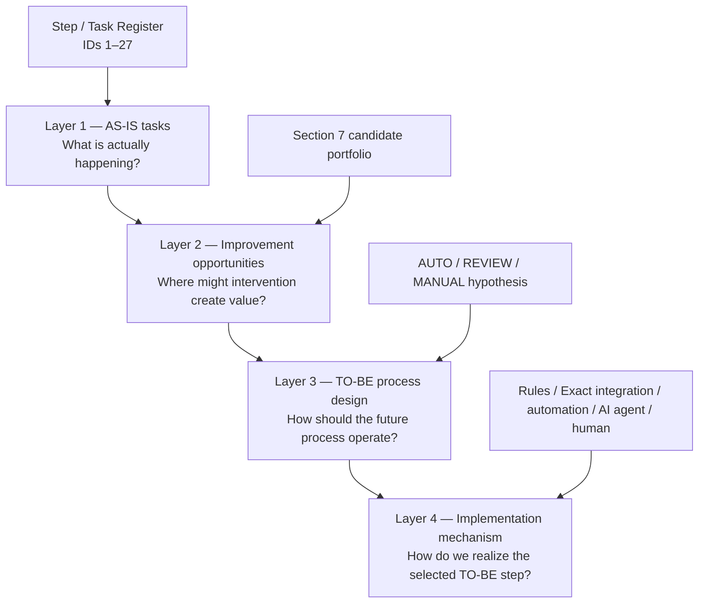
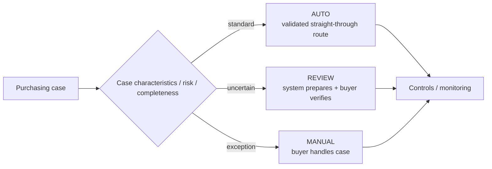
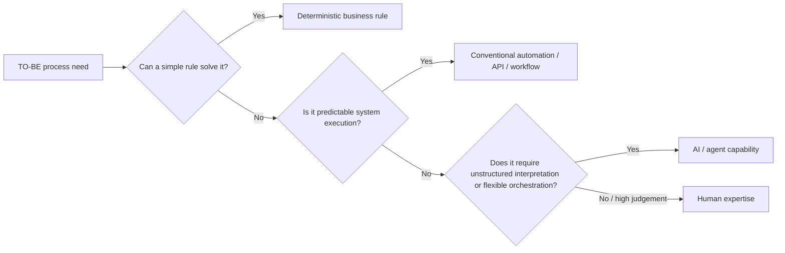
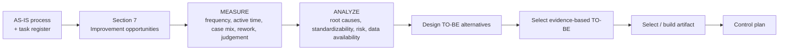
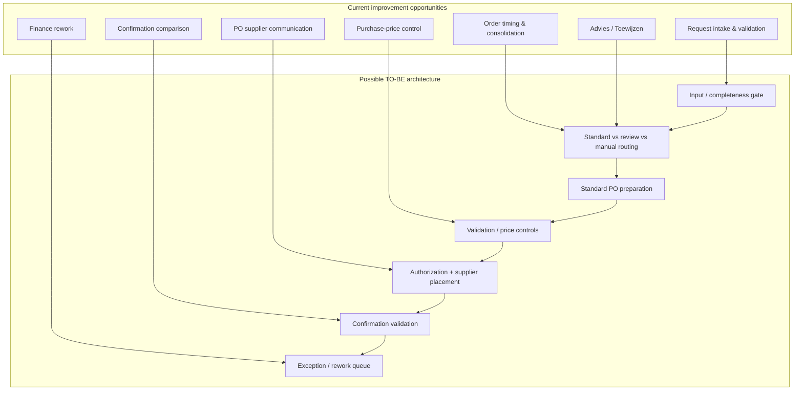
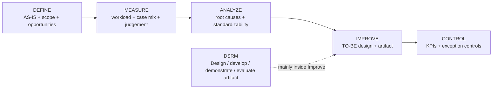

# Process Improvement Logic — AS-IS → Opportunities → TO-BE → Implementation

**Status:** Working navigation and logic guide, 24 August 2026.

This README explains how the current process files relate to each other and how the project should move from the observed **AS-IS process** toward an evidence-based **TO-BE process**.

The key distinction is:

> **Section 7 in `Process_Cleaned_V1.0.md` contains improvement opportunities derived from the AS-IS process. The TO-BE file contains a possible future-state architecture. Measure and Analyze are the bridge between them.**

The current TO-BE is therefore a **working hypothesis**, not yet the final result.

---

## 1. Main files in this folder

### [`Process_Cleaned_V1.0.md`](./Process_Cleaned_V1.0.md)

Current **AS-IS source of truth**.

It contains:

- the current operational purchasing workflow;
- observed/stated/formal evidence;
- the Step / Task Register;
- Section 7 candidate portfolio;
- resolved findings and open questions.

### [`TO_BE_Working_Hypothesis_v0.1.md`](./TO_BE_Working_Hypothesis_v0.1.md)

Current **future-state hypothesis**.

It explores whether purchasing could eventually be redesigned around:

- **AUTO** — standard, complete, low-risk cases;
- **REVIEW** — system prepares/supports, buyer verifies;
- **MANUAL** — exceptional, ambiguous or judgement-heavy cases remain with the buyer.

It also separates implementation mechanisms into:

- deterministic rules;
- conventional automation/integration;
- AI / agent capability;
- human expertise.

### [`../methodology/Phase_1_Current_Methodology.md`](../methodology/Phase_1_Current_Methodology.md)

Current **methodology and case-selection source of truth**.

It explains how DMAIC, DSRM, measurement and final artifact selection fit together.

---

# 2. The project layers

The project should be understood as four connected layers.



## Layer 1 — AS-IS tasks

The Step / Task Register answers:

> **What does the buyer currently do?**

Examples:

- ID 7 — decide order now versus hold;
- ID 12 — compare current supplier price with Exact;
- ID 20 — forward generated PO to supplier;
- ID 23 — compare supplier confirmation with PO / Exact;
- ID 26 — investigate Finance-returned issue.

These are operational units of work, not yet solutions.

## Layer 2 — Improvement opportunities

Section 7 groups related AS-IS work into broader candidate problem areas.

It answers:

> **Where might process improvement, automation or decision support create value?**

Current examples include:

- **Order timing & consolidation**;
- **Purchase-price control**;
- **Request intake & validation**;
- **Finance rework**;
- supporting opportunities such as **Advies / Toewijzen** and **PO supplier communication**.

A candidate can contain several task IDs.

Example:

```text
IDs 6–8
Assess stock/demand → order now vs hold → maximalisatie
        ↓
Candidate: Order timing & consolidation
```

and:

```text
IDs 11–13 + 23–24
Price-check decision → compare → correct → confirmation comparison
        ↓
Candidate: Purchase-price control
```

## Layer 3 — TO-BE process design

The TO-BE layer answers:

> **How should the improved purchasing process operate in the future?**

One possible architecture is to stop treating all cases identically and instead route them by case type:



This architecture may solve several Section 7 opportunities simultaneously.

For example:

- request validation can become an early routing gate;
- price control can become an automated validation step;
- supplier communication can become a standard-flow action;
- difficult buy/hold decisions can remain REVIEW or MANUAL;
- technically complex drawing/configuration cases can remain MANUAL.

## Layer 4 — Implementation mechanism

Only after a TO-BE step is justified should the project decide how to realize it.



Examples:

| Process need | Likely mechanism, subject to feasibility |
|---|---|
| Approval threshold | Deterministic rule |
| Required-field check | Deterministic validation |
| Retrieve stock/open PO data | Exact / Orbis integration |
| Generate standard PO fields | Conventional automation / API |
| Standard supplier email | Workflow automation |
| Interpret unstructured request email | AI where useful |
| Detect ambiguous/unusual content | AI + guardrails where useful |
| Coordinate multiple validated tools | Possible AI agent |
| Complex technical exception | Buyer |

---

# 3. How Section 7 leads toward the TO-BE

Section 7 does **not** directly determine the TO-BE.

The missing bridge is **Measure + Analyze**.



The logic is therefore:

> **AS-IS tells us what happens.**  
> **Section 7 tells us where improvement may be possible.**  
> **Measure tells us how much it matters.**  
> **Analyze tells us why it happens and whether it can be standardized.**  
> **TO-BE tells us how the improved process should work.**  
> **Implementation determines which combination of rules, automation, AI and people realizes it.**

---

# 4. Mapping current opportunities into a possible future architecture

The current Section 7 candidates can be viewed as potential modules inside a future process rather than as completely separate projects.



This means one future TO-BE workflow may combine several opportunities from Section 7.

However, the academic BEP can still select **one coherent artifact or process component** for deep development and evaluation.

---

# 5. What Measure must establish before accepting the current TO-BE hypothesis

The current AUTO / REVIEW / MANUAL architecture should only be adopted if evidence supports it.

Measure should therefore help establish:

1. **Workload contribution** — which task groups consume meaningful buyer workload?
2. **Frequency** — how often do these activities/cases occur?
3. **Standard-case share** — what proportion of cases genuinely follow a repeatable pattern?
4. **Exception share** — what makes cases unusual, risky or technically complex?
5. **Judgement requirement** — which tasks depend on tacit expertise even if they only take seconds?
6. **Data availability** — are the required Exact/Orbis/supplier fields accessible?
7. **Rule explicitness** — which decisions/checks can be written as deterministic rules?
8. **Rework burden** — where do defects or weak hand-offs create repeated work?
9. **Business value** — would changing the process materially reduce workload or improve reliability?

A useful exploratory case label during measurement is:

- `Standard candidate`
- `Review candidate`
- `Manual / exception`
- `Unknown`

These are working classifications only and should not yet be interpreted as proven automation feasibility.

---

# 6. Relationship to DMAIC and DSRM



Within this structure:

- `Process_Cleaned_V1.0.md` mainly supports **Define** and the transition into Measure;
- Section 7 provides the opportunity portfolio to be tested in **Measure/Analyze**;
- `TO_BE_Working_Hypothesis_v0.1.md` is an early **Improve hypothesis**, not yet an Improve conclusion;
- the final digital/AI artifact should be selected after the evidence supports a specific TO-BE intervention.

---

# 7. Current decision rule

Do **not** treat the current TO-BE workflow or an AI purchasing agent as already selected.

The present working logic is:

```text
AS-IS
  ↓
Opportunity portfolio
  ↓
Measure
  ↓
Analyze
  ↓
Evidence-based TO-BE
  ↓
Choose implementation mechanism
  ↓
Prototype / evaluate selected artifact
  ↓
Control
```

If the evidence shows that a large share of buyer workload is routine and standardizable, the current standard-flow / exception-flow hypothesis becomes stronger.

If the evidence instead shows that most workload is driven by technical exceptions, incomplete information, tacit judgement or rework, a different TO-BE process may be more appropriate.

The purpose of the current measurement phase is therefore not to prove the existing TO-BE idea, but to **test whether it is the right future-state design**.
