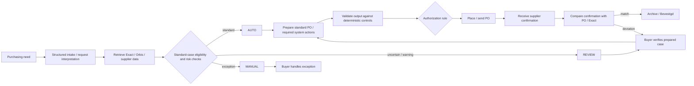

# TO-BE Working Hypothesis v0.1

**Status:** Working hypothesis, 24 August 2026. Not yet validated or selected as the final intervention.

**Purpose:** Preserve the current process-redesign direction without prematurely assuming that an AI agent must be the solution. The Measure and Analyze phases should determine whether this architecture is justified.

---

# 1. Core working hypothesis

The future purchasing process may be redesigned around a **standard-flow / exception-flow architecture**.

The process redesign comes first. Technology is selected afterwards for each step.

This means:

- deterministic business rules should remain deterministic rules;
- conventional automation should execute predictable system actions;
- AI should be used where unstructured information, ambiguity or flexible orchestration creates value;
- expert or high-risk exceptions should remain with the operational buyer.

The working convergence is therefore:

> **Process redesign determines the TO-BE architecture. An AI agent may become the implementation/orchestration layer for part of the standard flow, but the project should not assume this before Measure and Analyze provide evidence.**

---

# 2. Proposed three-way case routing

A future process could classify purchasing work into three operational routes.

## AUTO

A case is sufficiently standard, complete and low-risk to be processed automatically using validated rules and system integrations.

Possible characteristics:

- known article;
- supplier already determined/approved;
- required data available;
- no unusual technical description;
- no special drawing or unsupported attachment requirement;
- no abnormal price/data condition;
- authorization route is deterministic;
- no exception signal is triggered.

## REVIEW

The system can prepare the case, but a buyer should verify or approve the result before execution.

Possible characteristics:

- unusual price deviation;
- incomplete confidence in extracted request information;
- unusual quantity or delivery condition;
- one or more warning signals;
- uncertain classification between standard and exception.

## MANUAL

The case requires buyer expertise and remains outside straight-through automation.

Possible characteristics:

- specialized/configured component;
- technical drawing or long/special specification;
- ambiguous request information;
- new or unusual article/supplier situation;
- high-risk exception;
- case requiring tacit technical judgement.

---

# 3. Working TO-BE flow

This is a hypothesis only. The actual TO-BE process should be designed after the workload and case-mix evidence is collected.

---

# 4. Technology-selection principle

The redesigned workflow should not use AI where simpler technology is more reliable.

| Need | Preferred mechanism, subject to feasibility |
|---|---|
| Authorization threshold/routing | Deterministic business rule |
| Required-field completeness checks | Deterministic validation |
| Retrieve stock, open PO, article or supplier data | Exact/Orbis integration |
| Generate/update standard PO fields | Conventional automation / API / workflow |
| Send or prepare standard supplier communication | Conventional automation / workflow |
| Interpret unstructured email/request text | AI where useful |
| Recognize ambiguous or unusual request content | AI + explicit guardrails where useful |
| Coordinate multiple tools and actions | Potential AI-agent orchestration |
| Technically ambiguous/high-risk exceptions | Operational buyer |

Possible implementation technologies include supported Exact/Orbis interfaces, workflow automation, Power Automate/RPA, custom software/services and an AI agent that calls validated tools. The final technology choice is not yet made.

---

# 5. How Direction 1 and Direction 3 may converge

The two earlier directions are not necessarily competing final solutions.

## Direction 1: AI-agent-first

Starts with the technology question:

> Which purchasing tasks can an AI agent perform for the buyer?

## Direction 3: process-redesign-first

Starts with the process question:

> What should the future purchasing process look like, which work should disappear or change, and which technology is appropriate for each step?

## Possible convergence

If Measure and Analyze show that a substantial share of workload consists of repeatable standard cases, the process-redesign direction may produce this conclusion:

> Redesign purchasing around exception-based processing, then use an AI agent as an orchestration layer for the standard flow while retaining deterministic controls and human exception handling.

Therefore the current working logic is:

`AS-IS analysis → workload/case-mix measurement → identify standard vs exception cases → design TO-BE → assign rule/automation/AI/human mechanism → prototype selected artifact → evaluate → Control plan`

---

# 6. What Measure must establish before adopting this TO-BE

The following evidence is needed before this architecture can be justified:

1. **Standard-case share:** what percentage of purchasing cases are genuinely routine/repeatable?
2. **Addressable workload:** how much active buyer time is spent on those standard cases?
3. **Exception taxonomy:** which features make a case non-standard or risky?
4. **Decision/judgement burden:** which apparently fast tasks depend on expertise even when they consume little time?
5. **Data availability:** can Exact/Orbis expose the fields needed to process and validate standard cases?
6. **Rule explicitness:** which controls can be expressed deterministically?
7. **AI need:** which inputs or decisions genuinely require unstructured-information handling rather than normal automation?
8. **Safety boundary:** can unusual cases be detected and routed reliably before automatic execution?
9. **Business value:** would the standard-flow workload reduction be material enough to justify implementation?

---

# 7. Additional measurement implication

Current timing observations should be supplemented with a simple case classification:

- `Standard candidate`
- `Review candidate`
- `Manual / exception`

For each observed case, where practical record:

`Task ID | Case/PO | Standard/Review/Manual | Start | End | Active time | # lines | judgement required | exception reason | notes`

For judgement-heavy tasks, duration should not be the only measure. Record the decision, cue/reason and whether a less-experienced operator could reproduce the decision from documented data/rules.

This classification is exploratory. It should not be used to claim automation feasibility until enough cases have been observed and technical feasibility is verified.

---

# 8. Potential evaluation if this becomes the thesis artifact

If the final artifact becomes an exception-based purchasing workflow with an AI/automation component, possible evaluation measures include:

- standard-case classification accuracy;
- exception-detection recall;
- **exception escape rate**: exceptional cases incorrectly allowed into automatic processing;
- PO-field accuracy against trusted reference cases;
- correction/review rate;
- percentage of cases eligible for straight-through processing;
- active buyer time saved or avoided;
- false positives routed unnecessarily to review;
- consistency across repeated test cases;
- human review burden remaining after automation.

The key control principle would be that uncertain or abnormal cases fail safely into REVIEW or MANUAL rather than being automatically executed.

---

# 9. Current status and decision rule

This document does **not** replace `Process_Cleaned_V1.0.md`. That file remains the AS-IS source of truth.

This TO-BE file should remain a **hypothesis** until the Measure and Analyze evidence supports or rejects it.

Do not treat the AI agent as selected merely because it appears in this hypothesis. The evidence may instead lead to a TO-BE process dominated by deterministic rules, conventional automation, process-standardization changes, decision support, or a different intervention.