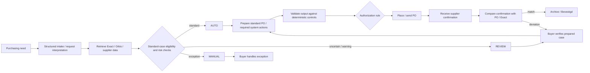

# TO-BE Working Hypothesis v0.1

**Status:** Working future-state hypothesis, 24 August 2026. Not yet validated or selected as the final intervention.

**Ownership:** This file contains the proposed future-state architecture only. Measurement gates, candidate prioritization and evaluation design are maintained in `docs/methodology/Phase_1_Current_Methodology.md`.

---

# 1. Core hypothesis

Operational purchasing may be redesigned around a **standard-flow / exception-flow architecture**.

The process design comes first. Technology is selected afterwards for each step:

- deterministic rules for explicit business logic;
- conventional automation/integration for predictable system actions;
- AI where unstructured information, ambiguity or flexible orchestration creates value;
- human expertise for exceptional, ambiguous or high-risk work.

An AI agent is therefore a possible implementation mechanism, not an assumed starting point.

---

# 2. Proposed case routing

## AUTO

A case is sufficiently standard, complete and low-risk to be processed through validated rules and system integrations.

Possible characteristics:

- known article;
- supplier already determined/approved;
- required data available;
- no unusual technical description;
- no unsupported special attachment/drawing requirement;
- no abnormal price/data condition;
- deterministic authorization route;
- no exception signal.

## REVIEW

The system can prepare the case, but a buyer verifies or approves it before execution.

Possible characteristics:

- unusual price deviation;
- incomplete confidence in request information;
- unusual quantity or delivery condition;
- warning signal;
- uncertain classification between standard and exception.

## MANUAL

The case remains with the buyer because it requires substantial expertise or carries higher uncertainty/risk.

Possible characteristics:

- specialized/configured component;
- technical drawing or long/special specification;
- ambiguous request information;
- new or unusual article/supplier situation;
- high-risk exception;
- tacit technical judgement.

These characteristics are provisional design hypotheses, not validated eligibility rules.

---

# 3. Working TO-BE flow

The actual TO-BE should only be adopted if Measure and Analyze support this architecture.

---

# 4. Technology-selection principle

Use the simplest reliable mechanism that fits the future-state need.

| Future-state need | Likely mechanism, subject to feasibility |
|---|---|
| Authorization threshold/routing | Deterministic business rule |
| Required-field completeness | Deterministic validation |
| Retrieve stock/open PO/article/supplier data | Exact/Orbis integration |
| Generate/update standard PO fields | Conventional automation / API / workflow |
| Standard supplier communication | Conventional automation / workflow |
| Interpret unstructured request text | AI where useful |
| Detect ambiguous/unusual content | AI + explicit guardrails where useful |
| Coordinate multiple validated tools/actions | Potential AI-agent orchestration |
| Technically ambiguous/high-risk exception | Operational buyer |

Possible technologies include supported Exact/Orbis interfaces, workflow automation, RPA/custom services and AI tools. No final technology is selected yet.

---

# 5. Status boundary

This file does **not** replace the AS-IS process master and does not prove automation feasibility.

- Current process truth: `Process_Cleaned_V1.0.md`
- Validation gates, measurement and candidate status: `../methodology/Phase_1_Current_Methodology.md`
- Workload interpretation: `../methodology/Workload_Definition.md`

The hypothesis may be strengthened, revised or rejected as Measure and Analyze evidence develops.