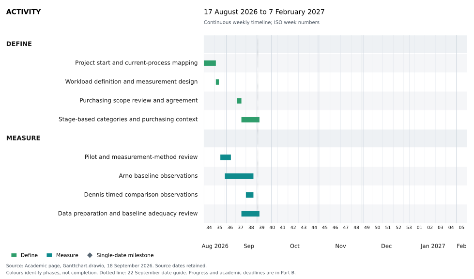
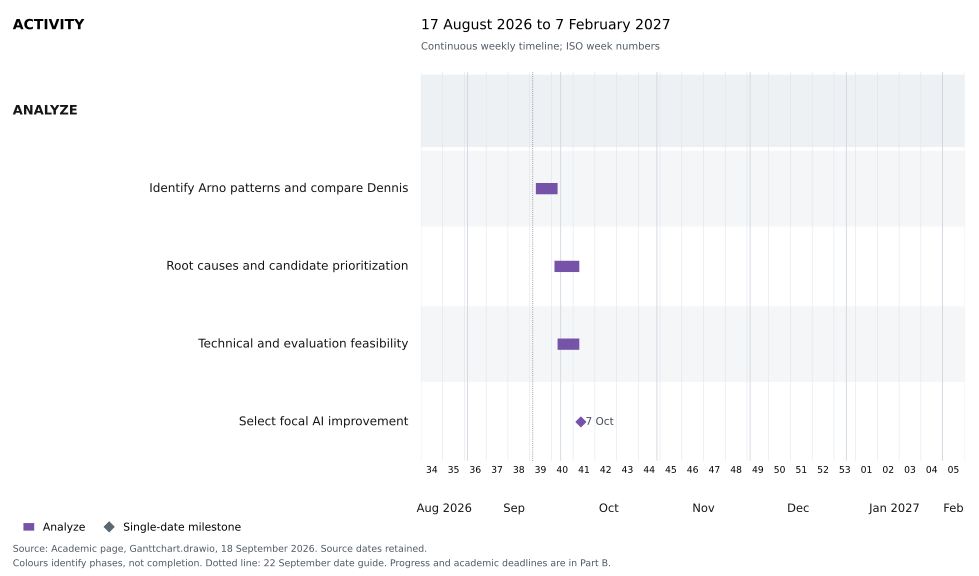
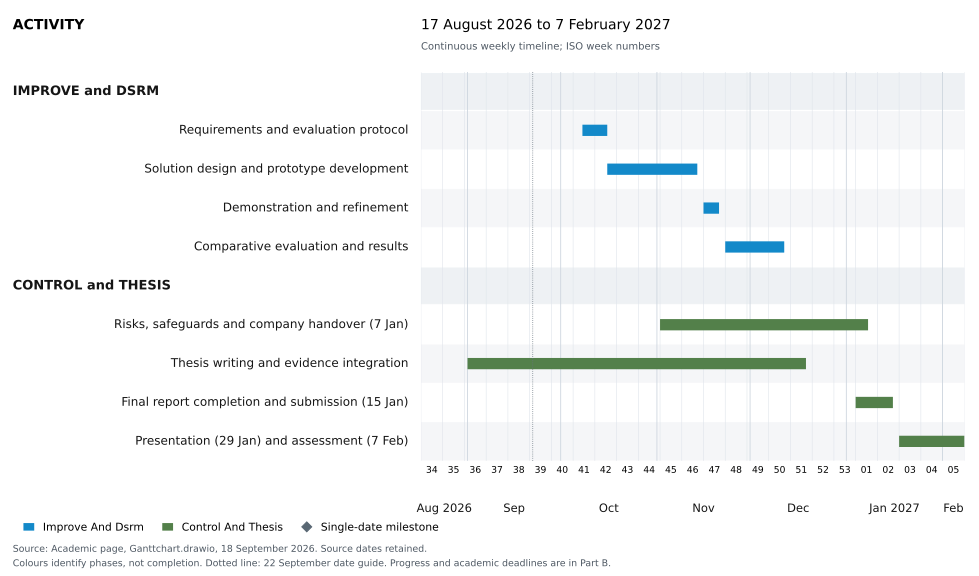

# Plan of Work

**Name student:** Yijie Wang

Student ID: [Student ID]

**Name TU/e supervisor:** Zhongxin Hu

**Name 2nd assessor:** [Second assessor]

Name company: Hytech-Pommec

## Part A. BEP Research Proposal

### Project Title

AI-supported operational procurement at Hytech-Pommec

### 1. Introduction

Operational procurement at Hytech-Pommec covers the daily execution of purchasing decisions. Arno, the operational buyer, processes requests in Exact, prepares and monitors purchase orders (POs), checks prices and supplier confirmations, and resolves missing or incorrect data. Initial observations also show decisions about when to order and whether demand for the same supplier can be combined. These tasks require manual information handling, verification and judgement, but their relative workload contributions and underlying causes have not yet been established.

The business concern is the workload associated with Arno’s manual purchasing tasks, checking and information handling. Some of the information and decisions used in operational purchasing originate in tactical purchasing. Dennis's relevant work and its connections with Arno therefore form part of the investigation. The study will examine whether those connections help explain the amount and difficulty of Arno’s work. It does not yet establish a dominant root cause or achievable savings.

Following Bowling and Kirkendall (2012), this study distinguishes the amount of work, or quantitative workload, from the difficulty of work, or qualitative workload. Task frequency, case volume and processing time will inform the assessment of the amount of work; evidence about judgement and problem solving will inform the assessment of its difficulty. Processing time provides information about the time required to perform the work, but does not by itself represent the full workload construct. Purchasing quality refers to the extent to which the outcome of a purchasing activity fulfils the requirements relevant to that activity. The specific workload indicators and quality criteria for evaluation will be justified after selecting the improvement component and specified before development and formal testing. Van Weele’s purchasing-process model, discussed by Bäckstrand et al. (2019), locates tasks within specification, supplier selection, contracting, ordering, monitoring and evaluation. It provides a framework for examining operational purchasing, relevant tactical purchasing tasks and the connections between them.

The primary objective of this Bachelor End Project (BEP) is to reduce Arno's workload within the included purchasing work while maintaining purchasing quality compared with current practice. The investigation includes Dennis's relevant tactical tasks, information exchanges and decision responsibilities. One coherent purchasing-process component will be selected for redesign and evaluation using artificial intelligence (AI). The component may involve both buyers where evidence links the proposed change to Arno's work. Other supported opportunities will become recommendations.

### 2. Research question

#### Main research question

To what extent can an AI-supported solution reduce the operational buyer’s workload at Hytech-Pommec without reducing the quality of the purchasing outcome?

#### Sub-research questions

1. Which parts of the purchasing workflow, including relevant operational and tactical purchasing tasks, contribute most to the operational buyer’s workload in terms of frequency, processing time, rework and judgement required?

2. What conditions and control measures are required for the proposed solution to be implemented reliably in the purchasing workflow, including relevant operational and tactical purchasing tasks?

3. Which of these activities offers the greatest potential for AI-supported improvement, considering workload contribution, business relevance, technical feasibility and the need for human expertise?

4. To what extent does the proposed AI-supported solution reduce workload while maintaining the required quality of the purchasing activity, when compared with current practice?

The operational buyer in these questions is Arno. Relevant tactical purchasing tasks performed by Dennis are included in the investigation and, where relevant, in the design and evaluation of the selected improvement. Reducing Arno’s workload remains the primary objective. Changes to Dennis’s work will be considered where the improvement affects his tasks or responsibilities.

### 3. Empirical context (incl. company description)

Hytech-Pommec develops and manufactures hyperbaric oxygen and life support systems. Procurement ensures that the company receives the right materials from suitable suppliers at the required time, price and quality. Strategic and tactical procurement include supplier selection, contracts, sourcing decisions and supplier relationships. Operational procurement executes purchasing decisions through requests, orders, monitoring and information checks. Exact supports order administration, allocation to underlying demand and supplier information.

The study will observe Arno's operational work and Dennis's relevant tactical work, including their inputs, outputs, decisions and exchanges. Johan has identified overlap between the roles, including cover during absences. Task purpose and observed responsibility will determine process-stage assignments; job titles alone will not. Johan provides company supervision, business context and support for access and feasibility decisions.

The detailed operational flow runs from the purchasing need to supplier confirmation, recorded as Bevestigd in Exact. Process validation will clarify which confirmation-related controls fall within this boundary. Relevant tactical work includes specification, supplier selection and agreements. Existing agreements can be reused, so each PO need not repeat every stage. Following the academic decision of 10 September, logistics and EXC time are excluded from the thesis Measure analysis and focal-case selection. Raw records remain preserved. The workload profile covers Arno's included purchasing work rather than his entire workload.

### 4. Method

#### Research Design/Approach

The study combines qualitative process investigation with quantitative profiling and evaluation of one selected intervention. Define, Measure, Analyze, Improve and Control (DMAIC) provides the overarching structure, following de Mast and Lokkerbol (2012). Define and Measure establish the relevant purchasing process and Arno's workload profile. Analyze uses both buyers' evidence to investigate contributing factors and select a bounded improvement component.

Within Improve, Design Science Research Methodology (DSRM) guides the artifact's objectives, design, development, demonstration and evaluation, following Peffers et al. (2007). Control translates findings into recommendations for use and monitoring. AI could support information extraction, document comparison, validation or routine decisions. The technical form, level of autonomy and integration requirements will follow the selected component and its evidence.

#### Sources of data and data collection

| Source | Data and collection | Purpose |
|---|---|---|
| Arno | Structured observation of tasks, active time, volume, interruptions and decisions; case questions | Establish his included workload profile |
| Dennis | Targeted observation and case walkthroughs recording tasks, inputs, outputs, decisions and exchanges with Arno | Identify relevant task patterns, handoffs and possible causes |
| Purchasing documents | Review SOPs, forms and formal process documents | Compare documented and observed practice |
| Purchasing records and systems | Relevant requests, POs, confirmations and available Exact or Orbis information, subject to access | Trace supported connections and assess feasibility |
| Evaluation cases | Record Arno's handling, review, correction and outcomes; record changes to affected tasks in Dennis's work separately | Evaluate the primary outcome and effects on other roles |

Structured continuous observation follows time-and-motion principles, including explicit coverage and task transitions (Zheng et al., 2011). Early observations produced the AS-IS task register; pilot refinement led to seven broad families for feasible live recording during task switching: REQ, CLAR, DEC, PO, CHECK, SEND and OTHER. After observation, the recorded work is linked to supported Task IDs and classified into analytical activities and Van Weele stages by its purchasing purpose. This implements the framework-led activity list discussed on 17 September. Local categories and adaptations are documented. Original times, flags and uncertainty remain; combined intervals are not split without evidence. Instantaneous decisions are tallied, and embedded decisions remain attributes of their timed episode.

The initial target is official Arno observation on five distinct dates, with the pilot reported separately. Actual hours will be reported by date and in total. Coverage, consistency across days and newly observed work determine whether extension is needed; five dates alone do not establish sufficiency. Dennis's smaller dataset supports investigation of activity patterns and connections, including differences between the buyers. Further fieldwork targets gaps. Walkthroughs inform interpretation; only reliable durations enter time summaries. Active buyer time uses exclusive intervals: inseparable activities share one interval and each minute is counted once.

### 5. Data analysis approach(es)

#### Workload profile and process analysis

For sub-question 1, active handling time is the primary quantitative indicator in the exploratory profile of Arno's included purchasing work. Frequency and volume complement this indicator; judgement, uncertainty and expertise notes inform difficulty. Interruptions describe workflow conditions. Where existing notes provide support, repeated work will be considered qualitatively within the same scope. Time alone does not represent the full workload construct.

Raw records remain unchanged. Derived data exclude logistics, EXC and unreliable durations. Timing checks address start/end evidence and overlap; classification confidence is separate. Included minutes are summarized by family, activity and purchasing stage. Time shares use included minutes; occurrence rates require verified observation exposure. Unresolved and combined episodes retain time without duplication. Dennis's evidence remains separate because unequal coverage prevents overall workload comparisons.

Process maps, cases and follow-up questions will investigate contributing factors for sub-question 1 and inform selection for sub-question 3. Analysis will trace information and decisions through both roles, examining missing inputs, clarification and overlapping responsibilities where supported. Proposed causes require supporting evidence. The selected component may involve Dennis while Arno's workload remains the primary outcome.

#### Selection and requirements of the improvement

For sub-question 3, candidates must meet conditions for permission, data access, reference outcomes, risk control and study time. Analyze will assess whether AI has a justified role. Candidates will be compared on addressable Arno workload, business relevance, data readiness, AI suitability, evaluation feasibility and human expertise. This can include effects on Arno's subsequent work within the validated purchasing boundary; EXC and logistics remain excluded.

Criteria, score anchors and weights will be agreed with the academic supervisor before ranking; sensitivity analysis will assess uncertain evidence and plausible weights. Johan will validate business feasibility. Exact and Orbis checks will establish access and interface requirements. For sub-question 2, inputs, outputs, implementation conditions, review controls and responsibilities will be specified with affected buyers, including Dennis where relevant.

#### Evaluation of workload and quality

For sub-question 4, the improvement will be compared with current practice using justified workload indicators and quality criteria. Before development and formal testing, the evaluation will specify cases, units, comparator, improvement thresholds and quality acceptance rules. If selected, handling time will include preparation, review, correction and all other attributable active work within scope. Equivalent incoming cases remain eligible when the intervention prevents work for Arno.

Development and evaluation cases remain separate. Matched cases and balanced condition order will be used where feasible; sample size and analysis depend on available evidence. Results will report workload indicators, uncertainty and quality. Relevant AI costs will be scoped after selection, distinguishing estimates from measured costs. Effects on Dennis will be reported separately. The company will agree acceptable transfers before evaluation; transferred work will not be presented as department-wide savings. Success requires predefined workload improvement and maintained quality relative to current practice; no benefit remains a valid finding.

### 6. Deliverables

#### Anticipated practical implications for the company

The project will help Hytech-Pommec understand which purchasing tasks contribute to Arno’s workload and how relevant tasks and information exchanges involving Dennis affect that work. This understanding will support the selection of one purchasing task or coherent process step for AI-supported redesign.

For the selected component, the project will deliver a proposed process design, an AI-supported prototype and an evaluation against current practice. The evaluation will assess its effects on Arno’s workload and purchasing quality, including effects on Dennis’s work where relevant. Based on these findings, the company will receive recommendations on whether and under which conditions the proposed solution could be used or developed further. The intended practical benefit is a feasible way to reduce Arno’s workload while maintaining purchasing quality.

#### Anticipated theoretical insights

The study aims to provide context-specific evidence about how AI-supported changes to purchasing tasks and information exchanges affect an operational buyer's workload and purchasing quality. It will examine information requirements, verification and human review in the selected component. Relating the findings to Van Weele stages will help explain how the intervention operates across relevant purchasing roles. The discussion will address the limits of the single-company setting, observation coverage and included work.

### References

Bäckstrand, J., Suurmond, R., van Raaij, E., & Chen, C. (2019). Purchasing process models: Inspiration for teaching purchasing and supply management. Journal of Purchasing and Supply Management, 25, Article 100577. https://doi.org/10.1016/j.pursup.2019.100577

Bowling, N. A., & Kirkendall, C. (2012). Workload: A review of causes, consequences, and potential interventions. In J. Houdmont, S. Leka, & R. R. Sinclair (Eds.), Contemporary occupational health psychology: Global perspectives on research and practice (Vol. 2, pp. 221-238). Wiley-Blackwell. https://doi.org/10.1002/9781119942849.ch13

de Mast, J., & Lokkerbol, J. (2012). An analysis of the Six Sigma DMAIC method from the perspective of problem solving. International Journal of Production Economics, 139(2), 604-614. https://doi.org/10.1016/j.ijpe.2012.05.035

Peffers, K., Tuunanen, T., Rothenberger, M. A., & Chatterjee, S. (2007). A design science research methodology for information systems research. Journal of Management Information Systems, 24(3), 45-77. https://doi.org/10.2753/MIS0742-1222240302

Zheng, K., Guo, M. H., & Hanauer, D. A. (2011). Using the time and motion method to study clinical work processes and workflow: Methodological inconsistencies and a call for standardized research. Journal of the American Medical Informatics Association, 18(5), 704-710. https://doi.org/10.1136/amiajnl-2011-000083

## Part B - Planning

The BEP combines 420 study hours for 1BEPIE and 1BEPIEX. Figures 1-3 use the simplified academic Gantt dated 18 September 2026, with four activity groups per DMAIC phase. The schedule runs from 17 August 2026 to the final assessment on 7 February 2027. Bars show planned work windows, not full-time effort or completion. Company-dependent access, observation and evaluation must fit before the placement ends on 7 January. Actual effort will be logged by work package and reviewed weekly.

The literature study supports measurement, candidate selection, design and evaluation. Candidate evidence is planned for 23-29 September, followed by scoring and feasibility checks from 30 September to 6 October and selection on 7 October. These research dates remain provisional. Analyze depends on the Measure coverage review and usable summaries. Artifact design and testing follow selection and evaluation-protocol agreement. Thesis writing runs alongside the research, with result integration in December and final checks in January.

Progress snapshot, 21 September 2026: four official Arno sessions are recorded (31 August, 1, 8 and 18 September), plus the separate 28 August pilot. All five records have completed post-session enrichment, including the 8 September OBS-16 exclusion. Dennis's 15 September observation provides qualitative evidence. Further timed observations and clarification may still be needed. The Measure coverage and consistency review remains open; completed enrichment does not establish sufficiency.

| Milestone | Planned date |
|---|---|
| Half-page project description | 15 September 2026 |
| Internal complete PoW draft; Measure sufficiency review | 18 September 2026, review still open |
| Supervisor draft review; Measure phase review | 20 September; 22 September 2026 |
| Final Plan of Work | 27 September 2026 at 23:59 |
| ILBEP | 28 September 2026 at 23:59 |
| Select AI improvement; finalize evaluation protocol | 7 October; 15 October 2026 |
| Artifact ready; evaluation complete | 20 November; 11 December 2026 |
| Company placement ends; final report | 7 January; 15 January 2027 at 23:59 |
| Presentation completed by; final assessment | 29 January; 7 February 2027 |

The internal draft and review targets of 18 and 20 September have passed; supervisor review and the formal Measure review remain open. Plan of Work submission is due on 27 September. Zhongxin reviews the document before it is sent to the second assessor. AI-component selection follows submission and remains conditional on sufficient evidence. Delays in evidence or access will be addressed at the weekly planning review.

Source: academic Gantt in Ganttchart.drawio, updated 18 September 2026. Progress above reflects records checked on 21 September. Chart colours distinguish phases; the dotted line marks 22 September and does not indicate completion.

### Figure 1. Gantt chart for Define and Measure

### Figure 2. Gantt chart for Analyze

### Figure 3. Gantt chart for Improve, Control and thesis completion

## Part C - Reflection at start BEP

### 1. Planning and Organizing

Experiences: In the Multi-Disciplinary CBL dashboard project (4CBLW00, 2024-2025), I worked on interface design, evaluation and reporting. My self-study reports recorded time for meetings, design changes and writing, which helped make my contribution visible. However, arranging evaluations depended on other people. SSA 13 records that, after other groups did not respond to my emails, I contacted fellow students to arrange participation. This experience showed me that a task list needs to include dependencies, follow-up moments and a workable alternative when access is delayed.

Feedback: In my earlier P&PD reflection, I identified prompt responses and deadline reminders as useful contributions to the team. My recorded peer feedback also asked for more active participation and more detailed input. That feedback suggests that being available and reminding others about deadlines is only part of organizing shared work. I also need to communicate what is ready, what is uncertain and which decision is needed next. The project records give me concrete examples to review, although they do not establish that I consistently planned well.

Self-assessment: I rate myself 6/10. I can organize tasks and keep records, but my planning is still fairly basic. I need to improve estimates, prioritize essential work and anticipate dependencies. In this BEP, access to buyers, usable observations and supervisor decisions will influence progress. A detailed schedule will only help if I update it when these conditions change.

Learning goals: During this semester, I want to maintain a realistic weekly plan that connects tasks to the next research milestone. I aim to identify access or review dependencies at least one week ahead and make the effect of unfinished work visible before it threatens a deadline.

Action plan: Each Monday I will select three priority outputs, estimate their hours and identify any required input. On Friday I will compare planned and actual effort, record reasons for differences and update the next week. I will include a short progress and dependency summary in supervisor updates.

### 2. Writing

Experiences: During the CBL dashboard project, I contributed to the report introduction and the explanation of the design process. SSA 13 records an introduction and a design overview to support the other writers. SSA 15 records 4.5 hours on the design-process section, including the reasons for changes between iterations. This gave me practice translating design work into a written explanation. Looking back at the self-study reports, I can follow what I did, but some descriptions need clearer grammar, more precise wording and a stronger connection between the problem, evidence and design decision.

Feedback: My earlier P&PD reflection states that my writing conveyed the main message, but needed fuller explanations to make it understandable to others. The student dashboard evaluation of 2 June 2025 also identified unclear labels and explanations, including the meaning of the progress bar and peer recommendations. Those comments concerned the interface, but they reinforced a writing lesson: a term that is familiar to me can still be unclear to its reader. I need to explain meaning rather than assume shared understanding.

Self-assessment: I rate myself 5.5/10. I can produce a useful first draft, but I need deliberate revision to make it clear and academically precise. I sometimes describe activities without sufficiently explaining why they matter. For the BEP, I particularly need to distinguish observations, interpretations and conclusions, and avoid implying that a proposed benefit has already been demonstrated.

Learning goals: My goal is to write paragraphs with one clear point, supporting evidence and an explanation of its relevance. Before each major draft review, I want consistent terminology for workload, handling time and purchasing quality, and a clear connection between the research questions and methods.

Action plan: I will reserve a weekly writing block and draft sections alongside the research. For each section, I will outline the argument before writing and check terminology, grammar and source support afterwards. At draft reviews, I will ask whether the reader can identify the main claim and understand its evidence. I will keep a revision log of recurring problems and compare an early methods section with the revised version in November and the final report in January.

### 3. Presenting

Experiences: In the CBL project, I prepared part of the final presentation about the development of the prescriptive dashboard. SSA 15 records work on the slides and my presentation script. The saved condensed script covers slides 2 to 9 in approximately three minutes and describes several design changes and their rationale. Preparing it required me to select what an audience needed to know. Reviewing it now, I see how easily a short presentation can become crowded when it tries to cover too many changes, sources and claimed benefits.

Feedback: My earlier P&PD reflection records full marks for the presentation-skills component and no detailed feedback. It also identifies confidence and composure as areas I wanted to improve. I regard the recorded result as encouraging, but it gives limited information about particular aspects of delivery. For this BEP, I therefore need more specific feedback on pace, structure, clarity and answers to questions. I should also verify every numerical result before including it in a slide or script.

Self-assessment: I rate myself 6/10. I can prepare a structured explanation and supporting slides. My main development needs are selecting the most relevant information, speaking with greater composure and explaining uncertainty clearly. A prepared script helps me organize my thoughts, but I want to become more comfortable answering questions about the reasoning behind a result.

Learning goals: By the final presentation, I want to explain the purchasing problem, method, main result and limitation within the agreed time. A listener unfamiliar with the project should be able to repeat the main conclusion and understand the evidence supporting it.

Action plan: From October, I will practise a three-minute project update every two weeks and record selected rehearsals. I will ask a peer or supervisor which message they remember and where the explanation became unclear. I will check timing and reduce unnecessary detail after each rehearsal. Before the final presentation, I will complete two full rehearsals and practise questions about case selection, quality criteria and uncertainty. I will compare feedback from early and final rehearsals to assess progress.

### 4. Collaborating

Experiences: The CBL dashboard project required me to coordinate design work with several teammates. My mid-term evaluation describes designing and prototyping with Maciej and sharing code and styling approaches during pair programming. Other self-study reports record discussions with Veerle and Maud about stakeholder feedback, as well as writing contributions that supported their report sections. These experiences showed me that completing my own task is not sufficient when another person needs a clear explanation or a usable handover. Decisions about what to change also needed agreement within the team.

Feedback: My earlier P&PD reflection records peer feedback to contribute more actively in meetings and provide more detailed input. The reflection also reports improvement in participation in group chats and in sharing completed deliverables. I recognise progress here, but the earlier feedback remains relevant. Responding to messages is easier than raising a concern, explaining an alternative or checking that everyone has understood a decision. I need to take a more active role in these discussions.

Self-assessment: I rate myself 6/10. I am able to work with others and respond to feedback, but I still need to make my reasoning and progress clearer. During the BEP, I will work independently while depending on buyers and supervisors for access, interpretation and decisions. I need to respect their time and communicate questions in a form they can answer.

Learning goals: I want to make a relevant contribution in each substantive project meeting and leave with a shared understanding of actions and responsibilities. I also want to raise disagreements or uncertainties early enough for others to respond before they affect the research.

Action plan: Before each meeting, I will prepare a short update, a clear question and, where appropriate, a proposed next step. Afterwards, I will record decisions, action owners and deadlines and check important interpretations with the relevant person. Once a month, I will ask a supervisor or collaborator for one example of effective communication and one improvement. I will review these examples alongside meeting notes in November and January to assess whether my participation and handovers have become clearer.

### 5. Dealing with Scientific Information

Experiences: In the CBL dashboard project, I helped investigate scientific literature on prescriptive learning dashboards. The shared research-paper overview identifies contributions by Veerle and me and includes my notes on potential benefits and limitations. This gave me experience connecting literature to a design problem and considering differences between users. However, a collection of article summaries does not automatically form a justified argument. Reviewing the project documents also reminds me to check whether broad statements about design benefits are supported by the specific study being cited.

Feedback: The stakeholder meeting notes record openness to exploring an LLM, alongside scepticism about how prompts would be generated and a request to discuss privacy with the LLM group. This feedback concerned the proposed application and highlighted questions that needed investigation. It reminded me that an appealing technical idea still requires evidence about how it works and whether it fits the setting. In the BEP, I need to turn such questions into focused searches and explicit design or evaluation requirements.

Self-assessment: I rate myself 6/10. I can find relevant papers and extract useful ideas, but my critical appraisal and synthesis need improvement. I need to examine methods, samples, outcome definitions and limitations more consistently. Findings from a student dashboard cannot simply be transferred to procurement. Similarly, a reduction in handling time must be assessed together with the quality of the purchasing outcome.

Learning goals: My goal is to build a traceable literature argument for workload measurement, process analysis and the selected AI intervention. For every central claim, I want to identify the supporting source, explain why it is relevant and state any limitation that affects its use.

Action plan: During the BEP, I will regularly read relevant papers critically and maintain a literature matrix with the question, method, setting, findings, limitations and relevance to my study, and record search terms and selection reasons. Before using a reference, I will check the original text and bibliographic details. At methods and draft reviews, I will ask the supervisor to challenge key source-to-claim links. Progress will be evaluated through corrected claims and a more coherent synthesis, rather than the number of citations alone.

## Part D - Declaration of scientific conduct

The supplied scientific-conduct declaration form is retained unchanged and unsigned in the Word document. Its image is not reproduced here.
