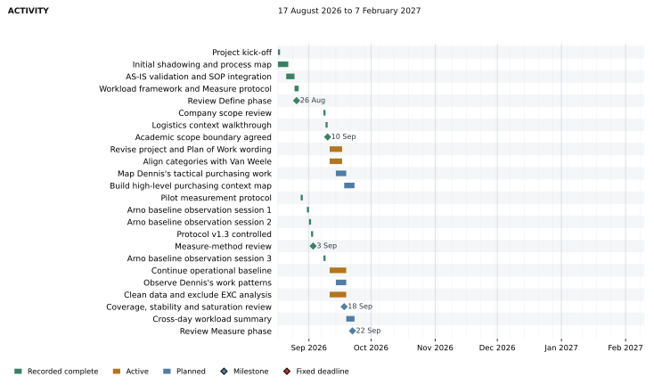
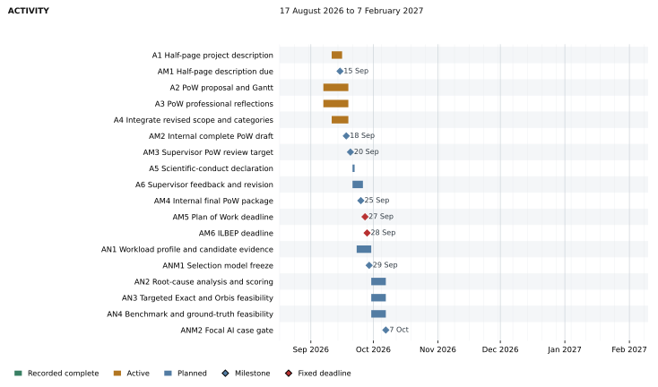
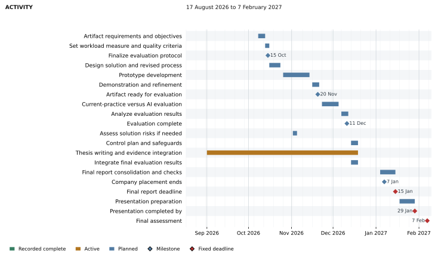

# Plan of Work

**Name student:** Yijie Wang

**Student ID:** [Student ID]

**Name TU/e supervisor:** Zhongxin Hu

**Name 2nd assessor:** [Second assessor]

**Name company:** Hytech-Pommec

## Part A. BEP Research Proposal

### Project Title

AI-supported operational procurement at Hytech-Pommec

### 1. Introduction

Operational procurement at Hytech-Pommec covers the daily execution of purchasing decisions. Arno, the operational buyer, processes requests in Exact, prepares and monitors purchase orders (POs), checks prices and supplier confirmations, and resolves missing or incorrect data. Initial observations also show decisions about when to order and whether demand for the same supplier can be combined. These tasks require manual information handling, verification and judgement, but their relative workload contributions and underlying causes have not yet been established.

The business concern is the workload associated with Arno's purchasing tasks while maintaining purchasing quality. Some of the information and decisions used in operational purchasing originate in tactical purchasing. Dennis's relevant work and its connections with Arno therefore form part of the investigation. The study will examine how these tasks and connections affect the amount and difficulty of Arno's work. It does not yet establish a dominant root cause or achievable savings.

Following Bowling and Kirkendall (2012), this study distinguishes the amount of work, or quantitative workload, from the difficulty of work, or qualitative workload. Arno's workload will be examined through task frequency, case volume, processing time, rework and evidence about the judgement and problem solving involved in purchasing tasks. Processing time provides information about the time required to perform the work, but does not by itself represent the full workload construct. Purchasing quality refers to the extent to which the outcome of a purchasing activity fulfils the requirements relevant to that activity. The specific workload indicators and quality criteria for evaluation will be justified after selecting the improvement component and specified before development and formal testing. Van Weele's purchasing-process model, discussed by Bäckstrand et al. (2019), locates tasks within specification, supplier selection, contracting, ordering, monitoring and evaluation. It provides a framework for examining operational purchasing, relevant tactical purchasing tasks and the connections between them.

The primary objective of this Bachelor End Project (BEP) is to reduce Arno's workload within the included purchasing work while maintaining purchasing quality. The investigation includes Dennis's relevant tactical tasks, information exchanges and decision responsibilities. One coherent purchasing-process component will be selected for redesign and evaluation using artificial intelligence (AI). The component may involve both buyers where evidence links the proposed change to Arno's work. Other supported opportunities will become recommendations.

<!-- PAGE_BREAK -->

### 2. Research question

#### Main research question

To what extent can an AI-supported solution reduce the operational buyer's workload at Hytech-Pommec without reducing the quality of the purchasing outcome?

#### Sub-research questions

1. Which parts of the purchasing workflow, including relevant operational and tactical purchasing tasks, contribute most to the operational buyer's workload in terms of frequency, processing time, rework and judgement required?
2. What conditions and control measures are required for the proposed solution to be implemented reliably in the purchasing workflow, including relevant operational and tactical purchasing tasks?
3. Which of these activities offers the greatest potential for AI-supported improvement, considering workload contribution, business relevance, technical feasibility and the need for human expertise?
4. To what extent does the proposed AI-supported solution reduce workload while maintaining the required quality of the purchasing activity, when compared with current practice?

The operational buyer in these questions is Arno. Relevant tactical purchasing tasks performed by Dennis are included in the investigation and, where relevant, in the design and evaluation of the selected improvement. Reducing Arno's workload remains the primary objective. Changes to Dennis's work will be considered where the improvement affects his tasks or responsibilities.

### 3. Empirical context (incl. company description)

Hytech-Pommec develops and manufactures hyperbaric oxygen and life support systems. Procurement ensures that the company receives the right materials from suitable suppliers at the required time, price and quality. Strategic and tactical procurement include supplier selection, contracts, sourcing decisions and supplier relationships. Operational procurement executes purchasing decisions through requests, orders, monitoring and information checks. Exact supports order administration, allocation to underlying demand and supplier information.

The study will observe Arno's operational work and Dennis's relevant tactical work, including their inputs, outputs, decisions and exchanges. Johan has identified overlap between the roles, including cover during absences. Task purpose and observed responsibility will determine process-stage assignments; job titles alone will not. Johan provides company supervision, business context and support for access and feasibility decisions.

The detailed operational flow runs from the purchasing need to supplier confirmation, recorded as Bevestigd in Exact. Relevant tactical work extends the investigation to specification, supplier selection and agreements. Existing agreements can be reused, so each PO need not repeat every stage. Following the academic decision of 10 September, logistics and EXC time are excluded from the thesis Measure analysis and focal-case selection. Raw records remain preserved. The resulting workload profile covers Arno's included purchasing work and does not estimate his entire workload.

<!-- PAGE_BREAK -->

### 4. Method

#### Research Design/Approach

The study combines quantitative observation summaries, qualitative process analysis and a comparison of the selected intervention with current practice. Define, Measure, Analyze, Improve and Control (DMAIC) provides the overarching structure, following de Mast and Lokkerbol (2012). Define and Measure establish the purchasing process across the relevant roles and Arno's operational workload profile. Analyze uses both buyers' evidence to investigate causes and select a bounded improvement component.

Within Improve, Design Science Research Methodology (DSRM) guides the artifact's objectives, design, development, demonstration and evaluation, following Peffers et al. (2007). Control translates findings into recommendations for use and monitoring. AI could support information extraction, document comparison, validation or routine decisions. The technical form, level of autonomy and integration requirements will follow the selected component and its evidence.

#### Sources of data and data collection

| Source | Data and collection | Purpose |
|---|---|---|
| Arno | Structured observation of task occurrence, active time, volume, interruptions, rework and decisions; case questions | Establish his included workload profile |
| Dennis | Targeted observation and case walkthroughs recording tasks, inputs, outputs, decisions and exchanges with Arno | Identify relevant task patterns, handoffs and possible causes |
| Purchasing documents | Review SOPs, forms and formal process documents | Compare documented and observed practice |
| Purchasing records and systems | Relevant requests, POs, confirmations and available Exact or Orbis information, subject to access | Trace supported connections and assess feasibility |
| Evaluation cases | Collect the selected workload indicators and purchasing outcomes under current and AI-supported practice; record changes to Dennis's affected tasks separately | Evaluate Arno's workload and purchasing quality; assess effects on other roles |

Observation follows time-and-motion principles, including explicit coverage and task transitions, consistent with Zheng et al. (2011). Live work families describe observable actions. Supported tasks are subsequently mapped to task IDs and Van Weele stages using their purpose. CHECK or SEND can occur in several stages. Request intake is timed when it involves visible work. Instantaneous decisions are tallied, while embedded decisions remain attributes of their timed episode. Date, actor, case identifier, timing quality and uncertainty are retained.

Five Arno observation days form the initial sufficiency checkpoint. Coverage, cumulative patterns and newly observed work determine whether targeted extension is needed. Dennis's evidence need not be equally large, but must support interpretable patterns in relevant tasks and connections. Follow-up targets missing information rather than an equal observation quota. Walkthroughs and interviews inform interpretation; only reliably observed durations enter time summaries.

<!-- PAGE_BREAK -->

### 5. Data analysis approach(es)

#### Workload profile and process analysis

For sub-question 1, the analysis will describe the amount and difficulty of Arno's included purchasing work. Frequency, case or line volume, active processing time and rework describe observable work demands. Case evidence about uncertainty, judgement and problem solving will inform the assessment of difficulty and expertise dependence. Each indicator will have an explicit definition and reporting rule. Processing time will represent time requirements; the indicators will remain separate, and no total or mental-workload score will be inferred.

Raw records remain unchanged. A derived dataset applies logistics, EXC and timing-quality exclusions. Arno's reliable included minutes will be summarized by task family and process stage. Time shares use all his reliable included timed minutes; occurrence rates state their observation exposure. Uncertain and multi-stage episodes remain identifiable without duplicated minutes. Dennis's patterns and reliable durations remain separate; unequal coverage prevents direct comparisons of overall workloads.

Process maps, case records and follow-up questions will support sub-question 1 and inform candidate assessment in sub-question 3. Analysis will trace tasks, information and decisions across Arno's and Dennis's relevant work, examining missing inputs, clarification and overlapping responsibilities where supported. Proposed causes remain hypotheses until supported by evidence. The selected component may include Dennis's tasks where they affect Arno's work.

#### Selection and requirements of the improvement

For sub-question 3, candidates must meet conditions for permission, data access, reference outcomes, risk control, study time and meaningful AI use. Eligible components will be compared on their contribution to Arno's workload, business relevance, data readiness, AI suitability, evaluation feasibility and human expertise. Addressable workload includes Arno's work arising later in the process. EXC and logistics remain excluded.

Criteria, score anchors and weights will be agreed with the academic supervisor before ranking. Sensitivity analysis will test whether uncertain evidence or plausible weights alter the choice. Johan will validate business feasibility. Targeted Exact and Orbis checks will establish access and interface requirements. For sub-question 2, the selected component's inputs, outputs, review controls and responsibilities will be specified with the affected buyers. Dennis participates where the design changes his work or information exchanges.

#### Evaluation of workload and quality

For sub-question 4, evaluation will compare the selected improvement with current practice in terms of Arno's workload and purchasing quality. Following selection, the protocol will justify which workload dimensions and indicators can be evaluated and define the unit, eligibility, comparator, meaningful improvement threshold and quality rubric before development and formal testing. Any time measure will include attributable preparation, review, correction and in-scope rework. Equivalent incoming cases remain eligible when the intervention prevents a task or removes the need for Arno to act.

Development and evaluation cases remain separate. Where feasible, matched cases and balanced condition order will address case mix and learning. Sample size and analysis will follow the available cases. Results will report the selected workload indicators, uncertainty, purchasing quality and AI cost, with conclusions limited to the dimensions assessed. Dennis's affected tasks will be reported separately. Work transferred to Dennis will not count as a department-wide improvement. Success requires both the predefined workload improvement and quality requirement; a finding of no benefit remains valid.

<!-- PAGE_BREAK -->

### 6. Deliverables

#### Anticipated practical implications for the company

The project will deliver an AS-IS purchasing map showing Arno's work, Dennis's relevant tasks and their connections, including observed role overlap. It will provide Arno's workload profile within the analytical boundary, a supported diagnosis and candidate comparison, and one evaluated AI-supported improvement to a coherent process component. The intervention may involve both buyers where the evidence supports that design.

Evaluation will assess whether the selected change reduces Arno's workload on the justified indicators while maintaining purchasing quality and will report effects on Dennis's affected work separately. Recommendations will describe responsibilities, use, monitoring and other supported purchasing opportunities. Production implementation and wider benefits remain subject to the findings and feasibility.

#### Anticipated theoretical insights

The study aims to provide context-specific evidence about how AI-supported changes to purchasing tasks and information exchanges affect an operational buyer's workload and purchasing quality. It will examine information requirements, verification and human review in the selected component. Relating the findings to Van Weele stages will help explain how the intervention operates across relevant purchasing roles. The discussion will address the limits of the single-company setting, observation coverage and the workload dimensions assessed.

### References

Bäckstrand, J., Suurmond, R., van Raaij, E., & Chen, C. (2019). Purchasing process models: Inspiration for teaching purchasing and supply management. *Journal of Purchasing and Supply Management, 25*, Article 100577. https://doi.org/10.1016/j.pursup.2019.100577

Bowling, N. A., & Kirkendall, C. (2012). Workload: A review of causes, consequences, and potential interventions. In J. Houdmont, S. Leka, & R. R. Sinclair (Eds.), *Contemporary occupational health psychology: Global perspectives on research and practice* (Vol. 2, pp. 221-238). Wiley-Blackwell. https://doi.org/10.1002/9781119942849.ch13

de Mast, J., & Lokkerbol, J. (2012). An analysis of the Six Sigma DMAIC method from the perspective of problem solving. *International Journal of Production Economics, 139*(2), 604-614. https://doi.org/10.1016/j.ijpe.2012.05.035

Peffers, K., Tuunanen, T., Rothenberger, M. A., & Chatterjee, S. (2007). A design science research methodology for information systems research. *Journal of Management Information Systems, 24*(3), 45-77. https://doi.org/10.2753/MIS0742-1222240302

Zheng, K., Guo, M. H., & Hanauer, D. A. (2011). Using the time and motion method to study clinical work processes and workflow: Methodological inconsistencies and a call for standardized research. *Journal of the American Medical Informatics Association, 18*(5), 704-710. https://doi.org/10.1136/amiajnl-2011-000083

<!-- PAGE_BREAK -->

## Part B - Planning

The BEP combines 420 study hours for 1BEPIE and 1BEPIEX. The supplied Ganttchart.drawio schedules work from 17 August 2026 to the final assessment on 7 February 2027. Figures 1-3 retain its dates and statuses, use full task names and mark milestones with diamonds. Company-dependent access, observation and evaluation must fit before the placement ends on 7 January. Actual effort will be logged by work package and reviewed weekly with progress and remaining tasks.

The literature study supports the workload and measurement framework, the September candidate comparison and the design and evaluation of the selected artifact. Data collection continues alongside process validation and cleaning. Analyze depends on the Measure coverage review and usable summaries. Artifact design and testing follow the focal-case and evaluation-protocol gates. Thesis writing runs alongside the research, with final result integration in December and report checks in January.

The repository records the pilot and three official Arno sessions. The 8 September session still requires derived-data preparation, including its explicit OBS-16 exclusion. Dennis fieldwork and the Measure sufficiency review remain open. Prepared documents do not by themselves complete submission or observation milestones.

| Milestone | Planned date |
|---|---|
| Half-page project description | 15 September 2026 |
| Internal complete PoW draft; Measure sufficiency review | 18 September 2026 |
| Supervisor draft review; Measure phase review | 20 September; 22 September 2026 |
| Final Plan of Work | 27 September 2026 at 23:59 |
| ILBEP | 28 September 2026 at 23:59 |
| Select AI improvement; finalize evaluation protocol | 7 October; 15 October 2026 |
| Artifact ready; evaluation complete | 20 November; 11 December 2026 |
| Company placement ends; final report | 7 January; 15 January 2027 at 23:59 |
| Presentation completed by; final assessment | 29 January; 7 February 2027 |

Selection of the AI improvement is planned after Plan of Work submission. The proposal therefore defines how the improvement will be selected and tested. Phase reviews require sufficient evidence. If data or feasibility conditions are unmet, targeted extension and its effect on later tasks will be discussed at the weekly supervisor meeting.

Source: [Ganttchart.drawio](https://drive.google.com/file/d/1Qe29SYs5xBGpjUXFTREVlIS7x2jsy18P/view), supplied 14 September 2026. Figures 1-3 retain its recorded statuses. The historical logistics walkthrough is background activity; logistics remains outside the thesis.

<!-- LANDSCAPE -->

### Figure 1. Gantt chart for Define and Measure

<!-- PAGE_BREAK -->

### Figure 2. Gantt chart for Academic deliverables and Analyze

<!-- PAGE_BREAK -->

### Figure 3. Gantt chart for Improve Control and thesis completion

<!-- PORTRAIT -->

## Part C - Reflection at start BEP

Complete each of the five reflections in approximately 300-400 words, for a total of 1,500-2,000 words. Use concrete experiences and actual feedback from earlier courses, projects or other relevant contexts. For each skill, address the experience, feedback, self-assessment, learning goals and action plan. Explain how progress will be monitored and evaluated during the BEP semester. Replace the bracketed prompts with your own reflection.

### 1. Planning and Organizing

**Experiences:** [Describe a previous course or project, your planning responsibilities and what happened.]

**Feedback:** [Summarize feedback on planning, deadlines or organizing work, and identify who gave it.]

**Self-assessment:** [Explain the strengths and development needs shown by this experience and feedback.]

**Learning goals:** [State a specific planning improvement for this BEP semester.]

**Action plan:** [Describe actions, timing and evidence for monitoring and evaluating progress.]

### 2. Writing

**Experiences:** [Describe a previous writing assignment, its context, your contribution and its outcome.]

**Feedback:** [Summarize actual feedback from a teacher, peer or trainer on your writing.]

**Self-assessment:** [Explain the writing strengths and development needs supported by this evidence.]

**Learning goals:** [State a specific writing improvement for this BEP semester.]

**Action plan:** [Describe practice, feedback moments and how you will evaluate progress.]

<!-- PAGE_BREAK -->

### 3. Presenting

**Experiences:** [Describe a previous presentation, its context, your role and what happened.]

**Feedback:** [Summarize actual presentation feedback from peers, teachers or trainers.]

**Self-assessment:** [Explain the presenting strengths and development needs shown by that evidence.]

**Learning goals:** [State a specific presenting improvement for this BEP semester.]

**Action plan:** [Describe planned practice, feedback moments and progress evaluation.]

### 4. Collaborating

**Experiences:** [Describe a previous team task, its context, your responsibilities and the outcome.]

**Feedback:** [Summarize feedback on your collaboration and identify its source.]

**Self-assessment:** [Explain what the evidence shows about how you work with others.]

**Learning goals:** [State a specific collaboration skill to develop during the BEP semester.]

**Action plan:** [Describe actions, feedback arrangements and evidence for monitoring progress.]

### 5. Dealing with Scientific Information

**Experiences:** [Describe previous work finding, evaluating or using scientific literature and its course or context.]

**Feedback:** [Summarize actual feedback on searches, source assessment, referencing or synthesis.]

**Self-assessment:** [Explain the strengths and development needs supported by this evidence.]

**Learning goals:** [State a specific improvement in dealing with scientific information during the BEP semester.]

**Action plan:** [Describe practice, review moments and how you will evaluate progress.]

<!-- PAGE_BREAK -->

## Part D - Declaration of scientific conduct

<!-- DECLARATION_IMAGE -->

The Word version retains the unsigned declaration from the supplied university template. Complete the name, ID, date and signature fields after reading the TU/e Code of Scientific Conduct.
